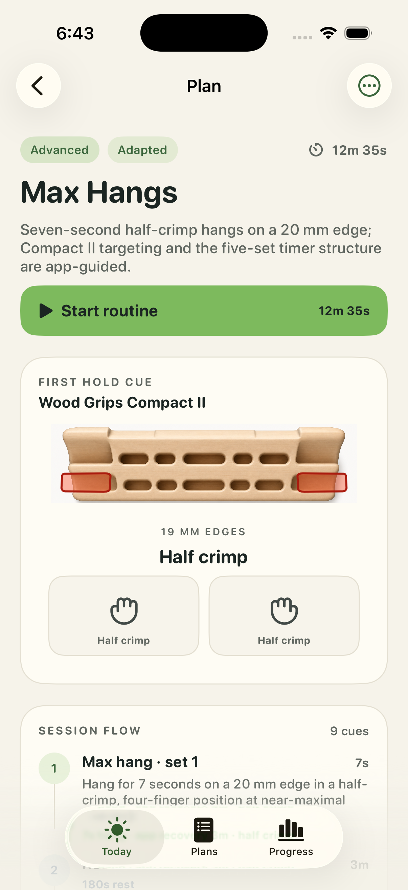
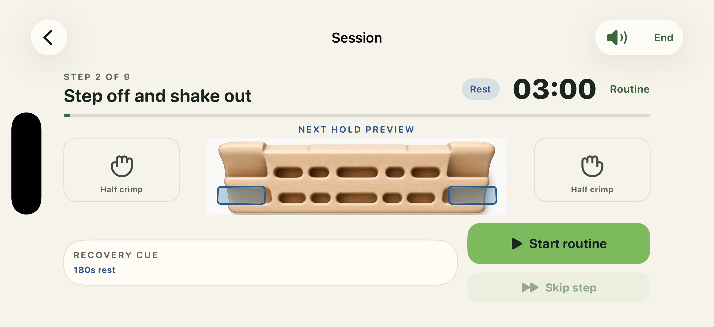

# All-board visual and presentation audit

Reviewed 2026-08-18. This is a historical visual-review record for the seven
completed direct-child packages that existed on that date: 132 logical holds
and 136 geometry pieces. It preserves the official comparison sources and app
screenshots used in the review. It is not an authoring procedure.

The official images support comparison of the visible product envelope and
contact placement. They do not establish measurements, grip posture, finger
capacity, features, or training semantics unless the manufacturer explicitly
labels those facts.

## Catalog results and official comparison sources

| board | official product page | official front image | reviewed canvas (px) | holds / pieces |
| --- | --- | --- | ---: | ---: |
| Beastmaker 1000 | [product](https://www.beastmaker.co.uk/products/beastmaker-1000-series) | [front image](https://www.beastmaker.co.uk/cdn/shop/files/1000_Small_Tulip_1200x1200.jpg?v=1756733068) | 1000×259 | 22 / 22 |
| Beastmaker 2000 | [product](https://www.beastmaker.co.uk/products/beastmaker-2000-series) | [front image](https://www.beastmaker.co.uk/cdn/shop/files/2000_Small_Tulip_1200x1200.jpg?v=1756734230) | 2037×564 | 25 / 25 |
| DeWoodstok Woodbord | [product](https://www.dewoodstok.nl/product/hangboard-woodbord/) | [front image](https://www.dewoodstok.nl/wp-content/uploads/2025/08/05_E_woodbord.jpg) | 1685×465 | 17 / 17 |
| Escape Beta 22 | [product](https://escapeclimbing.com/products/ec72100) | [front image](https://escapeclimbing.com/cdn/shop/products/2020_Website_ProductImage_BetaBoardListing_01-02.jpg?v=1700454580) | 1503×394 | 22 / 22 |
| Lattice Triple Rung | [product](https://latticetraining.com/product/triple-rung-wooden-hangboard/) | [front image](https://latticetraining.com/app/uploads/2020/07/Triple-Rung-Web-1.jpg) | 1477×396 | 3 / 3 |
| Metolius Wood Grips Compact II | [product](https://www.metoliusclimbing.com/products/wood-grips-ii-training-boards) | [front image](https://www.metoliusclimbing.com/cdn/shop/files/Wood-Grips-II-Compact-Training-Board.jpg?v=1759460952) | 1774×457 | 19 / 19 |
| Trango Rock Prodigy Training Center | [product](https://trango.com/products/rock-prodigy-training-center) | [front image](https://trango.com/cdn/shop/files/22830_Rock_Prodigy_Training_Center_Main_Image.jpg?v=1737728750) | 1233×435 | 24 / 28 |

## Review findings

The review compared every normal and active hold path with the packaged
presentation and the official product imagery. All seven board identities, all
132 ordered logical hold IDs, all 136 pieces, and all non-geometry hold facts
were preserved. Every reviewed highlight remained on its intended physical
contact and no board or hold was clipped.

Board-level findings:

- Beastmaker 1000 and Metolius Wood Grips Compact II already used a tight
  presentation canvas.
- Beastmaker 2000, DeWoodstok Woodbord, Escape Beta 22, and Lattice Triple Rung
  showed their complete product envelopes without excess surrounding space.
- Trango Rock Prodigy Training Center showed both board halves and all 28
  geometry pieces for its 24 logical holds.

The implementation used to modify paths and presentation during this historical
audit has been removed. Future geometry is authored directly in `board.json`
from primary manufacturer evidence, following `docs/ADDING_A_BOARD.md`, then
reviewed by a person in Workbench and the app.

## Simulator screenshots

These retained screenshots came from dedicated iPhone 17 Pro / iOS 26.5 Debug
review routes. The portrait route shows the first-hold highlight and the
landscape route shows the next-hold highlight; they do not claim to show every
board.

## Historical validation result

At the time of review, the completed catalog passed package validation and the
bounded iOS Simulator `build-for-testing`. Future changes must use the current
package validator and repeat visual inspection; this historical result does not
validate later edits.
