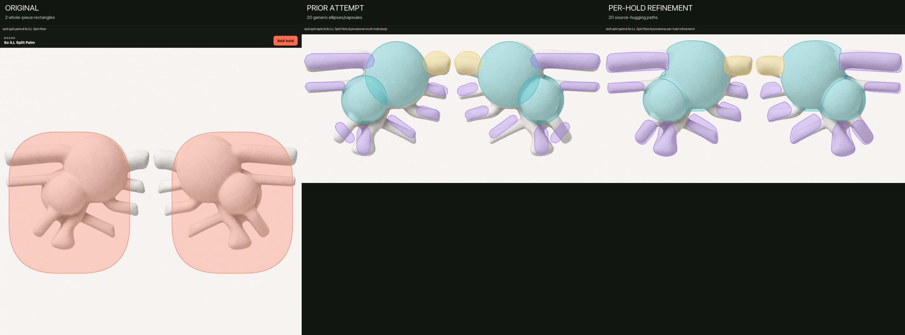
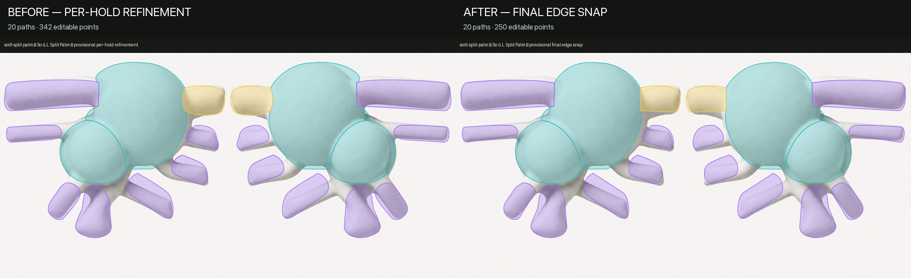
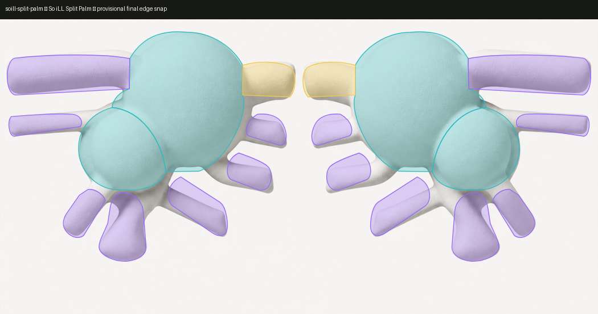
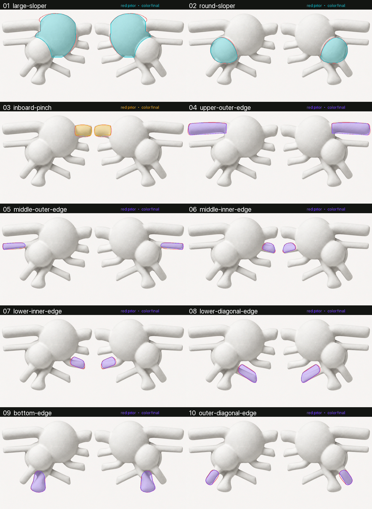

# Generative per-hold refinement: Split Palm visual study

Reviewed 2026-08-19. This case study records how a two-region placeholder for
the So iLL Split Palm was turned into a much more useful, low-point-count
visual hold map. It documents a repeatable review method and the visual
checkpoints from one disposable run. It does **not** publish a Split Palm board
package or establish manufacturer-authoritative hold semantics.

The result remains a visual study. The inventory, feature boundaries, names,
and pinch assignment are provisional. Front photography cannot establish
depth, finger capacity, intended grip posture, or a complete manufacturer hold
map. None of those fields should be added to a production package without a
source that states them.

## Result

The original package treated each physical half as one rounded rectangle. The
final study contains 20 independently editable paths: 10 exact mirrored pairs,
with two provisional slopers, one inferred pinch, and seven provisional
edge/crimp surfaces on each side. The final paths have 250 editable points and
zero detected interior-overlap pairs.



The first 20-hold attempt fixed the inventory problem, but its generic
ellipses and capsules did not follow the visible contact surfaces. Refining
each surface independently produced 342 editable points. A final source-edge
snap and simplification pass reduced that to 250 points while improving the
diagnostic mean distance to strong source edges from 3.7136 px to 3.0858 px, a
16.91% reduction.



The retained all-holds screenshot below comes from the actual Hangboard
Workbench renderer, rather than a separate approximation of its overlay.



## Evidence and its limits

The evidence register for the study was:

| evidence | what it supports | what it does not support |
| --- | --- | --- |
| [Official Split Palm product page](https://soillholds.com/products/split-palm) | Product identity, the official gallery and lifestyle photographs, and category-level wording on the page | A complete feature map, feature-to-name mapping, measurements, depth, finger count, or grip direction |
| Official front gallery photograph | Visible silhouettes, surface transitions, approximate symmetry, and candidate contact boundaries | Whether every visible surface is intended as a distinct hold or how deep it is |
| Official lifestyle photographs | Corroboration that several projecting rails can be used independently | A complete inventory or authoritative labels for individual features |
| Customer wording displayed on the official page: “two different slopers, a solid pinch, and multiple crimp sizes and angles” | Category support for slopers, a pinch, and multiple crimps/edges | Which physical feature has which label; customer wording is not a manufacturer feature diagram |

The external photographs were review inputs only and are not committed here.
Every inferred field in the generated run data was labeled `provisional`; the
unsupported depth, finger-capacity, and grip-posture fields were omitted.

## Why the first approaches failed

The iteration sequence is important because geometry generation cannot repair
an incorrect hold inventory.

1. **Two whole-piece rectangles.** The baseline had only one logical target
   per board half. Its overlays covered several unrelated contact surfaces and
   were unusable for exact highlighting.
2. **Whole-piece silhouette.** A generated outline followed each resin piece
   more closely, but still represented a physical board half rather than its
   independently usable surfaces. Better contours did not fix the semantic
   error.
3. **Metadata-first inventory.** The source evidence was converted to a frozen,
   provisional inventory of 10 pairs (20 paths). Generic ellipses and capsules
   made the separate targets visible, but still spilled across source edges.
4. **Independent per-hold refinement.** Each inventory item was generated and
   reviewed in isolation against the source photograph. This produced 342
   editable points with no interior overlaps.
5. **Edge snap, shared-boundary repair, then simplification.** Vertices were
   adjusted toward local source edges, shared boundaries were reconciled, and
   redundant points were removed only after the shapes were visually faithful.
   The final result has 250 points, no detected interior overlaps, and 10 exact
   mirrored pairs.

This sequence is the main lesson: freeze an evidence-labeled inventory before
asking a generator for paths, and generate contact surfaces rather than
product pieces.

## Repeatable workflow

The workflow below is deliberately board-agnostic. A new product may have a
different material, piece count, inventory, asymmetry, and cleanup regions,
but those differences must enter as generated run data. Do not add product
names, hard-coded coordinates, hand-authored masks, per-board templates, or
per-board thresholds to production code.

### 1. Create an isolated evidence run

Work under an ignored `.context/` directory or an isolated checkout. Record
the product page URL, every image URL, acquisition time, image dimensions, and
content hash before interpretation. Keep downloaded third-party evidence out
of committed runtime assets unless its license and intended use are clear.

Use a run directory with explicit artifacts, for example:

```text
.context/hangboard-refinement/<run-id>/
  evidence.json
  inventory.json
  geometry-prior.json
  geometry-final.json
  report.json
  repository/                  # disposable Workbench-readable checkout
  screenshots/
```

The files are an artifact contract, not an invitation to encode a particular
board into the tool. They make the same stages replayable on materially
different products.

### 2. Separate sourced facts from inference

Build an evidence table before generating metadata. Give every candidate field
one of these statuses:

- `authoritative`: stated or diagrammed by the manufacturer;
- `corroborated`: visible in more than one official view but not explicitly
  labeled;
- `provisional`: inferred from pixels or category-level wording; or
- `unsupported`: omit the field.

A category statement such as “multiple crimps” may justify searching for more
than one crimp surface. It does not justify assigning a particular depth,
finger count, or exact crimp name to a visible rail.

### 3. Freeze the provisional inventory

Identify independently usable contact surfaces, not merely disconnected
physical pieces. Assign stable, descriptive pair IDs and kinds only where the
evidence supports the category. The Split Palm study froze this provisional
per-side inventory before any final contour work:

| pair | provisional kind |
| --- | --- |
| `large-sloper` | sloper |
| `round-sloper` | sloper |
| `inboard-pinch` | pinch (inferred) |
| `upper-outer-edge` | edge/crimp surface |
| `middle-outer-edge` | edge/crimp surface |
| `middle-inner-edge` | edge/crimp surface |
| `lower-inner-edge` | edge/crimp surface |
| `lower-diagonal-edge` | edge/crimp surface |
| `bottom-edge` | edge/crimp surface |
| `outer-diagonal-edge` | edge/crimp surface |

If the evidence does not distinguish two adjacent surfaces, leave the split
provisional or reject it; do not disguise uncertainty with precise metadata.

### 4. Generate one path per contact surface

For every frozen inventory item, crop a context window around the candidate
surface and ask the same generator to return a closed vector path in source
coordinates.
The generator input should contain the evidence status, stable ID, source image
dimensions, candidate crop, neighboring candidate IDs, and the common geometry
constraints. Product identity may be present for provenance, but must not
select a special algorithm or template.

Apply the same constraints to every board:

- trace only the visible contact surface assigned to the inventory item;
- keep one closed, contiguous contour per geometry piece;
- do not absorb a neighboring usable surface;
- meet shared boundaries without interior overlap;
- preserve small silhouette changes that distinguish adjacent features;
- mirror only when source evidence supports symmetry; and
- retain source-space coordinates until final normalization.

Generate every item independently, then compose the complete board. A
full-piece mask is useful as a containment check, never as the final hold map.

### 5. Snap locally, reconcile globally

Refine each provisional contour against local gradients or another generic
edge signal in the native-resolution source. Treat the signal as a diagnostic,
not semantic truth: shadows, texture, and highlights can be stronger than a
real feature boundary.

After local snapping, run global checks across the inventory:

- reconcile shared borders so adjacent paths meet consistently;
- reject or repair interior intersections;
- verify every frozen inventory item is still present exactly once;
- check mirrored pairs mathematically when mirroring was justified; and
- inspect the composed overlay for uncovered or double-covered contact areas.

The Split Palm overlap diagnostic rasterized all paths in the 1244×616 source
space, eroded each mask by one pixel to ignore coincident antialiased borders,
and found zero intersecting interiors. That erosion rule was run data from a
generic diagnostic, not a Split Palm-specific production exception.

### 6. Simplify after fidelity

Only after contours pass visual review, remove redundant line or curve points.
Re-render after every simplification pass and reject any candidate that changes
the perceived contact boundary, creates an overlap, breaks a shared edge, or
changes the inventory. Point count is a maintenance and editing metric, not a
reason to accept a visibly worse shape.

The final study reduced 342 editable points to 250. Its nearest-strong-edge
metric improved by 16.91%, but that number alone is not an acceptance gate: it
cannot tell a true hold edge from a lighting boundary.

### 7. Render through the real Workbench

Put the candidate `board.json` and `assets/primary.png` in a disposable
Workbench-readable repository, not in `Hangboards/`. From the main checkout,
validate that ephemeral catalog with the repository command:

```sh
rtk scripts/hangboard-tools.sh packages validate \
  --root /absolute/path/to/disposable/repository/Hangboards
```

Then launch the actual editor against that disposable repository:

```sh
rtk python3 Tools/HangboardWorkbench/server.py \
  --repository-root /absolute/path/to/disposable/repository
```

Open `http://127.0.0.1:4173`, select the candidate board, and capture both the
all-holds view and isolated views for every hold. Do not rely only on a custom
debug renderer: runtime compositing, normalization, labels, and highlight
treatments can expose errors that the geometry generator does not.

The final per-pair sheet below compares the red 342-point prior contour with
the colored 250-point final contour on each isolated source region.



## Acceptance checklist

Accept a visual-study candidate only when all of the following are true:

- the evidence register records provenance and separates authoritative facts
  from inference;
- the hold count and stable IDs exactly match the frozen inventory;
- every surface has an isolated screenshot and has been visually inspected;
- the all-holds Workbench render shows no spill onto a neighboring contact,
  missed surface, clipping, or accidental whole-piece region;
- all path interiors are non-overlapping, with shared borders handled
  consistently;
- justified mirrored pairs match exactly, while unsupported asymmetry has not
  been erased;
- simplification lowers point count without degrading visible boundaries;
- unsupported metadata is omitted and all inferred metadata remains explicitly
  provisional; and
- the disposable package passes `packages validate`.

Reject or return the run for another pass when any inventory item is missing,
two usable surfaces are merged, a path follows lighting instead of geometry,
generic capsules visibly spill outside their feature, a low point count costs
fidelity, or a source limitation is presented as a product fact.

## Production boundary

This study answers “can a metadata-first generative pass create a materially
better editable hold map?” It does not answer “is this the authoritative Split
Palm map?” Promotion would require stronger source-backed semantics and a
generic implementation replayed unchanged across materially different boards.

Do not copy the study's coordinates, masks, inventory, thresholds, or
disposable scripts into a product-specific production path. A production
pipeline is acceptable only if the same code, parameters, schemas, and
artifact contracts can process unseen commercial boards, with product
differences supplied solely as automatically generated, provenance-bearing run
data and with the same human visual-review gates.
