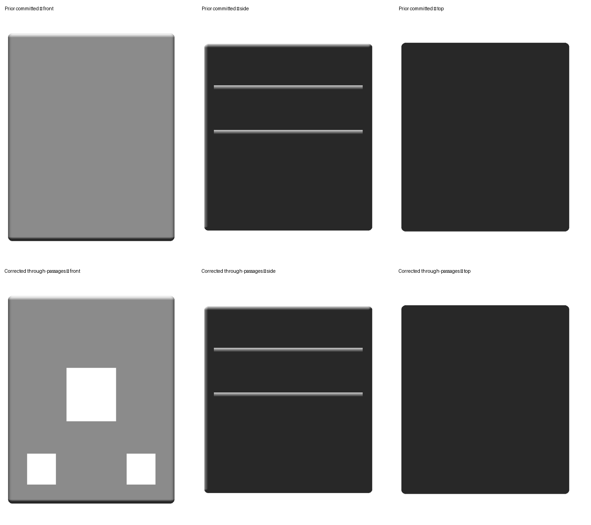
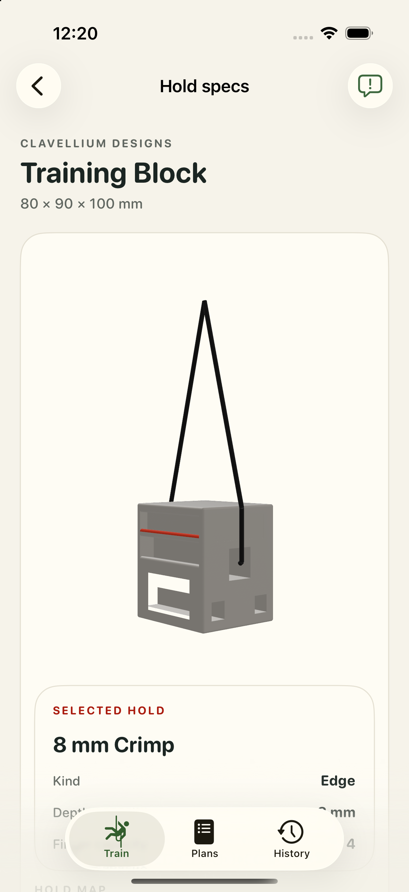
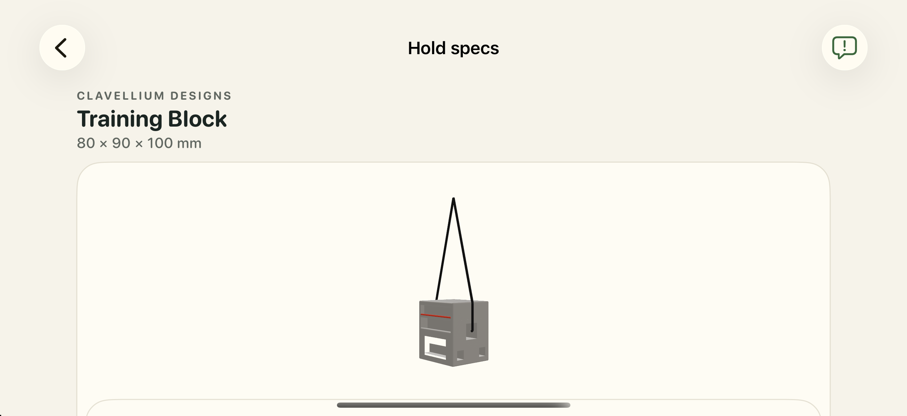
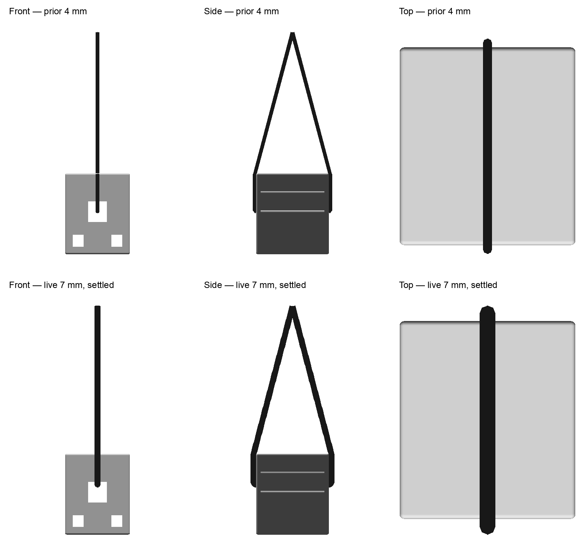

# Clavellium Training Block accuracy and suspension correction

Date: 2026-09-29. Package: `clavellium-training-block`.

The native FreeCAD migration already existed. This correction replaces its
estimated blind sling recesses with three straight rectangular through-passages
and adds one solved, connected suspension loop. The FCStd remains the only
geometry source; the sling is transient metadata in `suspension.json`, not a
mesh in the material-free USDZ.

## Evidence and owner ruling

Product references are the [manufacturer's climbing page](https://www.clavelliumdesigns.com/climbing)
and [Clavellium Etsy listing 1740404071](https://www.etsy.com/listing/1740404071).
The manufacturer's indexed text describes four angled edges, three pinch
options, and loading through a corresponding tether channel. The direct
manufacturer page failed DNS resolution during this audit; the Etsy item
could not be fetched, and no browser connection was available. Search excerpts
do not establish the internal route or exact geometry.

The original operator-supplied photos were recovered verbatim from the parent
of `8f2bfcffd`, which removed the historical audit archive. The September 26
migration provenance records their human approval. Their original publisher
cannot be independently established from the supplied bytes. These are
operator-provided physical-product evidence, not CAD renders or search
thumbnails. They are retained here for this correction:

| View | Retained file | SHA-256 | Observation |
| --- | --- | --- | --- |
| Channel face | `2026-09-29-clavellium-evidence/channel-view.webp` | `d6be696cca83299ee0677100221d7f71b4a18cc9f91936767d34c1c40ff1df5e` | Three square openings; flat woven sling using the central opening |
| Loaded blue block | `2026-09-29-clavellium-evidence/load-view.webp` | `a031588da8d141a79c13e363c7c60d2d3d01a1527fd4dedd57063144709bd599` | Sling loaded through a lower opening; side crimps |
| Red block side pull | `2026-09-29-clavellium-evidence/side-pull.webp` | `231fc4e35fc6ecabc0de45ccf101d77e3011a5a153d62f59551393308c0c3ad0` | A lower opening is used after reorienting the block |

On September 29 the owner answered **“straight through”** to whether each of
the three openings passes to the opposite face or connects internally to
another opening. This establishes three independent straight passages. The
owner did not know the channel-to-grip mapping. No such mapping is authored or
claimed. The existing ten contacts and single `front` position are preserved.

## Accuracy audit and field mapping

| Field or geometry | Basis | Result / limitation |
| --- | --- | --- |
| 80 × 90 × 100 mm envelope | Existing listing-derived manifest and prior approved geometry | Native and exported bounds match exactly |
| 8 / 10 / 15 / 20 mm crimps | Manufacturer text and existing factual contact metadata | Compiler measures exact inward X-axis depths; IDs unchanged |
| 80 / 90 / 100 mm opposed pinches | Existing listing-derived metadata and native envelope | Nominal spans retained; selectable patches have the existing 0.05 mm presentation relief |
| Four 9° crimp floors | Prior approved display reconstruction | Preserved estimate; manufacturer supports angled floors but does not verify 9° |
| Outer rounding and mouth sizes/locations | Prior approved display reconstruction | Preserved estimates, not manufacturer engineering dimensions |
| Passage connectivity | September 29 owner ruling | Corrected from 10 mm blind recesses to full straight through-passages |
| Central-channel sling | Channel-face photograph and owner-confirmed through-route | One loop has a leg at each broad-face mouth; no duplicate second loop |
| Round cord appearance | Explicit adaptation of photographed flat woven sling | Renderer uses round `matteCord`; no claim of supplied round rope |
| 2 mm radius, 550 mm loop length, 0.1 mm clearance, overhead support | Authored display estimates | Static CAD-section solve determines routes and board height |
| Default camera and upright central-channel pose | Display estimate | Shows the openings and side crimps; does not prescribe a loaded pose for any particular grip |

The prior provenance explicitly documented the blind depths as estimates and
deferred cords because the hidden route was unknown. The new owner ruling
supersedes that uncertainty. The body remains a display reconstruction, not
manufacturer-certified engineering CAD. In particular, lower mouth angles,
corner details, branding and surface texture have not been newly certified.
Materials, textures, branding, mounting hardware, hooks and loading weights
are omitted from the USDZ.

## Native authoring and suspension method

The three channel tools are now editable `Part::Box` objects, with the inherited
X/Z dimensions and native Y spanning −46..46 mm. The extra 1 mm beyond each
face ensures an open Boolean cut. Each tool explicitly declares
`HangTenChannelAxis=y`; the channel measurement tool measures its transformed
centerline. The actual mouth-to-mouth length is 90 mm, not the 92 mm cutter
length. All existing cuts and contact surfaces remain linked to the body.

The single central loop uses the existing `twoBranchCord` wire type with
`internalLoop`: one ordered pair in `passages.left`, empty `passages.right`,
and one branch. This represents two visible legs of **one** threaded sling.
The one-loop form requires a complete CAD-generated route cache for every
pose; uncached, exterior, incomplete and duplicate topologies are rejected.
Existing two-loop packages retain their prior contract and solver behavior.

`ropeSolver.channelProfile=rectangular` explicitly selects the wide-slot
section method. The circular-bore morphological closing bows inward at a
26 mm rectangular opening and cannot reach its mouth. The rectangular method
joins matching parallel depth rims across the void, preserving the remaining
CAD section, then opens a clearance notch only at the solved mouth. It rejects
tapered or overlapping section pieces. It is authoring metadata and never
ships in generated `board.json`.

The native solid is tessellated with `export_rope_collision_solid.py` and solved
with `solve_threaded_rope.py`. The initial historical generated pose lowered the board by
155.287 mm under the fixed support. The shipped `front` cached pose now lowers
the board by 154.096353 mm (`translation[1] = -0.154096353` in
`suspension.json`); the initial solve measurements below describe that earlier
cache, not the current front translation. The measured loop is 550.0000068 mm for
the declared 550 mm estimate. Every visible leg is sampled at 0.5 mm against
the watertight native solid; minimum centerline clearance is 2.100 mm for
the estimated 2 mm radius. The hidden segment passes through the void and is
not drawn. This is a static massless round-rope display adaptation; it does
not simulate a flat strap's stiffness, friction, or dynamic loading.

The temporary source-edit and inspection scripts, collision solid, reports,
before/after front/side/top previews and native captures belong under
`.context/strong-owl-clavellium/`. They are not build inputs. Logical camera
metadata was updated only through `set_board_manifest.py`.

## Verification

- Native passage probe: all three channel centerlines are empty throughout
  the 90 mm body; body is one valid solid; all ten contacts are valid.
- Compiler: exact X-axis crimp depths and all eleven node bindings retained.
- CAD rebuild: USDZ and descriptor reproduce byte-for-byte on pinned FreeCAD.
- Channel measurement: center mouth-to-mouth spine is exactly 90 mm.
- Cord regeneration: `--check` reproduces the committed generated cache and
  rejects native-solid collisions, excessive slack and loop stretch.
- Package validation and model delivery lock cover the FCStd, descriptor and
  suspension sidecar; no package `board.json` is committed.
- Final current-source `HangTenTests`: 1,235 tests, three skipped, zero failures
  on an isolated iPhone 17 Pro / iOS 26.5 Simulator. The malformed combination
  of single-loop passages with `meshWrap` is rejected before array indexing.
- Scoped Python verification: 472 passed across CAD tools (including real
  Clavellium FreeCAD and native-solid solve checks), package parsers and model
  tools. Unchanged pilot, Rock Rings, Prime Rib and Foundry native suites were
  excluded; the all-package reproducibility run was stopped after the separate
  Clavellium byte-identical rebuild passed.
- Physical model tap selected `cd-crimp-8mm` and visibly highlighted its shelf;
  a tap on the cord preserved the selection. Orbit, pinch selection, process
  relaunch and portrait/landscape cord visibility were reviewed. No cord
  accessibility target is exposed. The exact owned simulator and DerivedData
  were deleted after review.

Retained visual review (prior asset above, corrected asset below):

Python and native iOS results and current-source captures are recorded in the
workspace validation artifacts. Grip-specific channel choice remains unknown;
this change does not fill that gap with invented prescriptions.

## Follow-up: missing 80 mm pinch surfaces

The owner identified the bright C-shaped area near the bottom in the iOS
screenshots above. That was background visible through an incorrectly culled
contact surface, not a physical cutout. The first visual audit missed it.
`Pinch80Left` and `Pinch80Right` had inward-facing triangle winding; the body
partition removes the corresponding body faces, so those back-facing contact
meshes left a visible gap in a single-sided renderer.

The two FreeCAD contact shapes were reversed directly in the FCStd. No mesh
repair, double-sided material, or renderer workaround was added. Every mesh's
point set, body geometry, contact identity and dimensions are unchanged. All
six exported pinch surfaces now have outward winding and normals. The cord
routes and board pose are unchanged; only the sidecar's model hash changed.

The new native outward-winding regression failed on the preceding source and
passed after correction. Ten focused Python checks, the CAD-solid cord check,
package inventory validation, and the Clavellium byte-identical rebuild passed.
The corrected model remains material-free.

## Live-cord input and initialization milestone

The bundled `assets/primary.physics.json` is generated from the final wood
solid and the central native Box cutter. Its portal polygons meet the actual
90 mm body faces; the cutter's overhanging ends are not rope attachments.
The descriptor binds the exact CAD source and model hashes. The authoring
sidecar identifies source features and the continuous threading graph only.

The requested threefold thickness uses a retained 2 mm baseline radius to
derive a 6 mm collision and display radius. One 550 mm continuous rope includes
the hidden passage once. Board mass (1 kg), linear rope mass (0.01 kg/m), loop
length and overhead support are explicitly display estimates. The round rope
remains an adaptation of the photographed flat sling.

Pure Swift initialization searches against the exact collision triangles,
recomputes routes while solving hanging height, and subdivides the resulting
chain into links at most 2 mm long. It does not read cached contact points.
The upright seed automatically bears on the upper passage wall while the
source aperture centers remain unchanged. Initialization is tested separately
from live dynamics; the existing renderer remains in use until the numerical
and scene integration gates pass.

## Confirmed diameter correction

After the input milestone, the operator corrected the target from 12 mm to
**7 mm diameter** and confirmed this for Clavellium and Mini Bar. Clavellium's
physics input now uses radius 3.5 mm and retained baseline radius 2 mm with
scale 1.75. The owner's statement supplies the diameter; the round-cord
adaptation of the photographed flat sling remains explicit. The generated
physics hash was recorded as `9ca003c90ffa0ebbce400cbfd0458e1197e80aa6704c2b376cb670b47d0c578f`
for that intermediate worktree export; its raw bytes were not retained, so
that historical digest cannot serve as reproducible delivery evidence. The
committed `assets/primary.physics.json` has raw-byte SHA-256
`c60fbd6dfaf59bfd5fb7e6aa8d806f78af7e828a7f64074d326865e08f13e853`
at this review revision (`shasum -a 256`), which is the reproducible artifact
binding. Later descriptor edits require checking the current raw-byte digest.
The native board and USDZ hashes are unchanged. Matching Python validation,
Swift descriptor, collider and seed tests pass; live settling/rendering is
still pending its numerical gate. This input correction does not claim that
the existing static renderer already uses the new diameter.

## Live numerical gate, 7 mm cord

The current coupled nonlinear solver passes 30 host tests (224.543 s), with
29 full iOS Simulator tests plus the updated nine-test dynamics suite passing.
The suite covers upright/90°/180° rotations, repeated reversals, deterministic
repetition, half steps, genuine initially unseated aperture geometry, and actual
material feeding through both mouths while each material link retains its rest
length. Every accepted frame meets the 0.5% local strain, 0.5 mm total length,
finite-radius clearance and topology gates. The 90° diagnostic settles in
1.2375 simulated seconds. This is numerical evidence, not device performance.

The solver uses a simultaneous mass-metric constrained solve with tensile
geometric stiffness, unilateral multi-face contact, nonlinear descent checks,
sliding geometric portal crossings, and conservative wood/self-contact sweeps.
The retained 1 kg board mass, 0.01 kg/m rope mass and 18 s⁻¹ velocity damping
are display estimates, not manufacturer measurements. Contact positions are
computed from the native solid; cached sling contact points are not constraints.
Scene integration and displayed 7 mm cord remain pending. No factory grip/channel
mapping or flat-sling internal route has been inferred.

Verification logs: `.context/strong-owl-live-cords/task4-native.log`,
`task4-native-feed.log`, the plan's `task-4-tests.log`, and
`task4-package-suite.log` (411 Python tests passed).

## Native live scene and 7 mm display

The scene now consumes the validated physics descriptor. Clavellium's rendered
and collision radius are both 3.5 mm. A serial actor retains each physical
chain across pose changes, with bounded display steps, generation checks,
pause/stop/deallocation handling and sleep at accepted rest. A single transient
LowLevelMesh entity per rope keeps its buffers between frames. Cords have no
collision/picking components or accessibility elements; the source-bound board
contacts and resource lease remain intact. Camera orbit changes only the view.
Reduce Motion and picker cards request one accepted settled snapshot.

Signed iOS Simulator validation passed 29 scene/controller/mesh tests, including
actual independent worker states, release during pending work, clear/reselect,
matched radius, picking exclusion, stable buffers over 1,000 updates, paused
time, Reduce Motion and settled camera containment. Logs are retained in
`.context/strong-owl-live-cords/live-final-integration.log`. The signed current
source review build passed; this is not a physical-device performance result.

The following comparisons were shown and reviewed before completion of the
rendering change. The body USDZ is unchanged; the comparison reconstructs the
prior committed cached 4 mm exterior cord and the current validated 7 mm
settled chain, including its occluded passage.

Native screenshots: [front](2026-09-29-clavellium-evidence/strong-owl-live-ios-front.png),
[side](2026-09-29-clavellium-evidence/strong-owl-live-ios-side.png),
[top](2026-09-29-clavellium-evidence/strong-owl-live-ios-top.png).
The black pill outside the board viewport in the side capture is the simulated
iPhone's display cutout; it is not part of the model or cord.
[Capture provenance](2026-09-29-clavellium-evidence/strong-owl-live-ios-provenance.json)
records the isolated simulator, build flags, unchanged model hash and DEBUG
camera controls. Physical 90°/180° review rotations are not manufacturer grip
assignments. The accepted `cd-crimp-8mm` crimp-shelf pose remains unchanged; 8 mm names
the shelf, while the cord diameter is 7 mm. Catalog adaptation and
physical-device profiling remain separate, unfinished gates.
