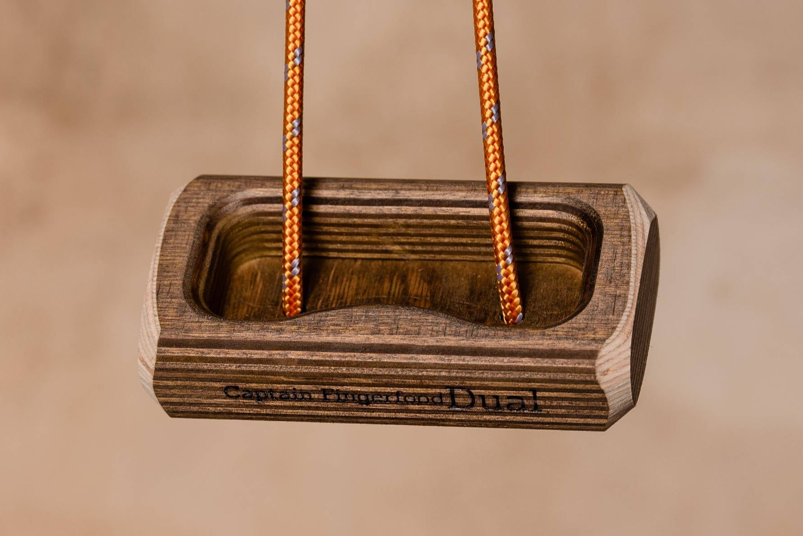
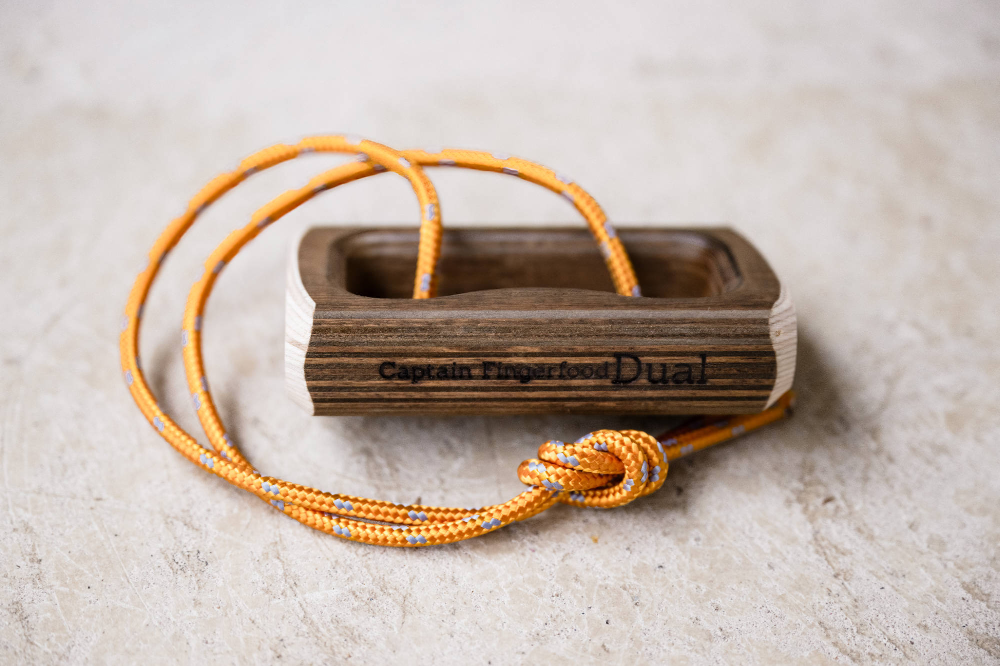
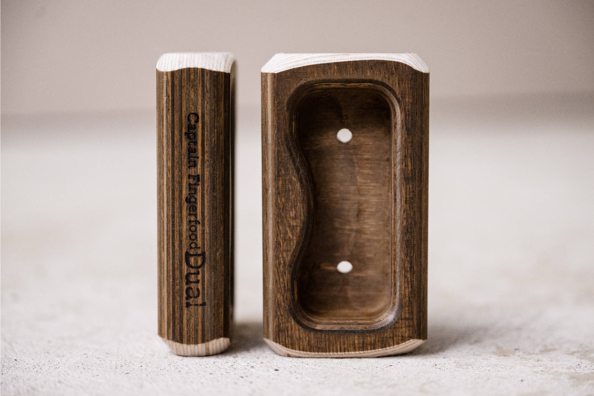

# captain-fingerfood-dual: CAD source evidence

Date: 2026-09-29. Publisher: Captain Fingerfood.

Two complementary views show the same DUAL with one curved and one straight opposing lip, continuous cavity, rounded exterior and two daylight floor openings. P1 shows the exterior cord; P2 shows front plus narrow side. The openings support floor-to-back voids, but the complete threading between them is not established. No U channel may be inferred.

Status: approved by user 2026-09-29. Native CAD is authored; see geometry-review.html and the native validation reports for the separate geometry review. Historical records naming an agent as reviewer are not treated as new human approval.

## Source 1: captain-fingerfood-dual.html

- Publisher: Captain Fingerfood
- URL: https://en.captainfingerfood.rocks/products/dual-hangboard
- SHA-256: `c93df995f581f2a731e45f38a8504744ee393059d7a714019dc679b702e3ffb2`
- Supports: exact-revision product
- Approval: historical cord evidence; new full visual set approved by user 2026-09-29

## Source 2: captain-fingerfood-dual-title.jpg

- Publisher: Captain Fingerfood
- URL: https://cdn.shopify.com/s/files/1/0602/4547/5542/files/DualTitelbild.jpg?v=1739704755
- SHA-256: `f57fb751f63c5258e8cb85a9d0f0ad27f6b9cb5eede94b5e1caccc496ec9468e`
- Supports: exact-revision title image
- Approval: historical cord evidence; new full visual set approved by user 2026-09-29

## Source 3: DualP1.jpg

- Publisher: Captain Fingerfood
- URL: https://captainfingerfood.rocks/cdn/shop/files/DualP1.jpg?v=1739704755
- SHA-256: `b67f397ceefa3054f7d6ac038a8459fe8389753713ebb97274acc1a17a6de5c8`
- Supports: Two complementary views show the same DUAL with one curved and one straight opposing lip, continuous cavity, rounded exterior and two daylight floor openings. P1 shows the exterior cord; P2 shows front plus narrow side. The openings support floor-to-back voids, but the complete threading between them is not established. No U channel may be inferred.
- Approval: approved by user 2026-09-29

## Source 4: DualP2.jpg

- Publisher: Captain Fingerfood
- URL: https://captainfingerfood.rocks/cdn/shop/files/DualP2.jpg?v=1739704755
- SHA-256: `5b9f30b16919157e9017f51cebe979bd5aae99f69b4c48827c7b5fdb1145649b`
- Supports: Two complementary views show the same DUAL with one curved and one straight opposing lip, continuous cavity, rounded exterior and two daylight floor openings. P1 shows the exterior cord; P2 shows front plus narrow side. The openings support floor-to-back voids, but the complete threading between them is not established. No U channel may be inferred.
- Approval: approved by user 2026-09-29

Native CAD review artifacts: [geometry comparison](geometry-review.html), [authoring notes](geometry-authoring-notes.md), [metadata preservation](metadata-preservation.json), [native edit validation](native-validation.json). Final app review is coordinated separately.

[Current 90° lower-cord revision](vertical-tightening-review/review.md) — [front/side/top comparisons](vertical-tightening-review/index.html), [current app views](vertical-tightening-review/app-review/index.html), and [runtime proof](vertical-tightening-review/runtime-validation.json). The general front-hole entry was accepted with “y”; the immediate 90° follow-up qualified that acceptance. The revised vertical shape awaits the user's review.

The earlier [front-hole correction](cord-entry-review.md), [comparisons](front-mouth-review/index.html), [app captures](app-review/index.html), and [runtime report](cord-entry-runtime-validation.json) are retained as historical evidence for sidecar `0c824dd…`. They do not describe the current tightened routes.
