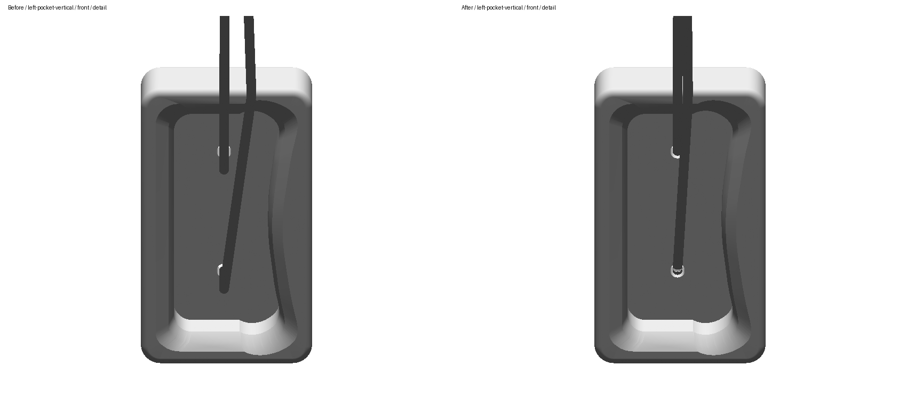
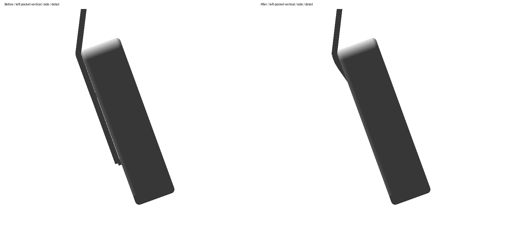
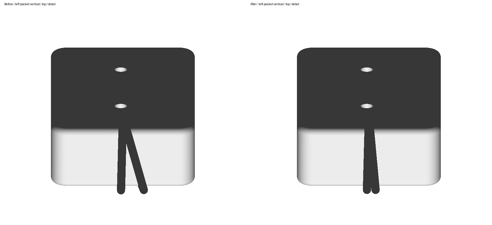

# DUAL: lower cord at 90°

The user asked: “the 90 degree position tho, why does the bottom cord jut out to the side?” This follows “y” accepting the preceding front-hole entry correction. Review remains on board #2; the vertical shape is not yet accepted.

The previous solver selected the first passing native section route after twelve alternatives failed clearance checks. In the vertical pose, that route ran 11.217132 mm sideways from the lower mouth. It also retained an artificial axial collar as a required bend: the approximately 90° turn was about 21.88 mm from the wood. Passing collision checks did not make this free-space bend a plausible cord bearing.

The opt-in `ropeSolver.tightening: "coupled3D"` now generates the same kind of native seed, then frees the collar vertices and shortens the visible paths together in three dimensions. Native contact normals propose small coupled lift-and-slide moves around the rim. Every accepted move must reduce the quantized path length, preserve front entry, and pass continuous solid and whole-path tube checks. Hanging height is settled again and the exact rounded result is certified. Existing saved routes never seed this solve.

The lower lead's vertical-pose lateral offset falls to 4.289888 mm, a 62% reduction. The unsupported collar knees are removed. At the seed's fixed height, the lower and upper leads shorten by 19.711049 mm and 14.522582 mm respectively. The settled translation Y is −0.174209430 m. The independent vertical review found each remaining turn above 5° within 0.041 mm of the radius-offset wood surface, and no tested feasible corner cut larger than the declared 1 µm search threshold. Minimum non-support distance between strands is 4.000338 mm for two 2 mm radii.

## Visual review

[All four poses, front/side/top, full/detail](index.html). Each pair uses the same unchanged USDZ, camera and scale, with previous committed routes on the left and current routes on the right. The prior sidecar, reports and screenshots are preserved in the [before snapshot](before/snapshot-provenance.json).

[Current app captures](app-review/index.html) show all four canonical selected-contact poses in a fresh installed build. The staged generated manifests and ODR models match the current packages. Physical DUAL UI orbit remains unverified; no oblique UI captures are claimed.

## Evidence and verification

Approved manufacturer [title image](../evidence/captain-fingerfood-dual-title.jpg), [P1](../evidence/DualP1.jpg), and [P2](../evidence/DualP2.jpg) establish the same mouths and exterior cord used in the preceding revision. [Source URLs and hashes](../README.md) are unchanged. No further hidden connection is inferred.

The CAD solid, USDZ, descriptor, mouths, radii, rest lengths, world anchor, pose rotations and cameras retain their prior bytes or values. Of 206 tracked package files, only DUAL's suspension sidecar changed: the explicit tightening selector plus generated routes and translation Y. [Package preservation proof](package-change-proof.json).

- [Current validation and all-pose metrics](verification.json).
- [Independent fresh apply/check identity](fresh-reproducibility-result.json): all four native poses; reports are byte-identical.
- [Exact rounded full-solid, tube, entry and length certificates](continuous-cord-clearance.json).
- [Independent current implementation and geometry review](final-independent-review.json).
- [Current Python, iOS, installed delivery and cleanup proof](runtime-validation.json).
- [Regression and diagnostic provenance](diagnostic-provenance.json); historical failed probes are labelled separately from the current native result.

This is deterministic bounded local shortening. It does not prove a global minimum or physical rope equilibrium. The 400 mm display rest lengths are unchanged; the vertical upper visible route is 352.328 mm and omits estimated slack. The remaining 4.29 mm lateral offset is a certified local result, not a proven unavoidable offset. The complete hidden cord connection remains unspecified. Manufacturer dimensions and these display cord estimates retain their existing evidence status.
