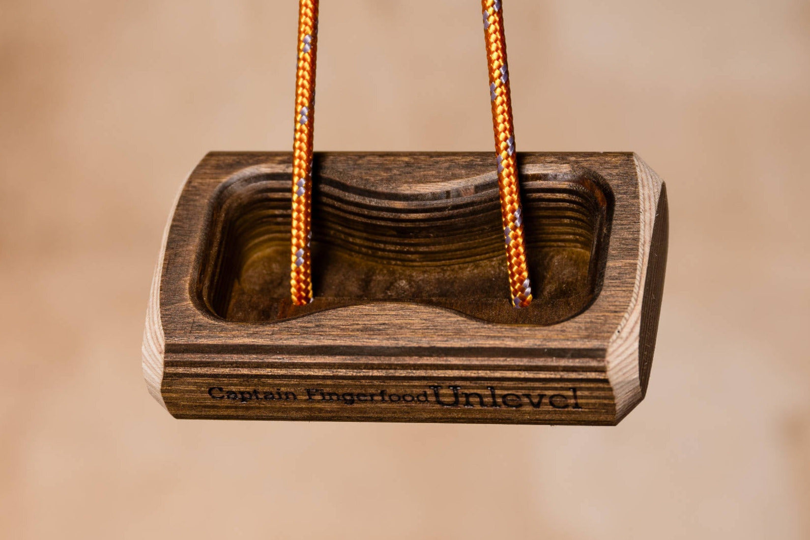
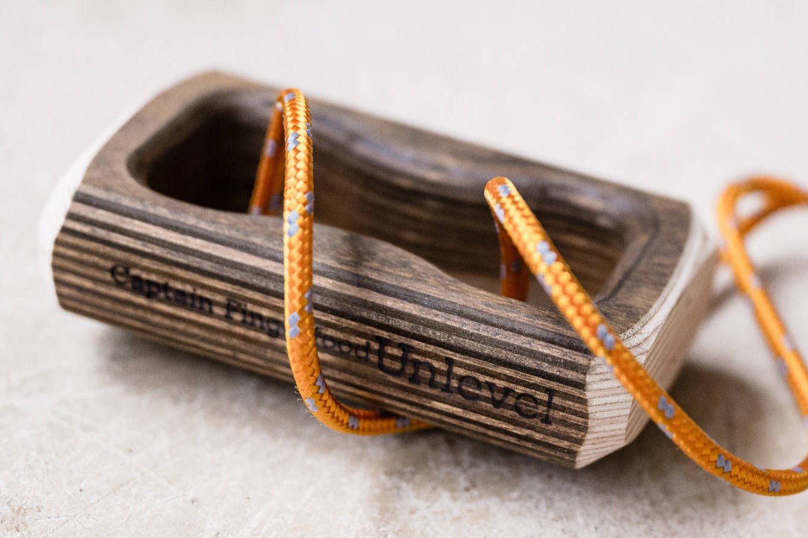
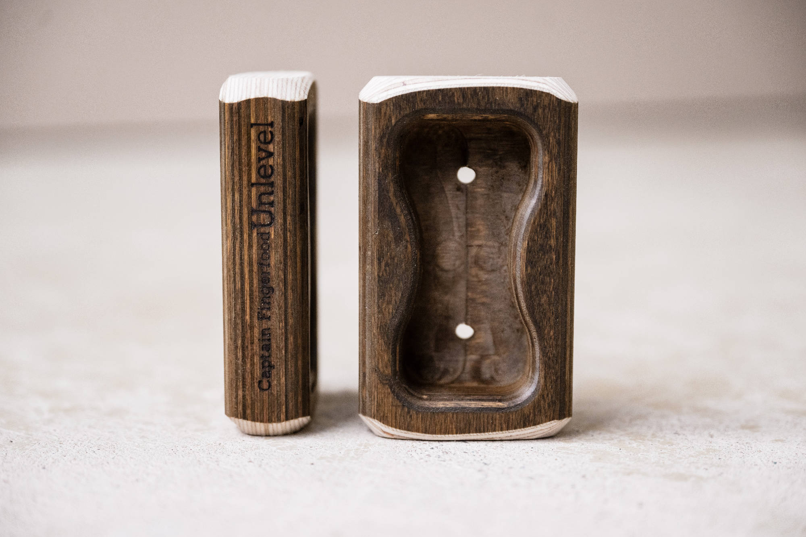

# captain-fingerfood-unlevel: CAD source evidence

Date: 2026-09-29. Publisher: Captain Fingerfood.

P1 shows the curved opposing lips, common cavity and two exterior strands; P2 shows the end profile, full cavity and two daylight floor openings. Floor-to-back voids are visually supported; a complete continuous threading graph is not established. Preserve four existing physical contact IDs.

Status: approved by user 2026-09-29. Native CAD is authored; see geometry-review.html and the native validation reports for the separate geometry review. Historical records naming an agent as reviewer are not treated as new human approval.

## Source 1: captain-fingerfood-unlevel.html

- Publisher: Captain Fingerfood
- URL: https://en.captainfingerfood.rocks/products/unlevel-hangboard
- SHA-256: `d129f6c637beac8eca88e0b9f3a8fa5f1682b669842d0ab0cbfef448842ad31b`
- Supports: exact-revision product
- Approval: historical cord evidence; new full visual set approved by user 2026-09-29

## Source 2: captain-fingerfood-unlevel-title.jpg

- Publisher: Captain Fingerfood
- URL: https://cdn.shopify.com/s/files/1/0602/4547/5542/files/Titelbild.jpg?v=1739704654
- SHA-256: `7eb711b6b28284a86835b7a460559f5ec80f9816bc691e2823982d98e1b0d813`
- Supports: exact-revision title image
- Approval: historical cord evidence; new full visual set approved by user 2026-09-29

## Source 3: UnlevelP1.jpg

- Publisher: Captain Fingerfood
- URL: https://captainfingerfood.rocks/cdn/shop/files/UnlevelP1.jpg?v=1739708294
- SHA-256: `ad5f5ace4d71475fb9b8f546d52bc63305868953898baf7aef67e966a571475f`
- Supports: P1 shows the curved opposing lips, common cavity and two exterior strands; P2 shows the end profile, full cavity and two daylight floor openings. Floor-to-back voids are visually supported; a complete continuous threading graph is not established. Preserve four existing physical contact IDs.
- Approval: approved by user 2026-09-29

## Source 4: UnlevelP2.jpg

- Publisher: Captain Fingerfood
- URL: https://captainfingerfood.rocks/cdn/shop/files/UnlevelP2.jpg?v=1712652284
- SHA-256: `75432a1c60bb6f2c735107551b52fff94fde6f2ae2f0a34a96b90c300ee416e9`
- Supports: P1 shows the curved opposing lips, common cavity and two exterior strands; P2 shows the end profile, full cavity and two daylight floor openings. Floor-to-back voids are visually supported; a complete continuous threading graph is not established. Preserve four existing physical contact IDs.
- Approval: approved by user 2026-09-29

Native CAD review artifacts: [geometry comparison](geometry-review.html), [authoring notes](geometry-authoring-notes.md), [metadata preservation](metadata-preservation.json), [native edit validation](native-validation.json). Final app review is coordinated separately.
