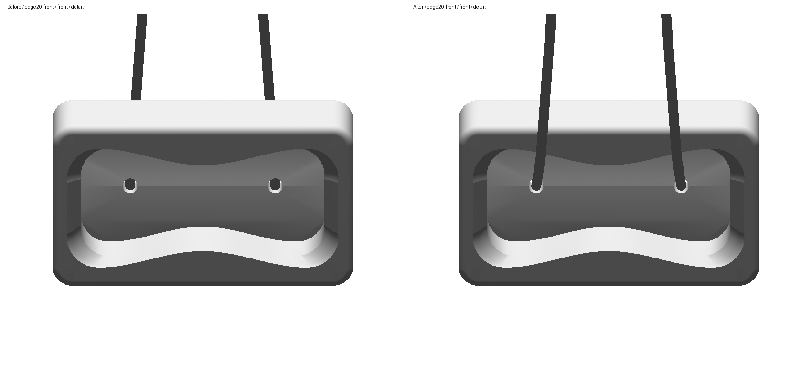
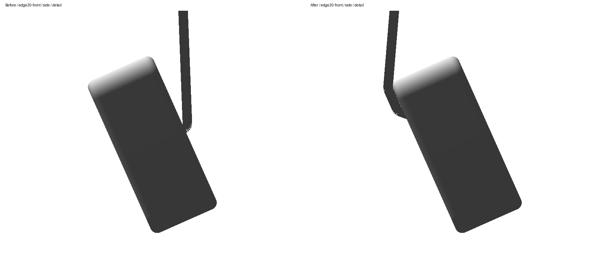
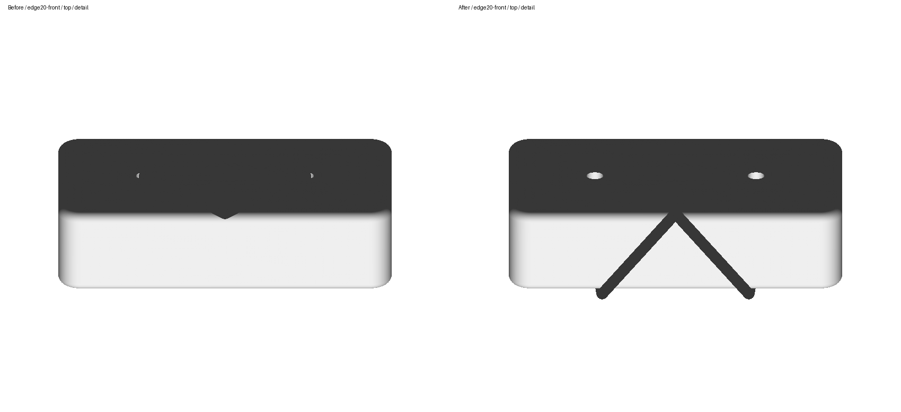
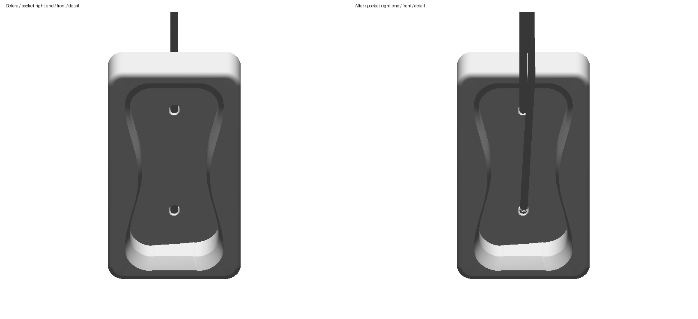

# UNLEVEL: front-hole cord entry

UNLEVEL is review #3 after the user accepted DUAL's revised displayed cord routing with “lgtm”. Its approved manufacturer reference describes a 12 × 7 × 3 cm portable board with opposing curved 20/25 mm edges. The CAD body's [front/side/top comparison](../geometry-review.html) and [authoring notes](../geometry-authoring-notes.md) are retained separately.

Preparing this review exposed the same entry-side error corrected on DUAL. In `edge20-front`, `edge25-inverted`, and `pocket-right-end`, both prior leads approached the floor mouths from the rear. Their final incident segments had negative front-axis projections of about −8.3 mm. The maker's title and P1 views show the leads crossing the front recess and entering the floor holes. [Exact source mappings and six pre-fix failures](source-and-pre-fix-entry-regression.json).

The source-backed outward `mouthAxis: [0, 0, 1]` fixes that entry direction. Both actual native mouth centers remain at runtime `[±0.029, 0, −0.0067]` m. The existing `coupled3D` method generates native section routes, frees the seed's artificial collar bends, shortens the visible paths together, and re-settles hanging height. No saved route cache seeds this solve. Complete rounded paths must preserve front entry and pass the original continuous native-solid and whole-path tube checks.

## Visual review

[All four poses, front/side/top, full/detail](index.html). Each pair shows the previous committed routes on the left and the revised routes on the right, using the same unchanged USDZ and paired scale. [Render provenance](render-provenance.json) and [immutable before snapshot](before/snapshot-provenance.json) retain exact identities.

[Fresh installed app captures](app-review/index.html) cover all four canonical selected-contact poses. They bind the current generated manifest, installed binary and exact ODR model. Physical UNLEVEL UI orbit remains unverified; no oblique UI capture is claimed.

Technical front/side/top images use fixed world axes. The app rotates the declared camera direction with the selected board pose, as implemented by `SuspendedBoardPresentation.makeCameraFraming`. Consequently the jug's technical front view shows its rear, while the canonical app camera shows its recess. These are distinct views of the same source-bound geometry.

## Evidence and verification

Approved manufacturer [title image](../evidence/captain-fingerfood-unlevel-title.jpg), [P1](../evidence/UnlevelP1.jpg), and [P2](../evidence/UnlevelP2.jpg) supply the retained evidence. [Manufacturer URLs, hashes and approval](../README.md) remain unchanged. The two native floor-to-back bores are independent; the complete hidden cord connection is unspecified.

- [Current native validation and all-pose metrics](verification.json).
- [Independent fresh apply/check identity](fresh-reproducibility-result.json).
- [Complete exact rounded solid, tube, front-entry and length certificates](continuous-cord-clearance.json).
- [Independent source and geometry review](final-independent-review.json).
- [Installed delivery, package tests, iOS tests and resource cleanup](runtime-validation.json).
- [Exact permitted package changes](package-change-proof.json).

Of 206 tracked package files, only UNLEVEL's suspension sidecar changes: source-backed mouth axes, the existing tightening selector, generated routes and translation Y. The CAD source, USDZ, descriptor, hold metadata, mouth positions, radii, rest lengths, world anchor, rotations and cameras retain their previous bytes or values. The accepted DUAL revision is preserved. Historical root native-cord/app reports describe the earlier sidecar; current reports live in this folder.

This is bounded local display geometry, without a global-minimum or whole-rope-equilibrium claim. Cord dimensions remain display estimates; a route shorter than its authored rest length leaves slack unrepresented. In the 90° pocket pose, the upper visible lead measures 347.85449 mm against its estimated 400 mm rest length, leaving 52.14551 mm of unrepresented slack. The lower lead is approximately 400 mm.

The producer's limited 10%/1%/0.1% corner-trim scan found no tested feasible cut above 1 µm. A separate independent scan extending to 45% of the adjacent edges found cuts up to 1.645 µm under the final safety gates. Those cuts arise outside the narrower scan; solver proposals also use stricter clearance margins. Neither scan establishes unrestricted stationarity, and some mild bends remain away from wood contact. Both scan definitions and results are retained in the independent review. The complete hidden threading remains unspecified. UNLEVEL's individual human visual acceptance is pending.
