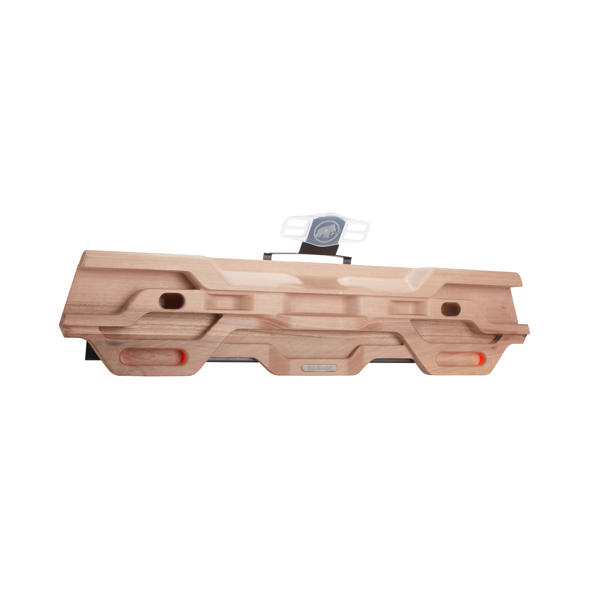
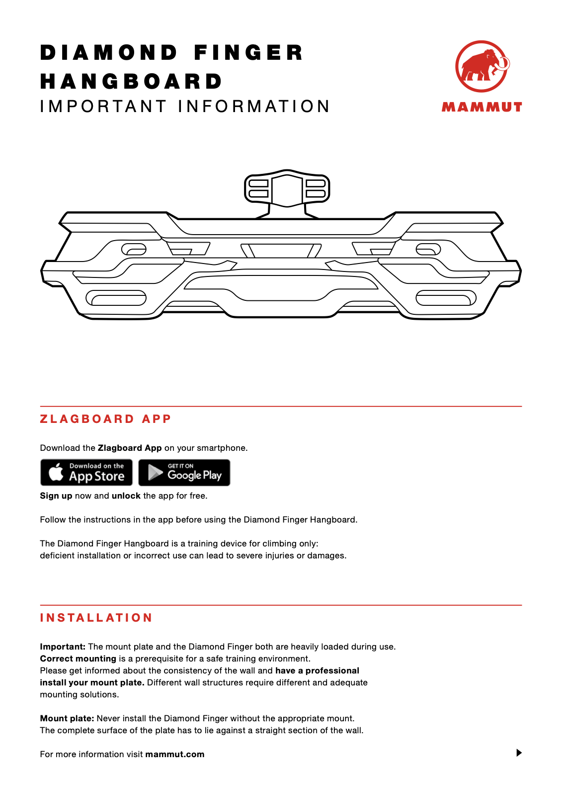

# mammut-diamond-finger source audit

Current correction (2026-09-30): the [geometry and runtime wood packet](geometry-and-wood-review/review.md) and [review page](geometry-and-wood-review/index.html) supersede the original construction described below. The current source is `06fb78ae8190d4ee90fdc343889940df1a33ddc552e5b866242eb55fae2158fe`; its unbound USDZ is `736b9390c36ba8dfadbc8d272db42a3c79a8f61d64d9142167fc67faa2eddd12`. It has 39 fully constrained sketches, flatter machined terraces, straight chamfers and notches, pill openings, angular recessed shelves and tray, and 106,272 exported triangles. All 16 original contact IDs and board facts are preserved; only the display finish opts into the existing runtime wood system.

The additionally retained [manufacturer press document](geometry-and-wood-review/sources/manufacturer-press-release.docx) confirms 85 cm width and walnut. Height, thickness, recess depths, slightly forward-sloping floors, tapers, rounds and the whole side profile remain display estimates. Final app, native/export, iOS/Python and delivery checks passed; the user accepted the shown revised geometry and wood finish with “Good enough” in [human review #6](human-review.json). Opus's [fourth opinion](geometry-and-wood-review/opus/review-response-4.md) found no source-supported app blocker.

The following text and linked original reports are the historical initial migration record. Their former geometry, counts and pending integration statements are preserved as history, rather than asserted to describe the corrected package.

Exact 2060-00020 walnut revision. Product photo supports deliberately sculpted upper channels, three lower lobes, symmetric cavity arrangement, and removal of phone/mount hardware. Manufacturer manual page 1 is a materially distinct drawn topology view; page 2 shows side/mount context. The second gallery photograph differs only by a phone accessory and is not counted as a second geometric view. Preserve the existing 16 contact IDs; the subtitle says 21 surfaces but no contact-inventory change is in scope. Only 33.5 in width is published in current package; other display dimensions stay explicitly estimated.

Source-set approval: asherlc, 2026-09-29, direct conversation: “those are fine, feel free to use more searches for individual boards as needed”. Consolidated snapshot: `.context/placid-badger/source-review.json`.

## Sources

- [product-01.jpg](https://static.mammut.com/master/2060-00020-7458_main_75743.jpg) — Mammut; SHA-256 `d08c0f36233171789ff450f4429646079f67ca2506da2f794ecf61089982014f`. Manufacturer gallery.
- [manual.pdf](https://static.mammut.com/file/2060-00020_man_en_070420_DiamondFingerHangboard_Manual.pdf) — Mammut; SHA-256 `0ada1438277dae39cf96e45dc72f9d0aabe383502718368f143212bf8e51b024`. Revision identity and mounting form.

## Immutable pre-migration reference

Git commit `d0e4e95191e4a76822815bb4eeef3a32caa6fea0`; USDZ SHA-256 `afdb299d0ee8558bfafcfe515b07e7a4ff2cee537db7a0dd2d0bc32d4889ba42`; descriptor SHA-256 `11362e19ea28ff621c74fba9868306f4004b7beb899dc67c70b6f4e4f544f622`. Bytes resolved through Git LFS and checked against the pointer. These are review/measurement references only.

## Retained primary visual comparison

## Native construction and verification

The canonical source is `Hangboards/mammut-diamond-finger/mammut-diamond-finger.FCStd`. It contains 58 fully constrained Sketcher profiles with a symmetric curved silhouette, a continuous native cubic front-relief profile, explicitly drawn trapezoid/bean/lateral-channel cutter lofts, analytic small-pocket lofts and final-body contact binders. The source embeds the original board metadata exactly and reopens/recomputes without authoring scripts, Python callbacks or an external mesh dependency. Named depth parameters drive the physical cavity floors. The obsolete on-disk `board.json` was removed only after an exact metadata roundtrip.

The 850 mm display width is consistent with the original rounded 33.5-inch metadata. Height, thickness, all pocket depths, opening sizes, relief curves and transition radii are operator-selected display estimates; no new factory dimensions or structured grip depths are asserted. The existing 16 contact IDs are preserved, including the small nested upper insets, lateral channels and central edge. Two visually documented lower recesses are included in the physical body without adding contact IDs. The pre-existing subtitle says 21 contact surfaces while the preserved inventory contains 16; that discrepancy remains explicitly unresolved and was not used to invent grips. Phone cradle, mounting plate, logos and colored inserts are omitted under repository policy.

Native checking passed validity for 1 solid(s), all 16 stable contact IDs, body-surface membership, absence of contact sheets on the rear plane and pairwise contact-surface non-overlap. Editing `Depth_mam_lateral_ledge_l` from 52 to 54 mm changed the physical body and only mam-lateral-ledge-l; restoring the parameter restored every contact bound and left the saved source bytes unchanged. The pinned compiler passed all ten source/archive, geometry, binding, depth, reimport, descriptor and staged-package stages. The final runtime contains 17 nodes and 66,799 triangles with no material/shader prims or material bindings. Hashes, dimensions, native checks, original source mappings and compiler evidence are retained beside this record.

| View | Prior and native CAD |
| --- | --- |
| Front | [Comparison](review/comparison-front.png) |
| Side | [Comparison](review/comparison-side.png) |
| Top | [Comparison](review/comparison-top.png) |

All three final comparisons were visually inspected alongside the retained manufacturer imagery. The exact prior asset comes from commit `d0e4e95191e4a76822815bb4eeef3a32caa6fea0`. Renders use the shared `preview.py` renderer, including its corrected positive-X side and positive-Z top painter order. The CPU previews shade triangle face normals while runtime exports retain native CAD surface normals. Native-app appearance, selection and performance acceptance remain root integration work.
