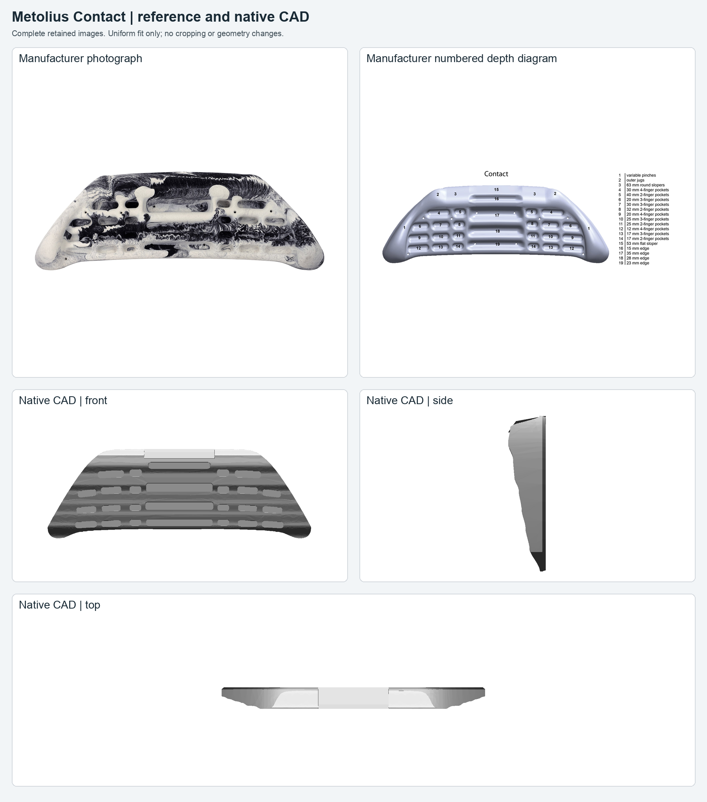
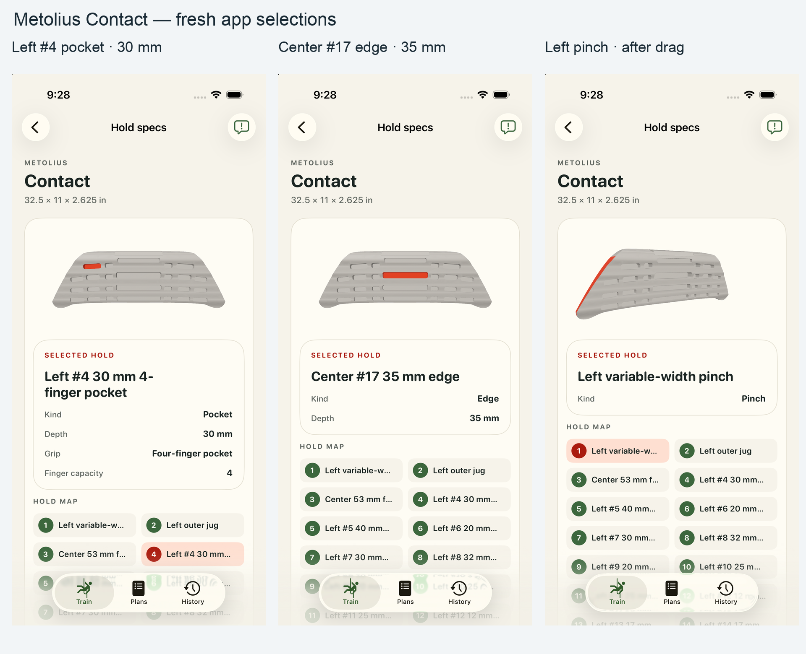
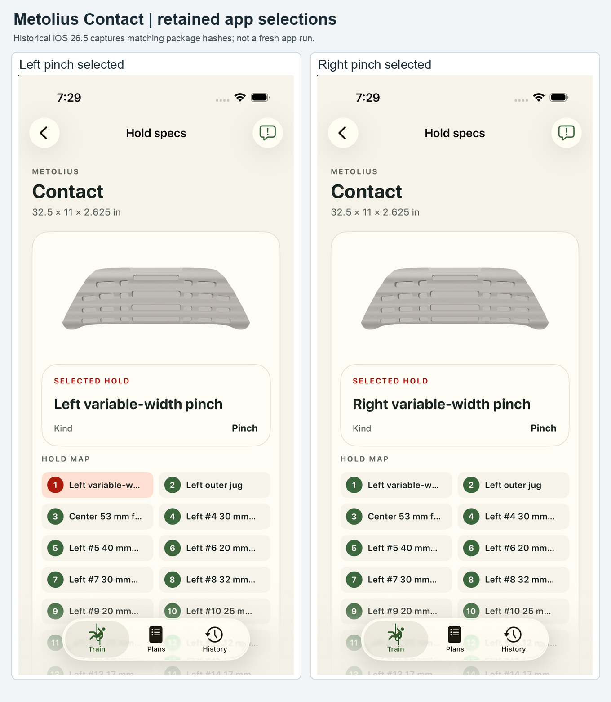

# Metolius Contact — review #7

Current package bytes match retained app validation, package verification and exact reproducibility proof. The fresh installed package also matches the native manifest, descriptor and model byte for byte. Original evidence is unchanged. Human acceptance pending.

## Fresh app review

Four fresh complete app captures were inspected: left #4 pocket, center #17 edge, left pinch front and left pinch after an actual drag. The pocket and edge highlights are visible from the front; the selected side pinch becomes visible after the drag, with selection preserved. The simulator and build directory were deleted and deletion verified.

## Review qualifications

- Published envelope: 32.5 × 11 × 2.625 in, represented as 826 × 279 × 67 mm. The manufacturer diagram specifies 22 pocket depths, four central edge depths, a 53 mm flat sloper and 63 mm round slopers.
- Aperture sizes and centres, relief curves, corner radii, central roof angle and unmeasured transitions are operator-selected display estimates. Lip and relief shapes differ visibly from the prior mesh; see complete comparisons below.
- All 33 existing contact IDs and hand-capacity metadata are retained. Separate historical capacity work was not silently incorporated.
- Neutral appearance is intentional: manufacturer swirl textures, colors, material bindings and mounting hardware are omitted.
- Historical app captures identify the left/right pinch selection in the UI, but no clearly visible selected pinch surface appears on the front model in these views. They do not establish highlight extent or all-contact visual coverage.
- A fresh iOS build and four full-frame app captures verify a selected left pocket, center edge and left pinch, including one real drag with selection preserved. All 33 contact IDs are available through accessibility. This is representative visual coverage, not an all-contact visual sweep. No geometry, package, appearance or source code changed; retained CAD compilation and reproducibility proof remain applicable. Human acceptance remains pending.

## Historical app evidence

These earlier frontal pinch captures are retained separately from the new app run.

## Full images and proof

- [Manufacturer photograph](../sources/product-01.jpg)
- [Manufacturer depth diagram](../sources/product-02.jpg)
- [Source audit](../source-audit.md)
- [Fresh app validation](fresh-app/validation.json)
- [Installed package validation](fresh-app/proof/installed-package-validation.json)
- [Fresh build result](fresh-app/proof/ios-build-command.json)
- [Verified resource cleanup](fresh-app/proof/verified-cleanup.json)
- [Historical app capture validation](../app-review/validation.json)
- [Native package proof](../package-verification.json)
- [Retained exact reproducibility](../reproducibility-final.json)
- [Prior/current front](../review/comparison-front.png)
- [Prior/current side](../review/comparison-side.png)
- [Prior/current top](../review/comparison-top.png)
- [Exact hashes and image placements](provenance.json)
