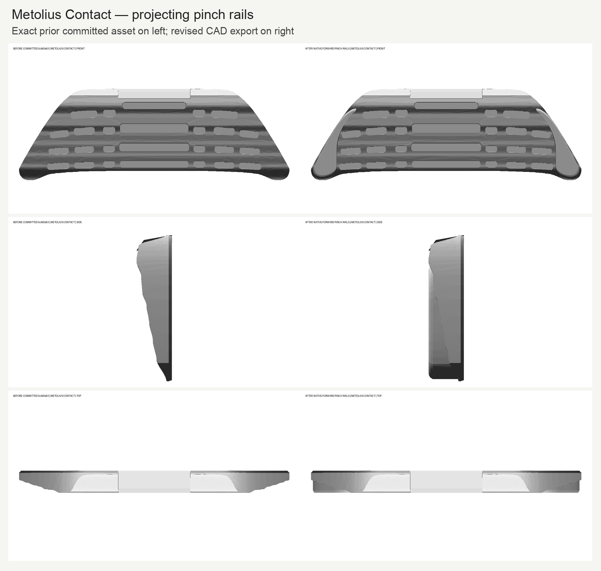
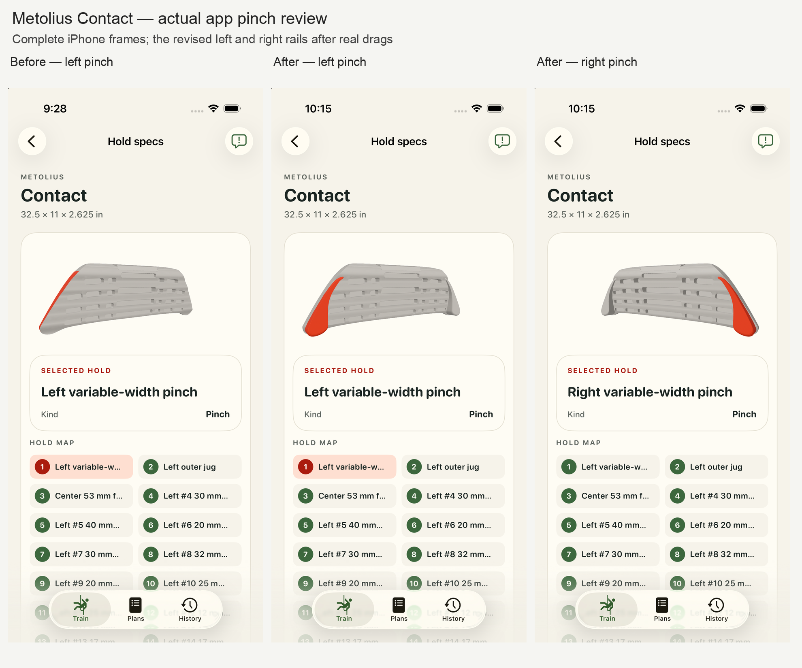
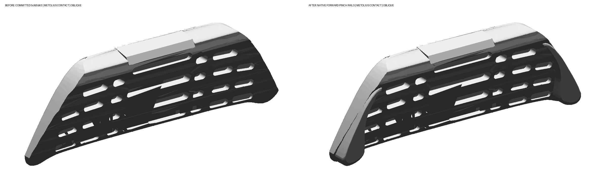

# Metolius Contact — review #7, projecting pinch rails

The previous outer bands followed the smooth shell and did not provide projecting rails to pinch. The revised native model adds a continuous rounded rail on each side, with opposing exposed surfaces. Both rails mirror exactly and their contact highlights follow the new native surfaces.

The exact prior committed asset from `5cfd5b6386b283b2eb8daefc054a42823fdf852b` is on the left in each comparison; the revised CAD export is on the right. Front, side, top and oblique images were inspected alongside the retained manufacturer photograph and numbered diagram. App captures show both pinch selections after actual drag rotations, plus an unchanged pocket and center edge selection.

All 33 contact facts, the raw embedded manifest, all 31 non-pinch native contact constructions and the published envelope/depth checks are preserved. Five constrained analytic rail sections are fused onto the original pocketed solid, so the previous pockets and jugs remain intact. The final body and both pinch surfaces remain editable in native CAD. USDZ meshes remain unbound and the existing neutral runtime finish is unchanged.

Rail projection, widths, curves, section scales and rounding are display estimates. Local projection measured from this authored CAD is 23.54–38.45 mm; Metolius does not publish those rail dimensions. The retained manufacturer [photograph](../sources/product-01.jpg) and [numbered depth diagram](../sources/product-02.jpg) support the feature interpretation, while the [product page](https://www.metoliusclimbing.com/products/contact-training-board) identifies the variable-width pinches and overall dimensions. No pixel measurements or image tracing were used.

Independent native/source/export checks passed, including actual parameter edit and restore, mirrored opposing surfaces, final-solid contact membership and ten exported rail witnesses. Two compiler runs produced identical model bytes. The full iOS suite passed 1,278 tests with three skipped; the Python suite passed 706 with ten skipped. All 64 installed Apple packages and canonical Android staging match current source; all 203 files outside this Contact package are unchanged. The isolated review simulator and its derived build and test bundle were deleted and deletion was verified.

The full validation and its practical limits are in [runtime-validation.json](runtime-validation.json). Original raw proof bytes and their copy mappings are retained in [raw-retention.json](raw-retention.json); the package hashes and source references are in [provenance.json](provenance.json).

Human acceptance is pending. Review remains on #7; the first six accepted boards and the remaining queue are unchanged.

Does the pinch look right now?
