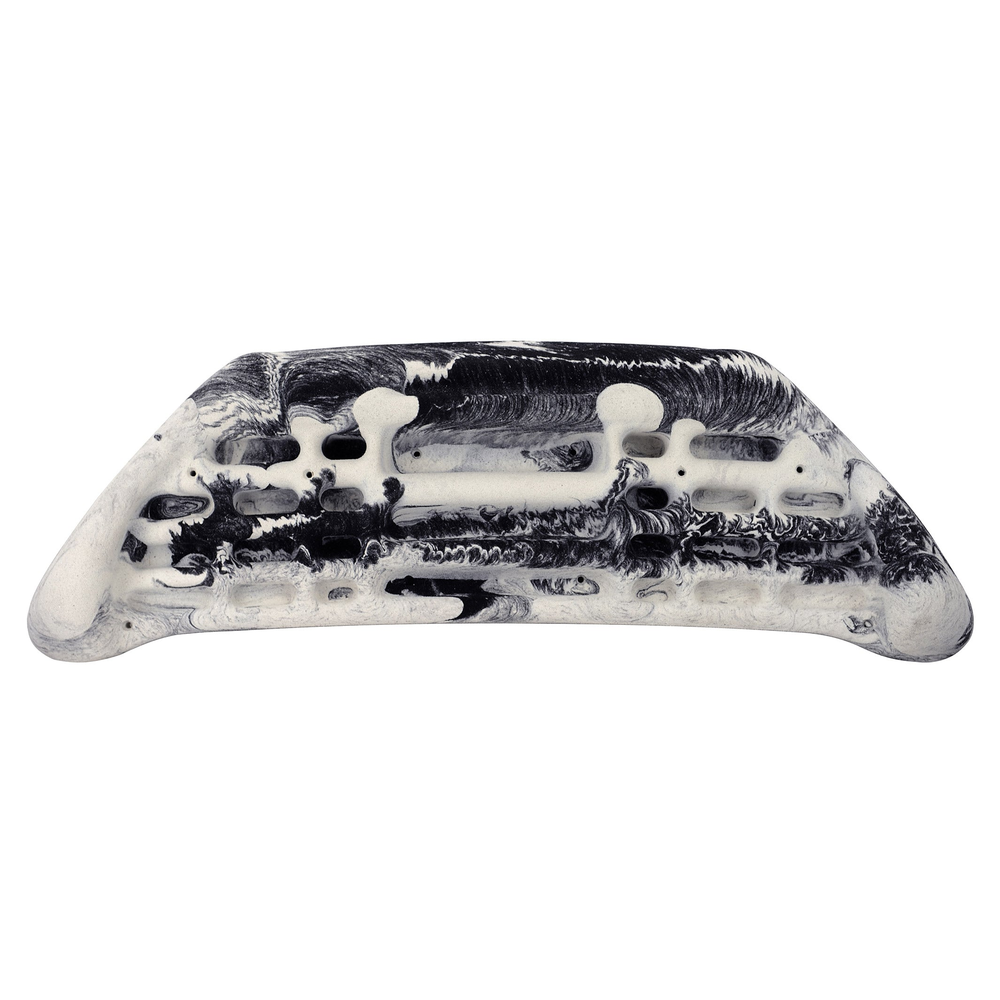
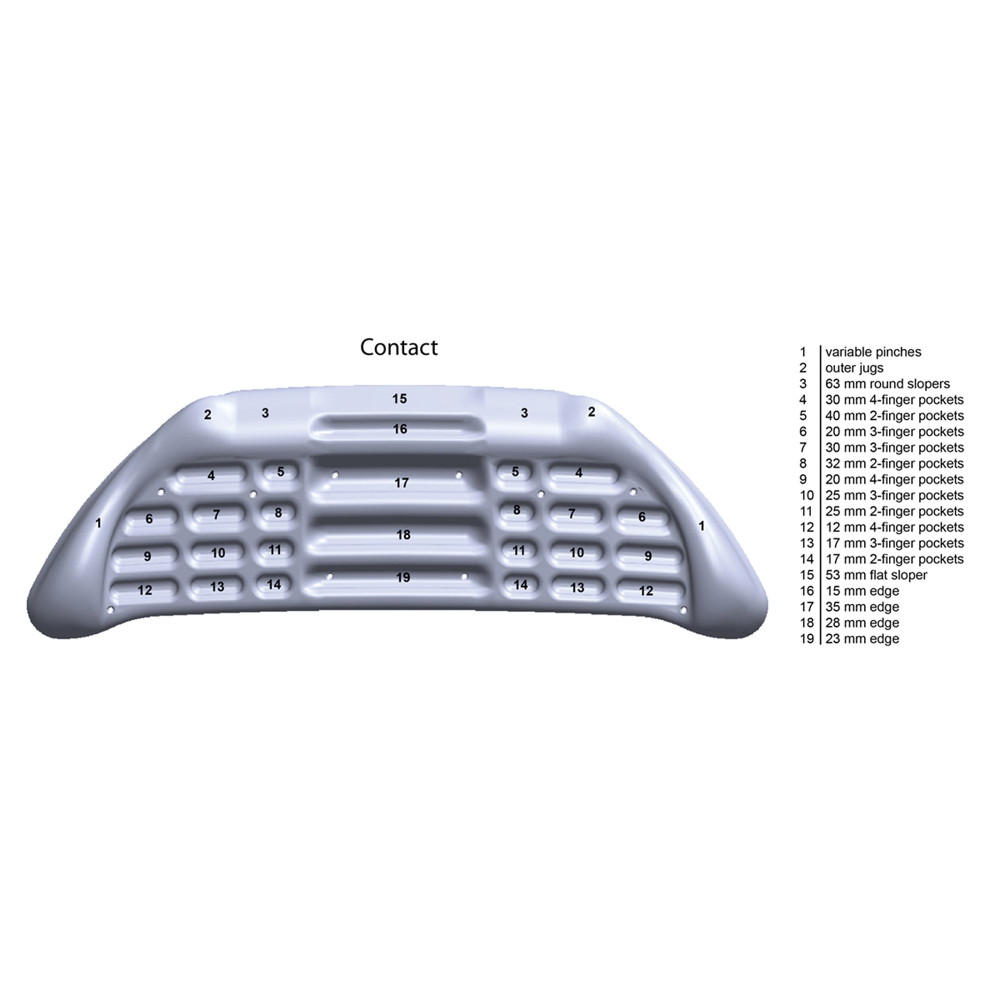

# Metolius Contact — current native revision

The projecting pinch-rail correction for review #7 is documented in [pinch-rails-review/review.md](pinch-rails-review/review.md), with exact prior-versus-revised front/side/top and app comparisons. The canonical FCStd now includes 140 constrained sketches and the exported asset has 36,299 triangles. All original board facts and 31 non-pinch native contact constructions are unchanged. The current source/model/descriptor identities are pinned in [runtime-validation.json](pinch-rails-review/runtime-validation.json). Human review remains pending.

The original migration audit below is historical. Its unedited bytes are retained in [before/source-audit.md](pinch-rails-review/before/source-audit.md); original compiler/native reports describe that earlier source and remain unchanged.

---

# metolius-contact source audit

Manufacturer photograph and independent numbered depth diagram establish curved symmetric shell, 11 pocket pairs, four central edges, outer jugs, variable pinches, flat center sloper and paired round slopers. Published envelope 32.5 x 11 x 2.625 in. Diagram depths match existing pocket and central-edge facts. Preserve existing IDs and handCapacity fields; another active PR #516 concerns handCapacity only.

Source-set approval: asherlc, 2026-09-29, direct conversation: “those are fine, feel free to use more searches for individual boards as needed”. Consolidated snapshot: `.context/placid-badger/source-review.json`.

## Sources

- [product-01.jpg](https://cdn.shopify.com/s/files/1/0955/0030/4457/files/Contact-Hangboard-black-white.jpg?v=1759459002) — Metolius; SHA-256 `b9cf153d82f0072ae2e4b0064821dee1d666ff1d8b34ba21fed1fcfd6944c055`. Manufacturer product gallery.
- [product-02.jpg](https://cdn.shopify.com/s/files/1/0955/0030/4457/files/con-num-dep_341f2901-a11e-4256-a4c3-0531110c730e.jpg?v=1762201170) — Metolius; SHA-256 `6c824af42552a9ed12f7e336dac47d9a2c61441b6f90515d196f3484ad0a1202`. Manufacturer product gallery.

## Immutable pre-migration reference

Git commit `d0e4e95191e4a76822815bb4eeef3a32caa6fea0`; USDZ SHA-256 `b3ebd064731ff948900641c6270154ace42d8cb881b01afc422d0117de51d736`; descriptor SHA-256 `9569f4b76ebd972647f06d1ab9805a9f7ea016586b538331e7e41f311026be0a`. Bytes resolved through Git LFS and checked against the pointer. These are review/measurement references only.

## Retained primary visual comparison

## Native construction and verification

The canonical source is `Hangboards/metolius-contact/metolius-contact.FCStd`. It contains 135 fully constrained Sketcher profiles with a symmetric analytic silhouette, continuous native cubic front relief, a separate planar center sloper roof, 26 capsule-pocket lofts and final-solid surface binders. The source embeds the original board metadata exactly and reopens/recomputes without authoring scripts, Python callbacks or an external mesh dependency. Named depth parameters drive the physical cavity floors. The obsolete on-disk `board.json` was removed only after an exact metadata roundtrip.

The manufacturer envelope is 826 x 279 x 67 mm. The native checks enforce that envelope, all 26 published pocket depths, the 53 mm center flat-sloper depth and both 63 mm round-sloper regions. The first smooth envelope was rejected during dimensional/visual review because it overshot the outer width; the final ruled silhouette loft remains within the declared perimeter. Aperture sizes and centers, relief curves, corner radii, center roof angle and unmeasured transitions are operator-selected display estimates. Original hand-capacity metadata is retained unchanged; the independent #516 capacity work was not incorporated or overwritten.

Native checking passed validity for 1 solid(s), all 33 stable contact IDs, body-surface membership, absence of contact sheets on the rear plane and pairwise contact-surface non-overlap. Editing `Depth_edge_16_center` from 15 to 17 mm changed the physical body and only edge-16-center; restoring the parameter restored every contact bound and left the saved source bytes unchanged. The pinned compiler passed all ten source/archive, geometry, binding, depth, reimport, descriptor and staged-package stages. The final runtime contains 34 nodes and 32,262 triangles with no material/shader prims or material bindings. Hashes, dimensions, native checks, original source mappings and compiler evidence are retained beside this record.

| View | Prior and native CAD |
| --- | --- |
| Front | [Comparison](review/comparison-front.png) |
| Side | [Comparison](review/comparison-side.png) |
| Top | [Comparison](review/comparison-top.png) |

All three final comparisons were visually inspected alongside the retained manufacturer imagery. The exact prior asset comes from commit `d0e4e95191e4a76822815bb4eeef3a32caa6fea0`. Renders use the shared `preview.py` renderer, including its corrected positive-X side and positive-Z top painter order. Native-app selection and performance acceptance remain root integration work.

The CPU review renders shade triangle face normals; the runtime export retains native CAD surface normals. Native-app screenshots remain the final appearance check.
