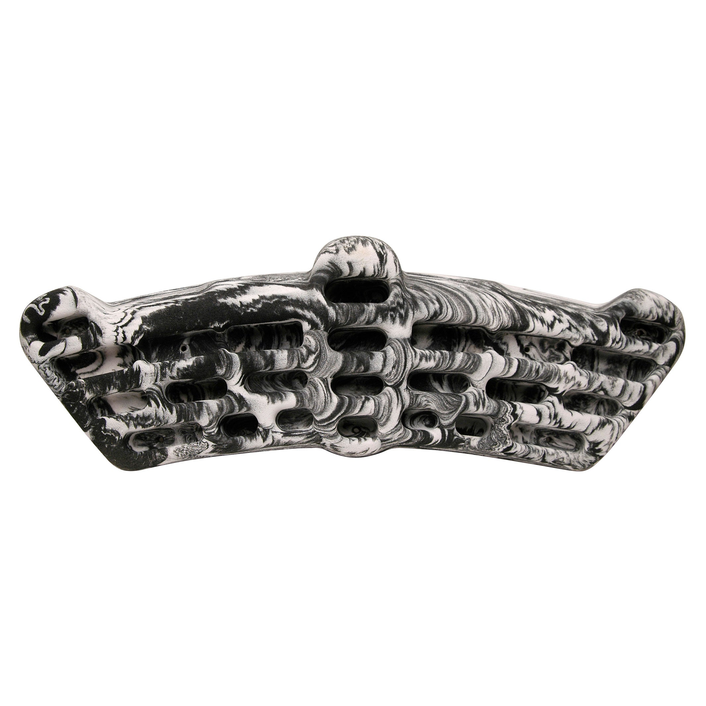

# metolius-simulator-3d source audit

Manufacturer photograph and independent numbered depth diagram establish broad arc shell taper, outer and center jugs, top slopers, long second-row edges, lower pocket pairs and four central pockets. Published envelope 28 x 8.75 in. Preserve current split left/right flat sloper and combined center round sloper identity. Another active PR #516 concerns handCapacity only.

Source-set approval: asherlc, 2026-09-29, direct conversation: “those are fine, feel free to use more searches for individual boards as needed”. Consolidated snapshot: `.context/placid-badger/source-review.json`.

## Sources

- [product-01.jpg](https://cdn.shopify.com/s/files/1/0955/0030/4457/files/Simulator-black-white.jpg?v=1759460469) — Metolius; SHA-256 `5ac1677d6280dc90242cb1dcef47691647fd3f5a9adc3c465838e930075f58a9`. Manufacturer product gallery.
- [product-03.jpg](https://cdn.shopify.com/s/files/1/0955/0030/4457/files/sim-num-dep_c543622d-e670-4601-8d4d-792cc8e46dea.jpg?v=1762201085) — Metolius; SHA-256 `e9561ab3fb6d3a85014097dcbdb0bc3d9c4079f9cb0954bd87965d180329932a`. Manufacturer product gallery.

## Immutable pre-migration reference

Git commit `d0e4e95191e4a76822815bb4eeef3a32caa6fea0`; USDZ SHA-256 `009a01ee856ea496cdf3b3e8fd182db034ccac15f864e80d51f1c34791d89106`; descriptor SHA-256 `7caeb6a2d296ffbbc94e5f71104ca272d9dd1999f54f12e35363509617b1412f`. Bytes resolved through Git LFS and checked against the pointer. These are review/measurement references only.

## Retained primary visual comparison

## Native construction and verification

The canonical source is `Hangboards/metolius-simulator-3d/metolius-simulator-3d.FCStd`. It contains 128 fully constrained Sketcher profiles with a symmetric analytic silhouette, continuous cubic front relief, distinct native flat/round shoulder roofs, 24 capsule-pocket lofts and final-solid semantic surface binders. The source embeds the original board metadata exactly and reopens/recomputes without authoring scripts, Python callbacks or an external mesh dependency. Named depth parameters drive the physical cavity floors. The obsolete on-disk `board.json` was removed only after an exact metadata roundtrip.

The native checks enforce the manufacturer 711 x 222 mm face envelope, all 24 published pocket depths and the chart-specified 55 mm flat and 65 mm round sloper regions. The approximately 94 mm display depth, aperture widths/centers, relief curves, shoulder transitions and corner radii are operator-selected estimates. The original single central round-sloper ID intentionally binds two separate shoulders around the center jug, preserving inventory while avoiding surface overlap. Final face supports were selected after floor-depth normalization, preventing stale topology from an intermediate shallow-pocket adjustment. Original hand-capacity metadata remains unchanged; the independent #516 capacity work was not incorporated or overwritten.

Native checking passed validity for 1 solid(s), all 30 stable contact IDs, body-surface membership, absence of contact sheets on the rear plane and pairwise contact-surface non-overlap. Editing `Depth_edge_11_left` from 14 to 16 mm changed the physical body and only edge-11-left; restoring the parameter restored every contact bound and left the saved source bytes unchanged. The pinned compiler passed all ten source/archive, geometry, binding, depth, reimport, descriptor and staged-package stages. The final runtime contains 31 nodes and 34,634 triangles with no material/shader prims or material bindings. Hashes, dimensions, native checks, original source mappings and compiler evidence are retained beside this record.

| View | Prior and native CAD |
| --- | --- |
| Front | [Comparison](review/comparison-front.png) |
| Side | [Comparison](review/comparison-side.png) |
| Top | [Comparison](review/comparison-top.png) |

All three final comparisons were visually inspected alongside the retained manufacturer imagery. The exact prior asset comes from commit `d0e4e95191e4a76822815bb4eeef3a32caa6fea0`. Renders use the shared `preview.py` renderer, including its corrected positive-X side and positive-Z top painter order. The CPU previews shade triangle face normals while runtime exports retain native CAD surface normals. Native-app appearance, selection and performance acceptance remain root integration work.
