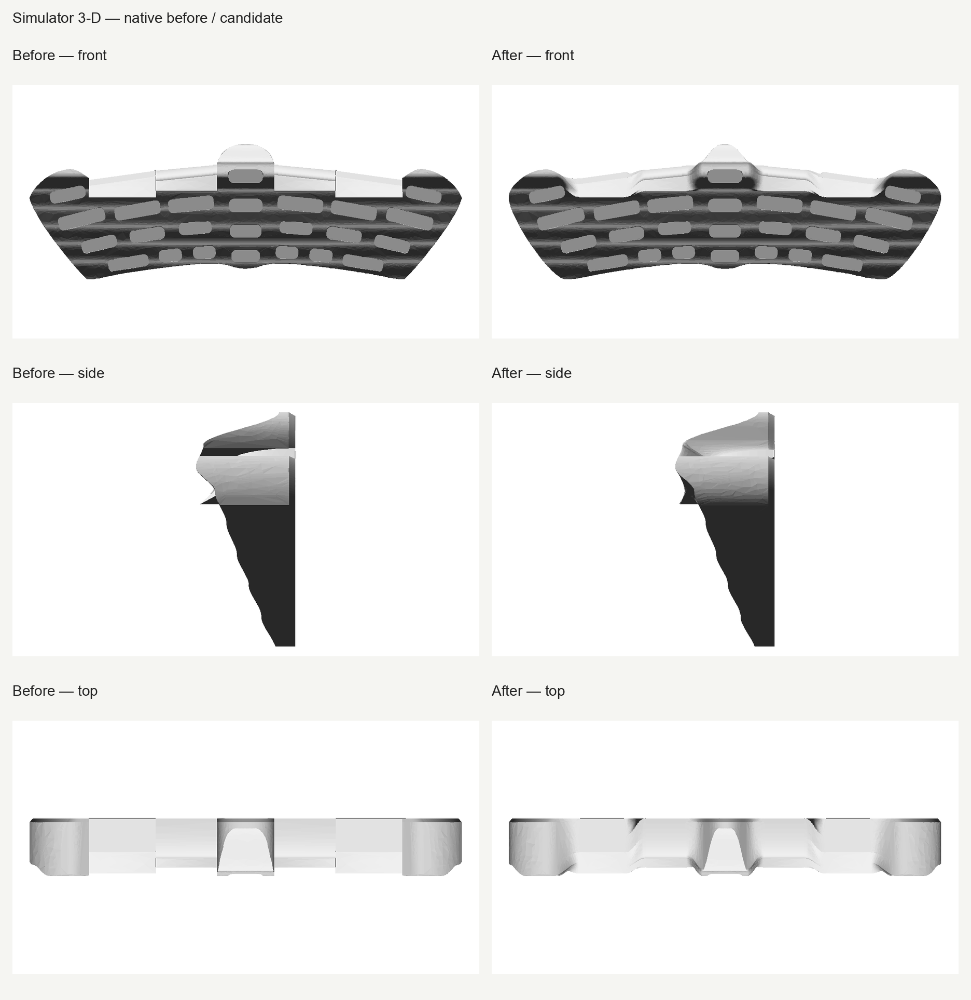
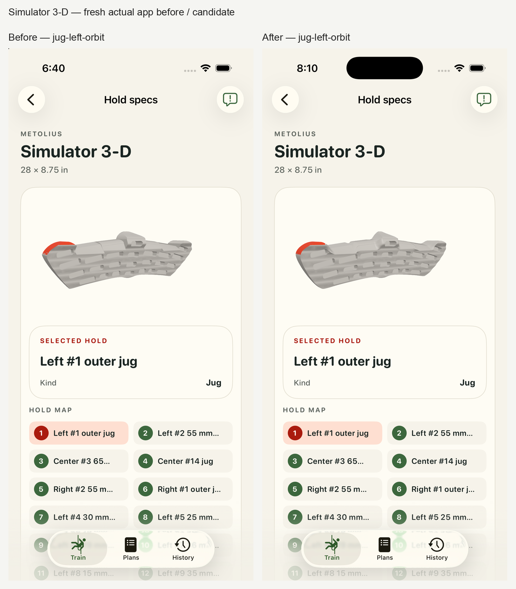

# Metolius Simulator 3-D — revised review #8

Rounded outline joins and blended shoulder transitions; actual-app inspection confirms smoother corners and continuous shoulders, with representative highlights preserved. Published face and hold-depth facts and all 30 logical contacts are unchanged. Revised human acceptance remains pending.

The original **Jagged** feedback and exact prior source/model/descriptor bytes are preserved in `before/`. Fresh captures cover five representative selected IDs and three real drag orbits, not every contact visually. Native continuity measurements do not certify manufacturer accuracy or final app appearance.

Authored overall thickness is measured 94.1183246 mm, a display estimate with a +0.1183246 mm difference from the former ~94 mm estimate. Exact 94 mm preservation is not claimed. Published 711 × 222 mm face dimensions and 27 hold-depth checks retain their strict original gates. The final continuity report measures residual roof normal changes up to 6.7698°. Finite probes do not establish global roof G1 or C1 continuity. Loft widths, guards and control poles remain display estimates. The exact thickness finding and its final disposition remain visible; the standard 0.28 mm tessellation deflection is unchanged.

cleanup-command-output.log contains the exact fresh read-only cleanup-verification stdout after the registered EXIT trap completed teardown. It is not the original trap stdout; verified-cleanup.json and the fresh device-list bytes prove the exact reviewed UUID is absent and DerivedData/test bundle were deleted.

[Exact technical proofs](runtime-validation.json) · [Raw copy hashes](raw-retention.json). Human acceptance is pending. Reviews #1–7 and #9 onward remain unchanged.
