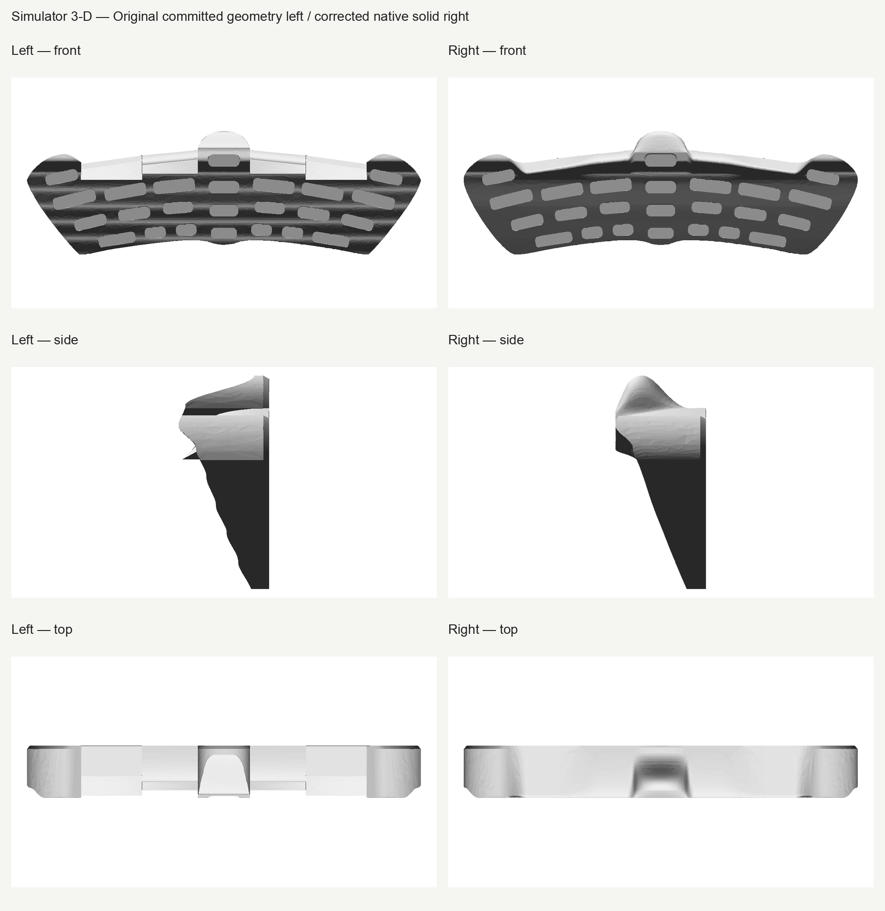
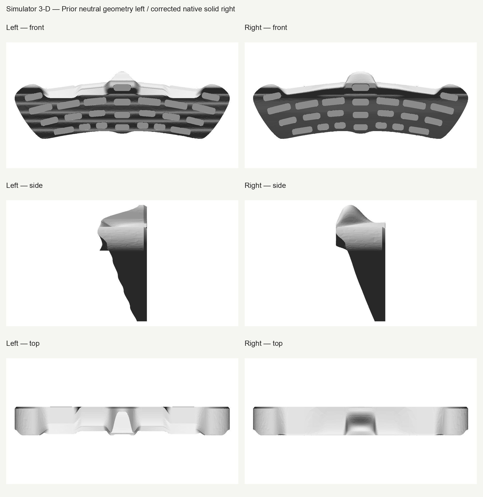
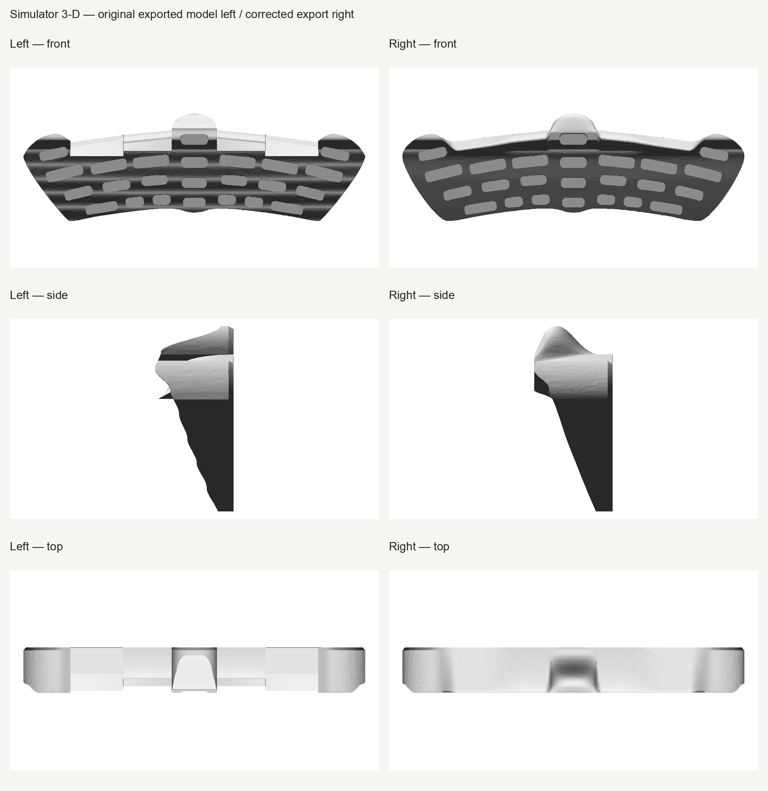
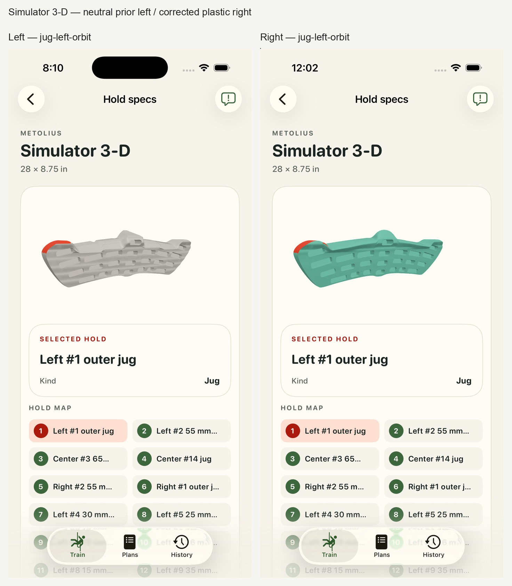
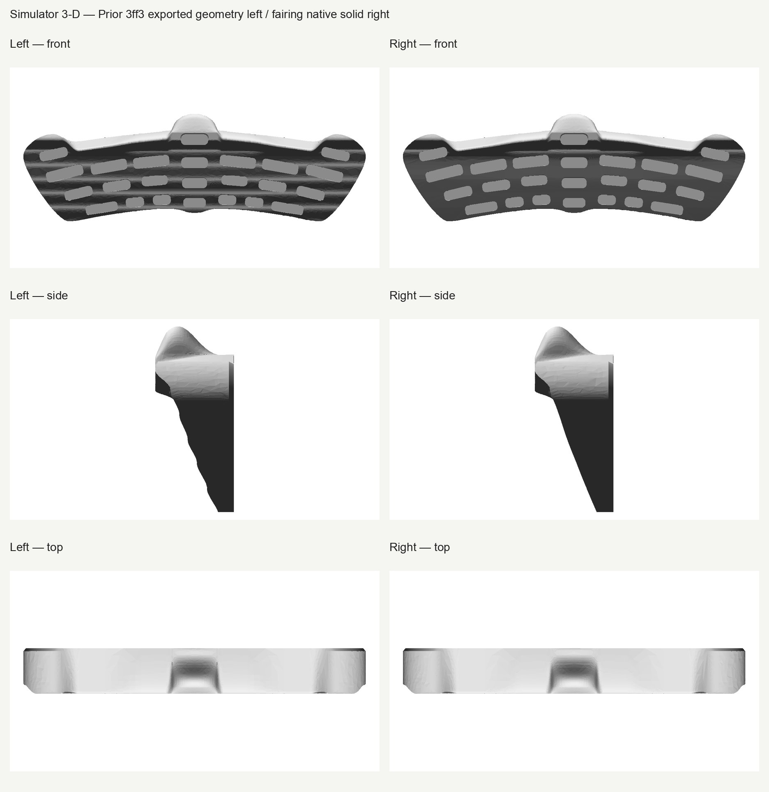
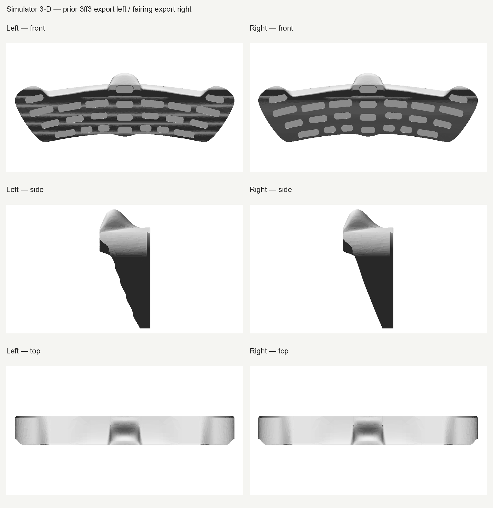
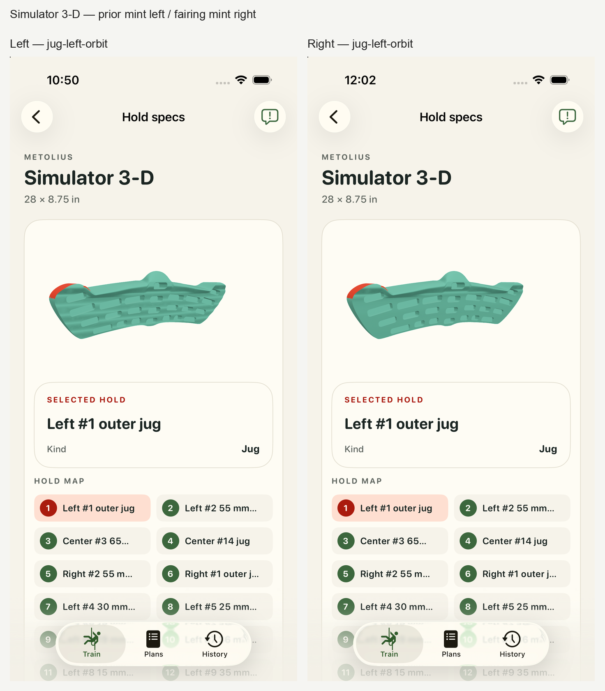

# Metolius Simulator 3-D — Opus corrections, fairing and plastic, review #8

Fair lower front face, corrected center jug and forward slopers, with plastic display finish. Fresh actual-app inspection shows the broad waves removed and a clean rear face, with representative selection and drags preserved. Opus finds no blocker and recommends human review.

The separate fairing app comparison retains the plastic finish on both sides. Prior 3ff3 images are immutable historical captures; the final side is a fresh actual-app run. It visually isolates this geometry revision.

The neutral-to-plastic app comparison includes **both geometry and finish changes**. The neutral frames are retained historical evidence, not a fresh run. All eight neutral and eight corrected plastic frames and AX records are retained; five selected contacts and three actual drags represent this review. Four fresh finish frames include selection and deselection; four additional critical center-jug frames retain front, high-front, end-on and rear-leaning views with at least five actual swipes. The mint appearance uses the existing app palette, not a manufacturer color or swirl reproduction. The USDZ remains unbound.

Original **Jagged** feedback, the plastic instruction, the full initial Opus center-jug regression finding and subsequent Opus responses remain exact. The neutral [jagged review](../jagged-review/index.html) is immutable history superseded by the source-supported center-jug feedback. Neither prior nor final #8 is accepted.

The later `21ca…` native-gated candidate was also superseded by the user's rear-ridge and forward-sloper feedback. Its earlier Opus native pass is historical. The exact candidate/proof bytes and relayed feedback excerpts remain in `before/superseded-21ca/`; final app and Opus gates apply only to the latest corrected hashes.

The later `46df…` candidate genuinely passed strict native depth/edit/restore checks and fixed the rear ridge/front setback. Opus still requested two local junction fixes before export. Its native pass is retained in `before/superseded-46df/`, separate from the unwaived21ca failure; no final acceptance is carried forward.

The intermediate `ec348…` lip carrier failed independent C0/contact clipping checks at the X47 split. Its exact source, partial diagnostics and completed rejected clipping review remain in `before/diagnostic-native/`; no final gate uses that source. [Final-source native grasp sections and views](proof/final-native-grasp/provenance.json) are retained separately.

Additional checkpoints retain the failed `65e…` cubic approximation and `d4f…` trim BOP diagnosis. The `31bec…` checkpoint retains genuine strict native/functional passes alongside its blocked off-station seam gate. These exact historical statuses remain separate; no tolerance waiver or final acceptance is carried forward.

The later 3ff3 candidate retains technical native/export/reproducibility passes and completed mint app captures. The user's waviness question and Opus identified unsupported broad front bands requiring this fairing correction. Its raw technical passes, app frames, original feedback and corrected v2 swipe bookkeeping remain immutable in `before/diagnostic-native/`. Human review remained pending; no human rejection or acceptance is recorded.

The five new lower-profile spans retain deliberate depth anchors and shared nonzero derivatives; their local continuity does not establish global roof G1/C1. Protected upper clipped native Boolean differences are exactly zero in both directions with no difference solids, while raw mass integrals differ 3.72537953mm³; selected upstream control bounds/areas/volumes are unchanged. This is scoped native equivalence, not a byte-identical BRep claim. All estimates require visual review; final exported topology/normal coverage limits must come from fresh export reports.

Final b722 exact exported semantic shells have 2974 boundary edges and 62 non-manifold edges under exact-position welding; exact exported welded watertightness is false. 1089 triangles have opposing corner normals across 6.849906 mm². Universal corner-normal alignment is not claimed; the raw requires-review topology report is retained with its scoped technical disposition. Finite native vertices/native triangle centers/export triangle centers reach 0.229643/0.238085/0.231503 mm, within the unchanged 0.28 mm deflection; this is not continuous Hausdorff certification. All 27 exported depth facts pass their strict 0.001 mm gate. All 583 rear native facets match the actual float32-encoded export, with complete wall-facing normals; the first rear-correspondence verifier setup exception is retained alongside the passing v2 correction, with no asset changes. Root and Opus inspected all 16 fresh actual-app frames: the rear face is clean and the broad front waves are removed. Small selected contact-boundary teeth and inherited outer-jug faceting remain explicit display limitations. Technical topology and normal caveats are retained; human acceptance remains pending. The earlier 3ff3 upper-roll vertical-ray failure/Euclidean supplement remain historical and are not promoted as b722 findings.

The raw 192-corner legacy comparison remains review-required at 7.161516° for one corner. The separate strict native supplement passes: 191 corners agree with the legacy result; one uses its unique actual native facet owner (face 53, index 52), whose UV and same-face inverse position differ only 3.18e−14mm and whose normals agree at 0°. The legacy heuristic instead used adjacent face 26, projecting that corner 0.200909mm away. The original <0.001° angular gate, ≤0.00002mm UV-position gate and exact export-position gate remain unchanged. This finite sample does not certify universal normal equivalence. The first three exports were stopped for diagnosis, with exact logs/ownership/cleanup retained as stopped diagnostics; unchanged b722/f4 was then rerun.

[Exact exported high-front comparison](proof/front-fairing-export-grasp-review/comparison-high-front.png) · [Rear-center comparison](proof/front-fairing-export-grasp-review/comparison-rear-center.png) · [Rear-oblique comparison](proof/front-fairing-export-grasp-review/comparison-rear-oblique.png) · [Grasp sections](proof/front-fairing-export-grasp-review/comparison-grasp-sections.png).

The center-jug rear return and finger-room profile are operator-selected display adaptations responding to user feedback. The retained manufacturer front photographs, comparison sheet and mounting instructions do not establish a definitive rear profile or any incut dimension. The 55/65 mm sloper support depths remain sourced; locating those support bands from the front backward is an explicitly labeled interpretation and display adaptation. No material chemistry, manufacturer mint color, global roof G1/C1 continuity or exact estimated thickness is claimed.

Overall thickness is measured 94.0007501 mm, a display estimate. Published 711 × 222 mm face dimensions and all 27 hold-depth checks retain their strict gates. Exact 94 mm thickness preservation is not claimed. At the retained ±0.0001 mm seam probes, sampled normal changes reach 2.0557°. Finite probes do not establish global roof G1 or C1 continuity. Estimated transitions, rounding, loft controls and thickness remain display geometry.

The retained ios/ios-cleanup.json records the registered EXIT trap result for exact owned Simulator 72312582-DB46-44A7-9C61-D8C0E9F75876 and removal of its DerivedData/test bundle. ios/verified-cleanup.json and devices-fresh-deletion-verification.json are the later independent read-only deletion verification; they are not original trap stdout. Only the exact owned Simulator/build/test resources and archived/closed Opus advisor were cleaned.

[Technical proofs](runtime-validation.json) · [Raw copy hashes](raw-retention.json) · [First Opus take](proof/opus/opus-first-review.md) · [Final Opus take](proof/opus/opus-final-review.md). Human acceptance remains pending; #1–7 and #9 onward are unchanged.
