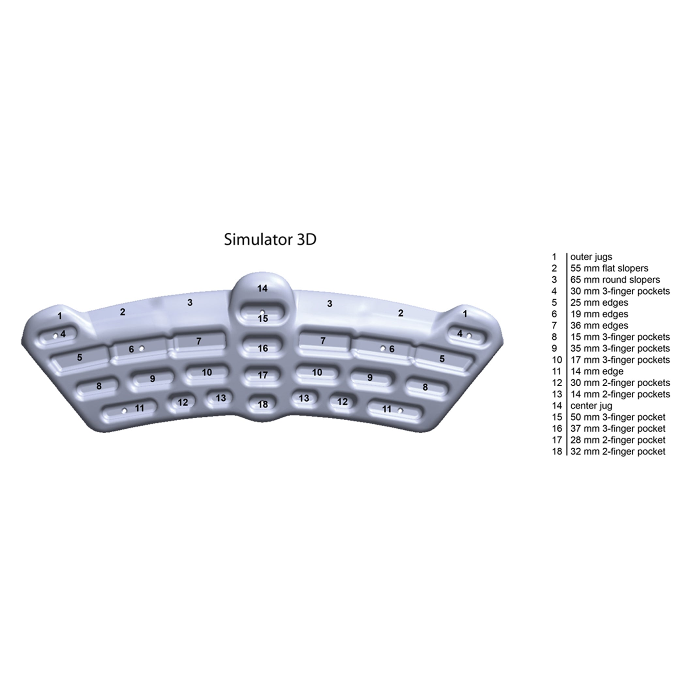

Asher accepted the displayed Simulator 3-D with “lgtm” on 2026-10-01. The source is `b7223032abe4b5c00a8b16d8ddcafed8b836d806795f1d37bbffab80ce5560ef`. All retained technical limits still apply. The immutable review packet records its pre-acceptance state; the current [human review record](human-review.json) records the reply.

# Metolius Simulator 3-D — current Opus corrections, fairing and plastic revision

Fair lower front face, corrected center jug and forward slopers, with plastic display finish. Fresh actual-app inspection shows the broad waves removed and a clean rear face, with representative selection and drags preserved. Opus finds no blocker and recommends human review.

[Current review packet](opus-and-plastic-review/review.md) and [hash-bound technical/Opus proof](opus-and-plastic-review/runtime-validation.json) supersede the prior neutral candidate after the source-supported center-jug feedback. Human acceptance remains pending. The existing app mint palette reflects `display.surfaceFinish=plastic`; no manufacturer color or texture claim is made.

Overall thickness is measured 94.0007501 mm, a display estimate. Published 711 × 222 mm face dimensions and all 27 hold-depth checks retain their strict gates. Exact 94 mm thickness preservation is not claimed. At the retained ±0.0001 mm seam probes, sampled normal changes reach 2.0557°. Finite probes do not establish global roof G1 or C1 continuity. Estimated transitions, rounding, loft controls and thickness remain display geometry.

The center-jug rear return and finger-room profile are operator-selected display adaptations responding to user feedback. The retained manufacturer front photographs, comparison sheet and mounting instructions do not establish a definitive rear profile or any incut dimension. The 55/65 mm sloper support depths remain sourced; locating those support bands from the front backward is an explicitly labeled interpretation and display adaptation. No material chemistry, manufacturer mint color, global roof G1/C1 continuity or exact estimated thickness is claimed.

The later 3ff3 technical pass and mint app checkpoint remain exact historical evidence. The user's waviness question and retained Opus finding prompted the new front-profile fairing; that checkpoint carried no human acceptance or rejection. The five new lower-profile spans retain deliberate depth anchors and shared nonzero derivatives; their local continuity does not establish global roof G1/C1. Protected upper clipped native Boolean differences are exactly zero in both directions with no difference solids, while raw mass integrals differ 3.72537953mm³; selected upstream control bounds/areas/volumes are unchanged. This is scoped native equivalence, not a byte-identical BRep claim. All estimates require visual review; final exported topology/normal coverage limits must come from fresh export reports.

The neutral audit and exact review state below are historical; its [jagged packet](jagged-review/index.html) remains immutable. Both initial and neutral candidates and raw feedback are preserved in [before/](opus-and-plastic-review/before/).

---

# Metolius Simulator 3-D — current native revision

Rounded outline joins and blended shoulder transitions; actual-app inspection confirms smoother corners and continuous shoulders, with representative highlights preserved. Published face and hold-depth facts and all 30 logical contacts are unchanged. Revised human acceptance remains pending.

The correction responding to **Jagged** is shown in [jagged-review/review.md](jagged-review/review.md). Current source/model/descriptor identities and technical evidence are pinned in [runtime-validation.json](jagged-review/runtime-validation.json). Human acceptance remains pending. Authored overall thickness is measured 94.1183246 mm, a display estimate with a +0.1183246 mm difference from the former ~94 mm estimate. Exact 94 mm preservation is not claimed. Published 711 × 222 mm face dimensions and 27 hold-depth checks retain their strict original gates. The final continuity report measures residual roof normal changes up to 6.7698°. Finite probes do not establish global roof G1 or C1 continuity.

The original audit below is historical. Its exact bytes and original raw proofs are retained in [before/](jagged-review/before/); original reports continue to describe that earlier revision.

---

# metolius-simulator-3d source audit

Manufacturer photograph and independent numbered depth diagram establish broad arc shell taper, outer and center jugs, top slopers, long second-row edges, lower pocket pairs and four central pockets. Published envelope 28 x 8.75 in. Preserve current split left/right flat sloper and combined center round sloper identity. Another active PR #516 concerns handCapacity only.

Source-set approval: asherlc, 2026-09-29, direct conversation: “those are fine, feel free to use more searches for individual boards as needed”. Consolidated snapshot: `.context/placid-badger/source-review.json`.

## Sources

- [product-01.jpg](https://cdn.shopify.com/s/files/1/0955/0030/4457/files/Simulator-black-white.jpg?v=1759460469) — Metolius; SHA-256 `5ac1677d6280dc90242cb1dcef47691647fd3f5a9adc3c465838e930075f58a9`. Manufacturer product gallery.
- [product-03.jpg](https://cdn.shopify.com/s/files/1/0955/0030/4457/files/sim-num-dep_c543622d-e670-4601-8d4d-792cc8e46dea.jpg?v=1762201085) — Metolius; SHA-256 `e9561ab3fb6d3a85014097dcbdb0bc3d9c4079f9cb0954bd87965d180329932a`. Manufacturer product gallery.

## Immutable pre-migration reference

Git commit `d0e4e95191e4a76822815bb4eeef3a32caa6fea0`; USDZ SHA-256 `009a01ee856ea496cdf3b3e8fd182db034ccac15f864e80d51f1c34791d89106`; descriptor SHA-256 `7caeb6a2d296ffbbc94e5f71104ca272d9dd1999f54f12e35363509617b1412f`. Bytes resolved through Git LFS and checked against the pointer. These are review/measurement references only.

## Retained primary visual comparison

## Native construction and verification

The canonical source is `Hangboards/metolius-simulator-3d/metolius-simulator-3d.FCStd`. It contains 128 fully constrained Sketcher profiles with a symmetric analytic silhouette, continuous cubic front relief, distinct native flat/round shoulder roofs, 24 capsule-pocket lofts and final-solid semantic surface binders. The source embeds the original board metadata exactly and reopens/recomputes without authoring scripts, Python callbacks or an external mesh dependency. Named depth parameters drive the physical cavity floors. The obsolete on-disk `board.json` was removed only after an exact metadata roundtrip.

The native checks enforce the manufacturer 711 x 222 mm face envelope, all 24 published pocket depths and the chart-specified 55 mm flat and 65 mm round sloper regions. The approximately 94 mm display depth, aperture widths/centers, relief curves, shoulder transitions and corner radii are operator-selected estimates. The original single central round-sloper ID intentionally binds two separate shoulders around the center jug, preserving inventory while avoiding surface overlap. Final face supports were selected after floor-depth normalization, preventing stale topology from an intermediate shallow-pocket adjustment. Original hand-capacity metadata remains unchanged; the independent #516 capacity work was not incorporated or overwritten.

Native checking passed validity for 1 solid(s), all 30 stable contact IDs, body-surface membership, absence of contact sheets on the rear plane and pairwise contact-surface non-overlap. Editing `Depth_edge_11_left` from 14 to 16 mm changed the physical body and only edge-11-left; restoring the parameter restored every contact bound and left the saved source bytes unchanged. The pinned compiler passed all ten source/archive, geometry, binding, depth, reimport, descriptor and staged-package stages. The final runtime contains 31 nodes and 34,634 triangles with no material/shader prims or material bindings. Hashes, dimensions, native checks, original source mappings and compiler evidence are retained beside this record.

| View | Prior and native CAD |
| --- | --- |
| Front | [Comparison](review/comparison-front.png) |
| Side | [Comparison](review/comparison-side.png) |
| Top | [Comparison](review/comparison-top.png) |

All three final comparisons were visually inspected alongside the retained manufacturer imagery. The exact prior asset comes from commit `d0e4e95191e4a76822815bb4eeef3a32caa6fea0`. Renders use the shared `preview.py` renderer, including its corrected positive-X side and positive-Z top painter order. The CPU previews shade triangle face normals while runtime exports retain native CAD surface normals. Native-app appearance, selection and performance acceptance remain root integration work.

## 2026-10-03 — merged-main capacity metadata restoration

The current native source is `ac957ebf25e5134ab2875e9b06d9c23831f35b0b8bcbc64730d6a626b7f8588e` after restoring the existing `round-sloper-3-center.handCapacity = 2` from merged main PR #516 (merge `781e64636eafb382f6ad49cbdf276be354117310`, incoming main `d53c019c43319a70b32e6dc654814de29e87ab89`). The historical human-reviewed source `b7223032abe4b5c00a8b16d8ddcafed8b836d806795f1d37bbffab80ce5560ef` above remains the geometry approval identity; [human-review.json](human-review.json), its shown hash and the 2026-10-01 “lgtm” answer are unchanged.

The [metadata integration packet](../runtime-final-2026-10-03/metadata/README.md) records the exact initial three-way audit across boards #1–15 and four existing paired round-sloper task mismatches: Entry minute 8, Intermediate minutes 4 and 10, and Advanced minute 10. This restores merged-main capacity for the existing shared contact; it does not add source facts, routines, contacts, grip prescriptions or geometry. All routine content is unchanged.

The [native preservation proof](../runtime-final-2026-10-03/metadata/metadata-preservation.json) records 509 byte-identical BRep entries and every archive member except `Document.xml` unchanged. The only embedded manifest field changed is the restored capacity; model `f06a5350e07862d1619556d1c81aefe5bf83c64f5688394d2763355c459f637b` and descriptor `147f8c18768831c7bc4e04c161c491cbfa7c95c37f99d6ca1ba7a527b9736ffb` remain identical. The accepted geometry and plastic display remain valid under their existing review limits.

Queue #8 now distinguishes the current metadata source from that historical accepted source. Other queue entries and app-review statuses are unchanged. Focused post-correction runtime tests have not yet run at this documentation handoff; no new passing app-validation result is claimed.
