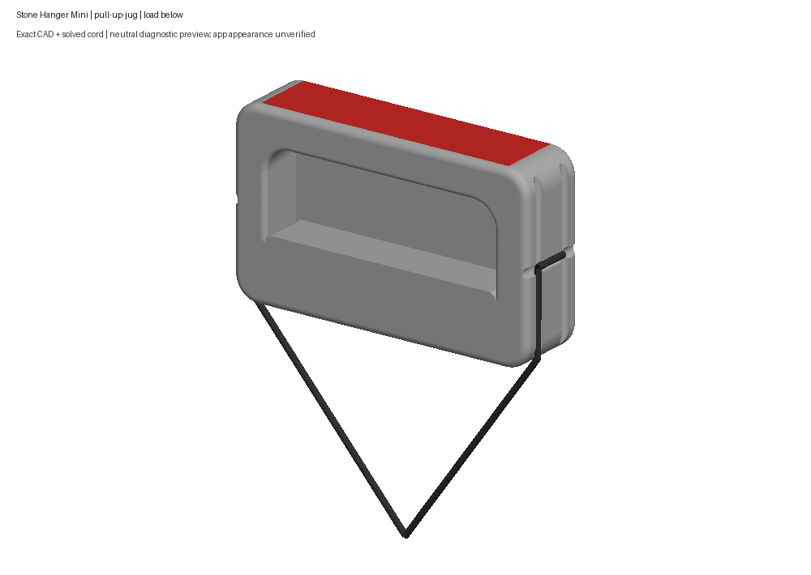
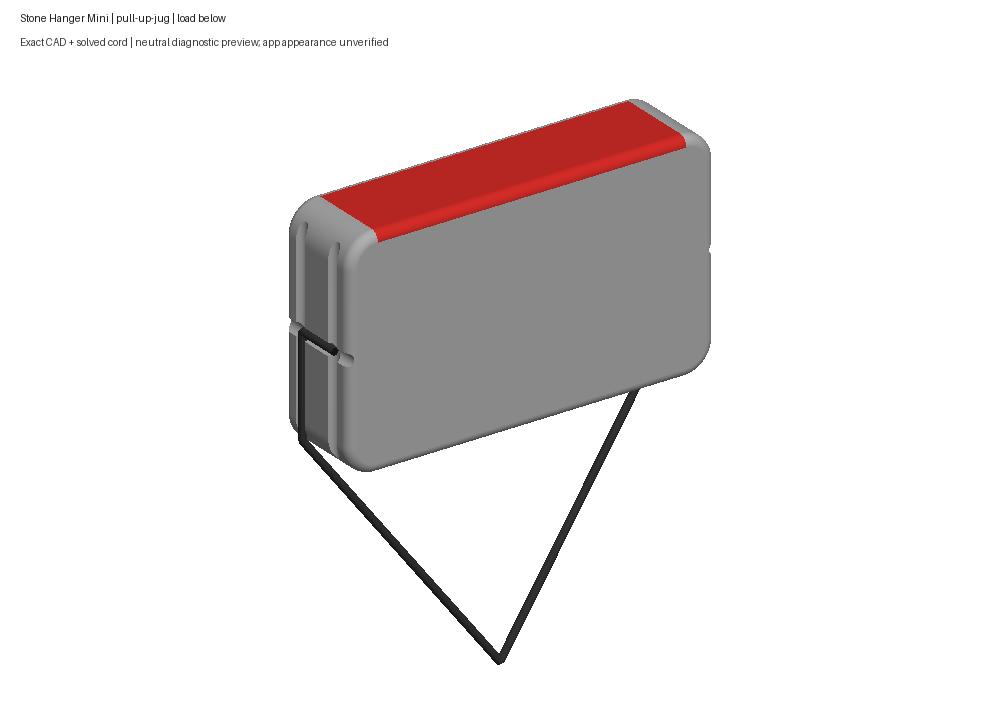
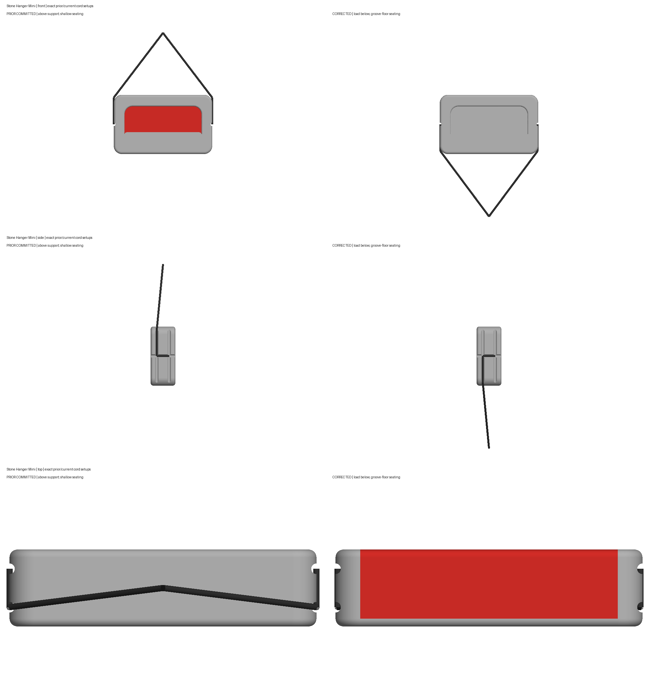

# Stone Hanger Mini #10: corrected jug and cord

The jug now selects the existing outside top flat and top/back round, as the human identified. The same faces remain part of pinch-60; the former recess wall is ordinary body. The accepted body and all 28,842 exported triangle positions are unchanged. The jug uses the upright position, and the mistaken opening-up jug position is removed.

The cords now seat at the native side-groove floor, follow the transverse grooves at mid-height, and run down toward the load. This review uses the manufacturer's hand/use photograph, which shows the load below. The retained above-loop oak packshot remains a separate supported arrangement. The current model omits the knot, cut tail and unseen continuation; no hidden bores were added. Earlier wood/granite rotations remain display estimates, rather than newly verified lifting orientations.

The compact 110 mm leads and 14 mm cross-return allowance are display estimates. The cross-return's solved route is 12.5 mm. Attachment stations come from the analytic 1.7 mm groove floor plus the unchanged 1 mm rope radius and a 20 µm proposal margin, rounded outward once to the existing 1 nm serialization grid. Routes are generated by the existing nativeRoutes solver. The three final positions and twelve continuous route certificates pass the existing 10 µm clearance tolerance. This numerical certificate does not establish live physics or real load safety.

The package gate caught a noncanonical order of the upright position's contact IDs. The supported metadata tool corrected that list only; Document.xml is the sole changed archive member and every geometry member is byte-identical. A fresh native rebuild from the final source matches the shipped USDZ and descriptor byte for byte. The final collider is freshly exported from that source; geometry and all six open grooves match the author export, with no bores.

All 64 packages validate, both Xcode and Android stage the exact generated Mini manifest and model bytes, the delivery lock passes, and 67 focused final tests pass with no skips or failures. The author's 38 native contract tests are retained with their distinct scope. The other 202 package files, seven reserved runtime files and 222 original completion artifacts remain byte-identical. Exact owned processes, staging folders and temporary config/cache directories were verified absent.

These are neutral CAD previews made from the actual USDZ, descriptor and saved native routes with shared per-pixel depth. They are not app screenshots. The prior isolated Simulator attempt stalled in system migration, so the corrected model's runtime finish, touch, orbit and workout behavior remain unverified. The accepted 100 × 60 × 25 mm display envelope is retained; the current maker page states 105 × 60 × 30 mm. Inherited thickness/depth edit fragility remains documented in the native handoff.

The earlier “Lgtm” accepted the overall body only. The subsequent cord/jug objections and the answer “Rounded outside top/back rail” are preserved in the human record. This correction awaits human acceptance.

[Contact-only front/side/top comparison](views/prior-current-jug-front-side-top.png) · [Granite edge](views/mini-corrected-granite-loaded.png) · [Wood edge](views/mini-corrected-wood-loaded.png) · [Shared pinch](views/mini-corrected-pinch-loaded.png) · [Validation](validation.json) · [Presentation identities](presentation-record.json)

Sources: [manufacturer product page](https://natureclimbing.com/products/stone-hanger-mini-oak), [usage photo: outer rail and load below](https://natureclimbing.com/cdn/shop/files/MiniHanger-86.jpg), [end close-up: groove seating and turn](https://natureclimbing.com/cdn/shop/files/Oakminihanger8.jpg), [oak above-loop packshot](https://natureclimbing.com/cdn/shop/files/Oakminihanger6.jpg). The user authorized further individual manufacturer research; these three additions were retained and reviewed whole without measuring pixels. The original approved image set is unchanged.

Does the Mini’s jug and cord look right now?
