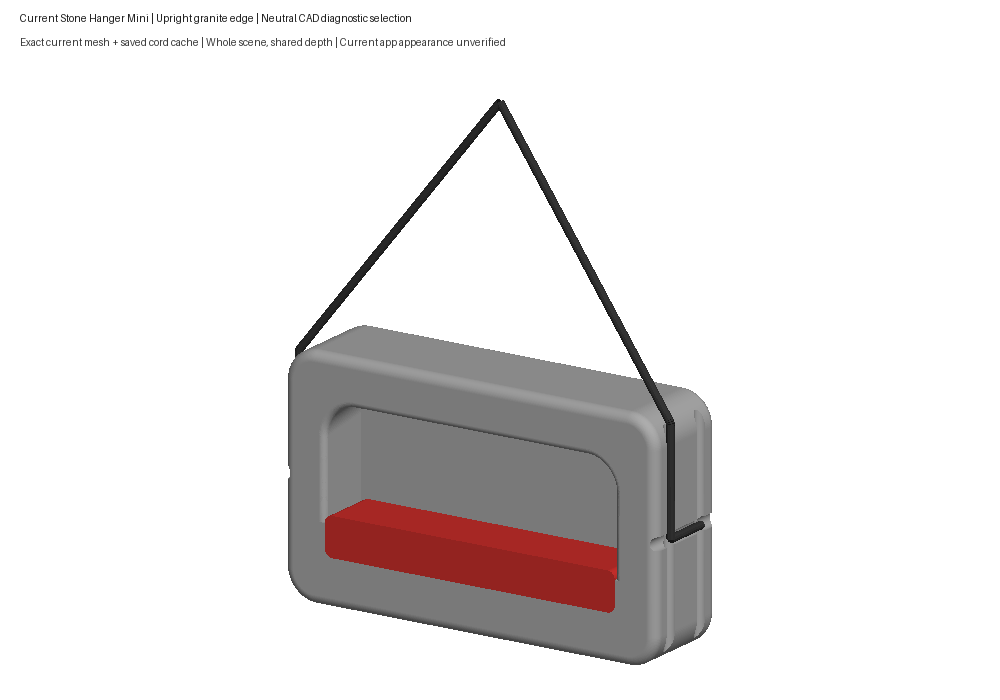
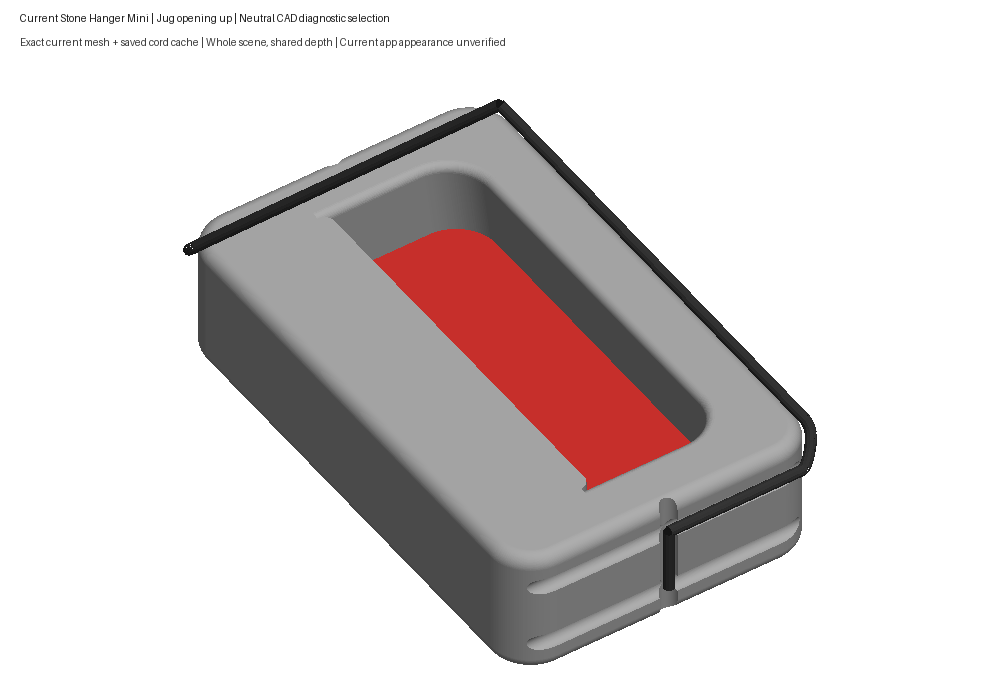
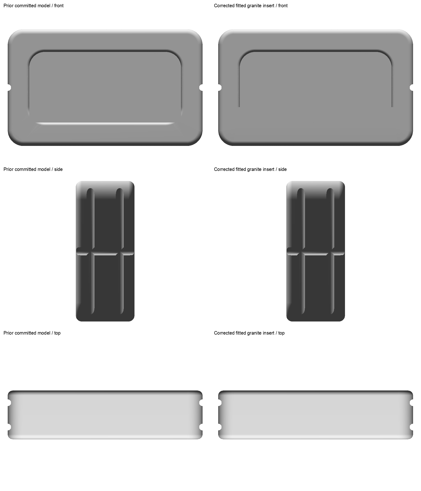
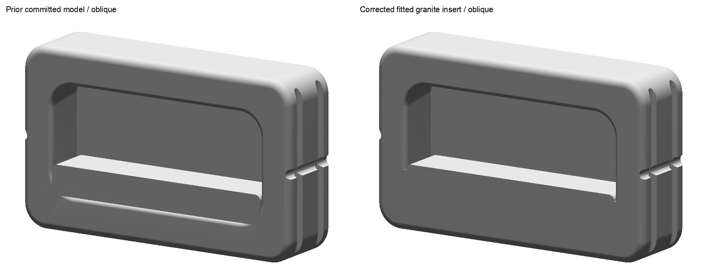

# Stone Hanger Mini rejected detail review — #10

The user rejected this presentation: “those cords dont look right” and “and the jug isnt the right part”. The user then identified the jug as the **rounded outside top/back rail**. The earlier overall-body Lgtm remains valid within its recorded scope; these final details were not accepted.

The raw images below are retained unchanged. The second image incorrectly selects a recessed wall and turns the board through a quarter turn. That highlighted surface is superseded by the human-confirmed outer rail. The cords in both images also need their groove seating corrected.

These whole CAD diagnostic previews used the exact saved USDZ and cord caches at the identities in [presentation-record.json](presentation-record.json). They did not show the app's wood/granite finishes or verify interaction. They remain evidence of the rejected presentation.

Those comparisons are byte-identical copies from the historical [completion packet](../completion-review/index.html). Its native, cord, export and Python checks apply to that old package; they do not verify the corrected rail binding or new routes.

The [October 2 runtime attempt](../runtime-retry-2026-10-02/runtime-validation.json) built and installed the old package but produced zero usable app frames and executed zero Swift unit cases when the isolated Simulator stalled in AddressBook migration. App appearance and interaction remain unverified.

The [feedback record](human-feedback.json) governs the correction now in progress. No new review answer is requested on this rejected packet.
