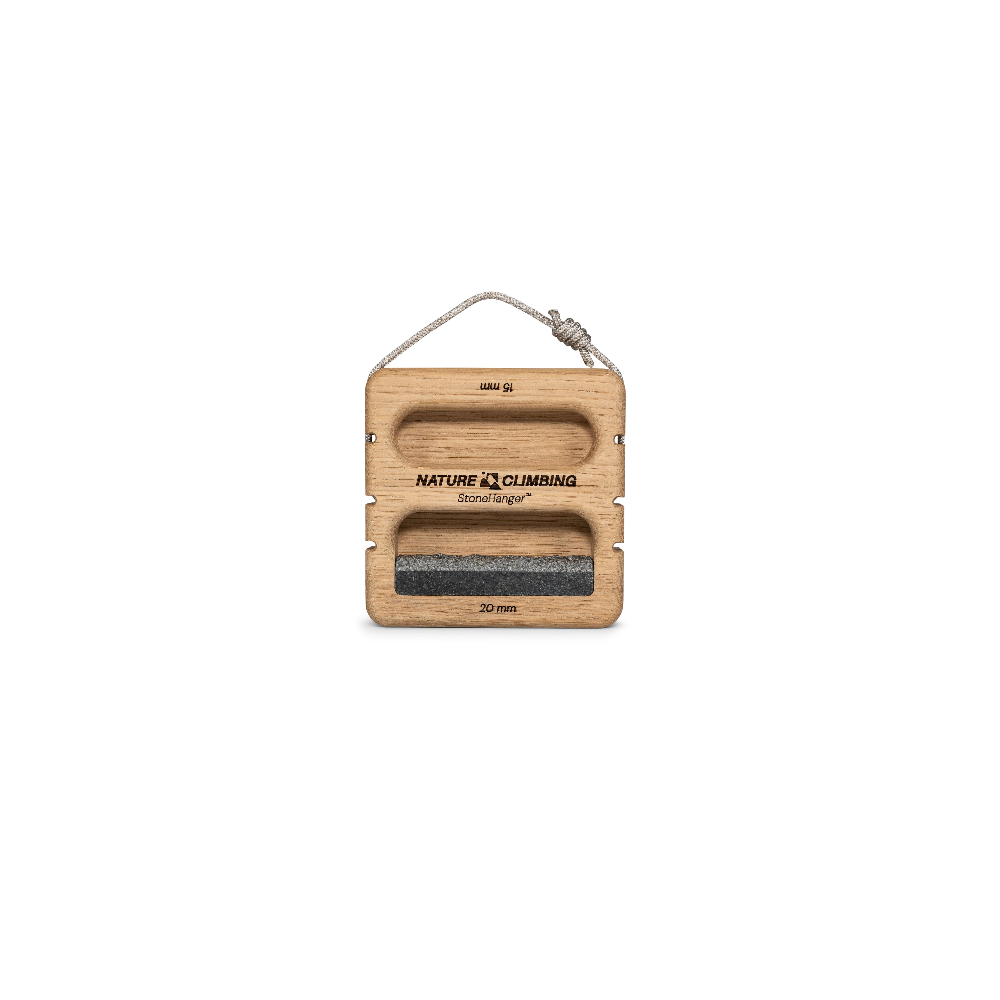
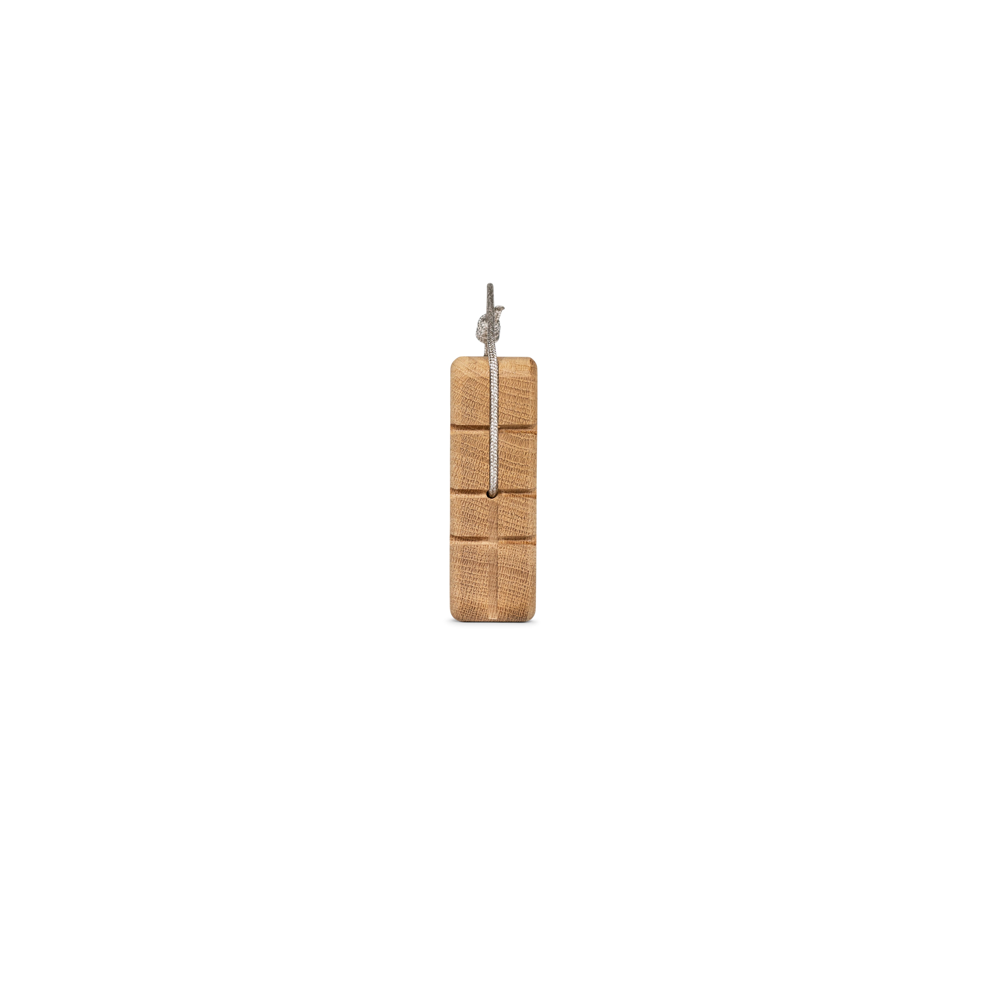
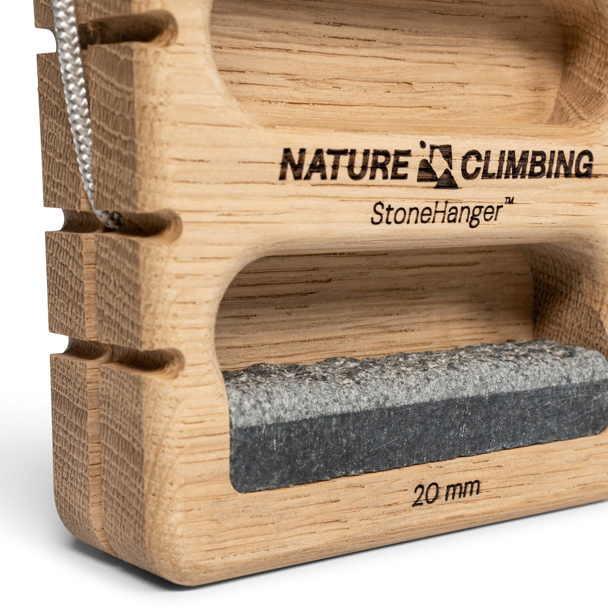
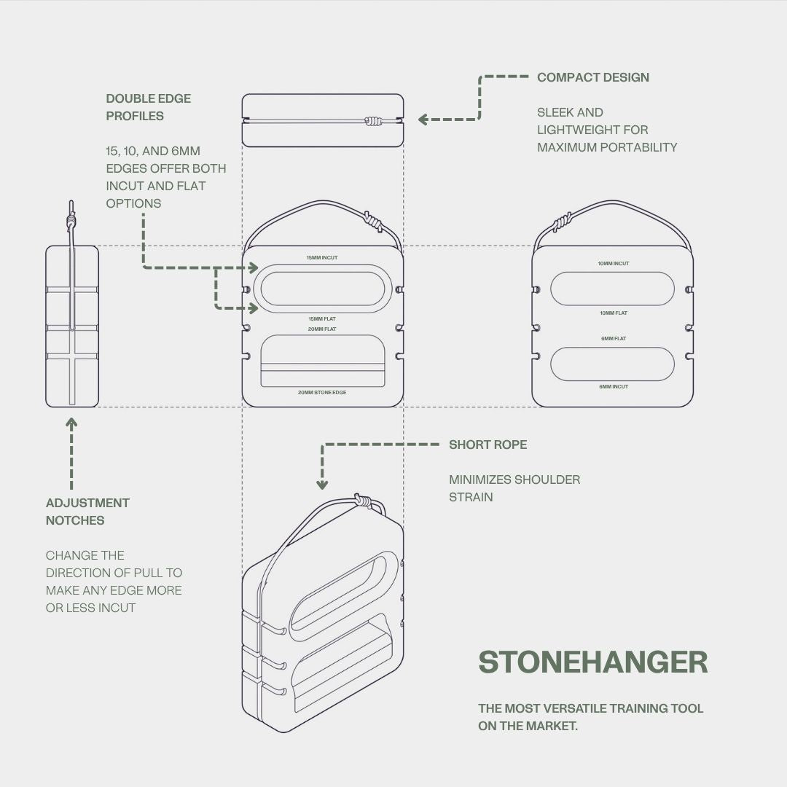

# nature-stone-hanger: CAD source evidence

Date: 2026-09-29. Publisher: Nature Climbing.

Granite front establishes two front cavities and the stone contact; side shows a lateral cord mouth and three adjustment grooves; close-up distinguishes incut/flat rails and granite insert. Technical drawing shows both faces and eight grip edges. The exact hidden side-to-side connection is not visible; historical evidence explicitly leaves it unknown.

Status: approved by user 2026-09-29. Native CAD is authored; see geometry-review.html and the native validation reports for the separate geometry review. Historical records naming an agent as reviewer are not treated as new human approval.

## Source 1: nature-stone-hanger.html

- Publisher: Nature Climbing
- URL: https://natureclimbing.com/products/stone-hanger-1
- SHA-256: `9724da3a1145da00c4d0e11afc268eb6f638d5ef5daf62e3e40bef7e7dde66ea`
- Supports: exact-revision front gallery
- Approval: historical cord evidence; new full visual set approved by user 2026-09-29

## Source 2: nature-stone-hanger-granite-variant.html

- Publisher: Nature Climbing
- URL: https://natureclimbing.com/products/stone-hanger-1?variant=47783638597970
- SHA-256: `2154d6b87ae40bc5f4ad93b73122f2a732f777f6985fbd8ee79eedf22d93ef0a`
- Supports: exact-revision Granite variant
- Approval: historical cord evidence; new full visual set approved by user 2026-09-29

## Source 3: Stone_Hanger_Granite_1.jpg

- Publisher: Nature Climbing
- URL: https://natureclimbing.com/cdn/shop/files/Stone_Hanger_Granite_1.jpg?v=1760101291
- SHA-256: `8e8df7719638e42d4018a43254b3dac0bf3bfb5ac0d6ba149e9c92f634254f40`
- Supports: Granite front establishes two front cavities and the stone contact; side shows a lateral cord mouth and three adjustment grooves; close-up distinguishes incut/flat rails and granite insert. Technical drawing shows both faces and eight grip edges. The exact hidden side-to-side connection is not visible; historical evidence explicitly leaves it unknown.
- Approval: approved by user 2026-09-29

## Source 4: Stone_Hanger_Granite_3.jpg

- Publisher: Nature Climbing
- URL: https://natureclimbing.com/cdn/shop/files/Stone_Hanger_Granite_3.jpg?v=1760101291
- SHA-256: `905103e785b884af1a56abc203010cac92ade82d9e3a9e97d67d3427de4c9bc2`
- Supports: Granite front establishes two front cavities and the stone contact; side shows a lateral cord mouth and three adjustment grooves; close-up distinguishes incut/flat rails and granite insert. Technical drawing shows both faces and eight grip edges. The exact hidden side-to-side connection is not visible; historical evidence explicitly leaves it unknown.
- Approval: approved by user 2026-09-29

## Source 5: Stone_Hanger_Granite_4.jpg

- Publisher: Nature Climbing
- URL: https://natureclimbing.com/cdn/shop/files/Stone_Hanger_Granite_4.jpg?v=1760859575
- SHA-256: `56d7f7312d42222f66bd01cfd7e77a5c9f711dd55dea3cfc885ce5094f322576`
- Supports: Granite front establishes two front cavities and the stone contact; side shows a lateral cord mouth and three adjustment grooves; close-up distinguishes incut/flat rails and granite insert. Technical drawing shows both faces and eight grip edges. The exact hidden side-to-side connection is not visible; historical evidence explicitly leaves it unknown.
- Approval: approved by user 2026-09-29

## Source 6: StonehangerTechDrawing_Draft1.jpg

- Publisher: Nature Climbing
- URL: https://natureclimbing.com/cdn/shop/files/StonehangerTechDrawing_Draft1.jpg?v=1760860112
- SHA-256: `57287e539da523b0366c3cf5a0d1c0b551a0ee65f2fddae202c9c4614bc1d7ee`
- Supports: Granite front establishes two front cavities and the stone contact; side shows a lateral cord mouth and three adjustment grooves; close-up distinguishes incut/flat rails and granite insert. Technical drawing shows both faces and eight grip edges. The exact hidden side-to-side connection is not visible; historical evidence explicitly leaves it unknown.
- Approval: approved by user 2026-09-29

Native CAD review artifacts: [geometry comparison](geometry-review.html), [authoring notes](geometry-authoring-notes.md), [metadata preservation](metadata-preservation.json), [native edit validation](native-validation.json). Final app review is coordinated separately.
