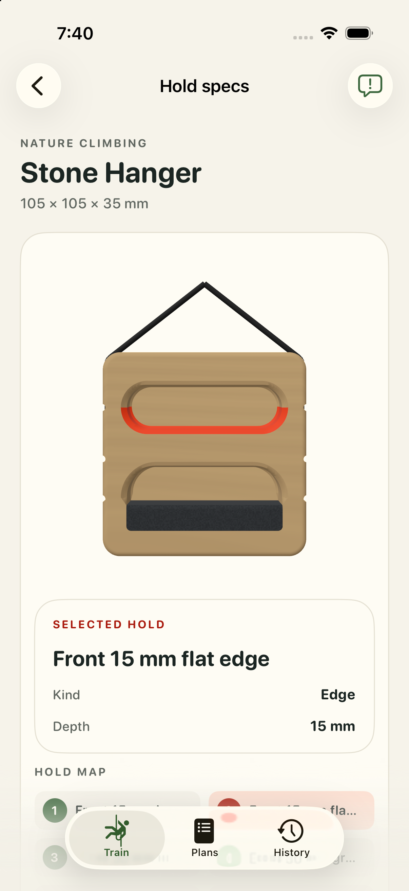

Asher accepted the displayed Stone Hanger with “Y” on 2026-10-01. The source is `44a081979246f076853a3537bd0b79375c822c554507a7e0d1e04347a25cc9c9`. The current [human review record](human-review.json) records that reply; the immutable technical packet retains its pre-acceptance state and all stated display limits.

[Before and after front, side and top](granite-seat-review/native-front-side-top.png) · [Technical review packet](granite-seat-review/index.html)

[Acceptance and unchanged-package verification](human-acceptance/acceptance-verification.json)
