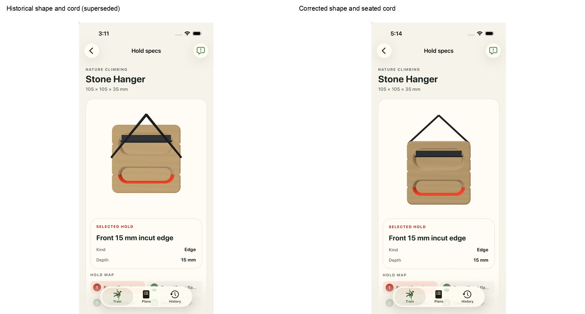
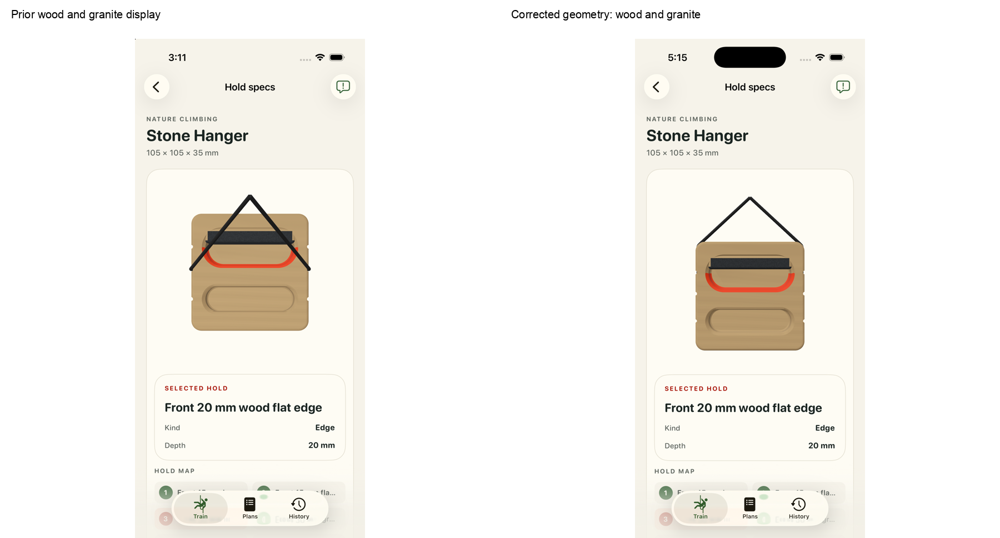
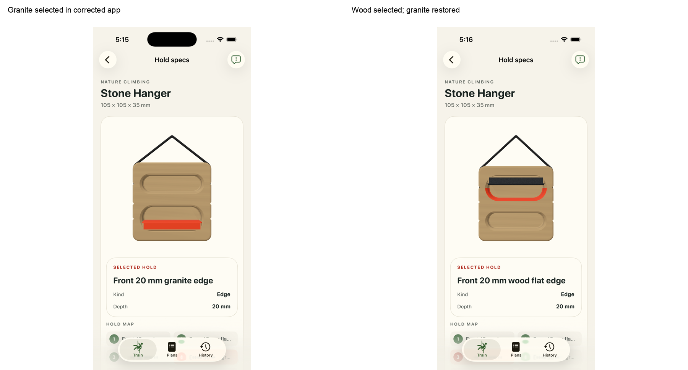
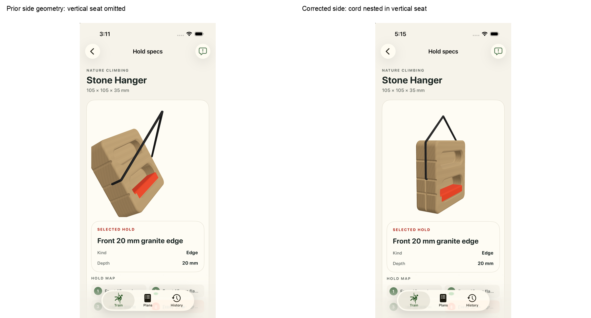
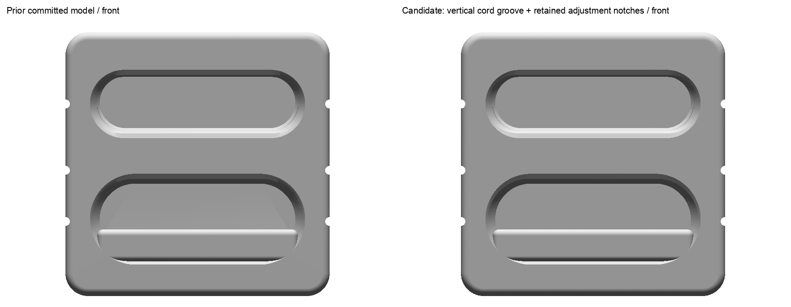
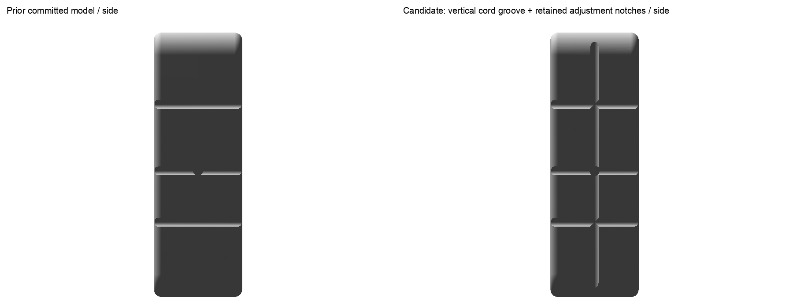
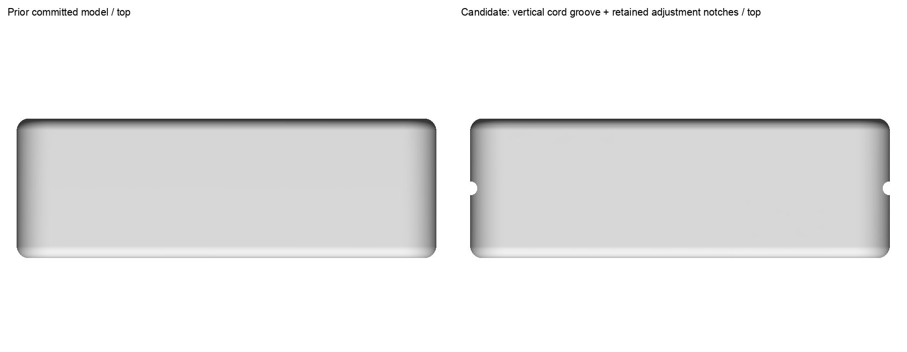
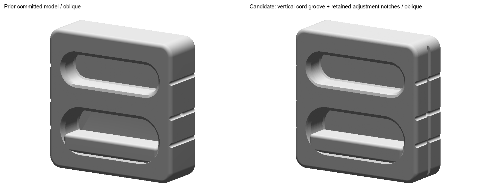

# Nature Climbing Stone Hanger — vertical cord seats, review #9

Added one longitudinal cord seat on each side, retaining all six transverse adjustment notches. Short 120 mm display branches nest in the seats and enter the middle side holes. The wood body, granite insert and all eight contact facts are preserved; all eight native bearing poses face upward, and fresh app review confirms usable selections and granite restoration.

Human acceptance is pending.

Original user comments:

- "the stone hanger needs granite texture where appropriate"
- "also cord is way too long"
- "and its missing the notches"
- "and the highlighted hold is in an impossible to weight position"
- "the cord goes inside the side notches"
- "there is 1 vertical groove on either side that the cord nestles into"

Topology answer: **Enters side holes; notches guide it**. The concealed connection remains unspecified.

The native body geometry now includes one vertical cord seat on each side, while all three transverse adjustment notches per side remain. The complete embedded manifest, all eight contact facts and positions, and wood/granite metadata are preserved. All four package identities are new and have fresh native, export, cord and runtime proof.

The before model and descriptor are byte-identical to committed HEAD 9399160729. The before native source includes metadata corrections made after that commit; it is not the committed source identity. The existing native and exact-export comparisons use the committed before-model geometry.

The prior body, mathematical and runtime checks remain historical and bound only to their former hashes. The full superseded packet is retained; its passes are not carried to the corrected shape. Prior app frames are exact historical captures, not a fresh old binary run.

- One vertical seat each side and existing three transverse adjustment notches per side are separate source-supported features; preserve both.
- Groove radius, depth, numeric span/entry placement, cord dimensions, support and loaded poses remain deliberate display estimates.
- The concealed connection remains unspecified beyond visible side-hole entry.
- All four corrected package identities require fresh native/export/cord/runtime proof. Prior 1b/7c passes are preserved as history without carrying them to the new shape.
- Raw images remain whole; no crop, registration, tracing or pixel-derived dimensions.
- Generic runtime wood/granite shaders depict materials; USDZ stays unbound with no baked material/texture.
- Material-facet frictionless discrete balance and numerical near-contact policy do not certify continuum cable or global board equilibrium or real load safety.
- Maker video sheets include multiple variants. All 10 original sheets retained; this independent evidence review physically viewed sheets 4 and 5 and four exact-revision primary images.
- Fresh checks: 260 Python tests, 259 focused iOS tests, all 64 packages. Installed byte parity covers Nature Stone Hanger only; overlapping historical suites are not added.
- The prior 30 degree pitch and 50 mm forward support offset are superseded adaptations. Current poses use identity or exact axis half-turn rotations, with a centered support and 25 mm initial display offset; solved hanging translations remain estimates.
- Small polygonal shading bands remain at the tight cord bend beside the seat without changing the route. Whole still frames and recorded drags do not cover every continuous camera angle.
- The before model/descriptor are exact committed HEAD939916 geometry; the before native source contains later metadata corrections. Earlier app frames are retained historical captures, not a fresh prior-binary run.

Exact raw reports, commands, logs, accessibility records, images and cleanup evidence are retained under `raw/` and covered by `packet-hashes.json`. Root owns queue, delivery-lock, batch and acceptance updates.
