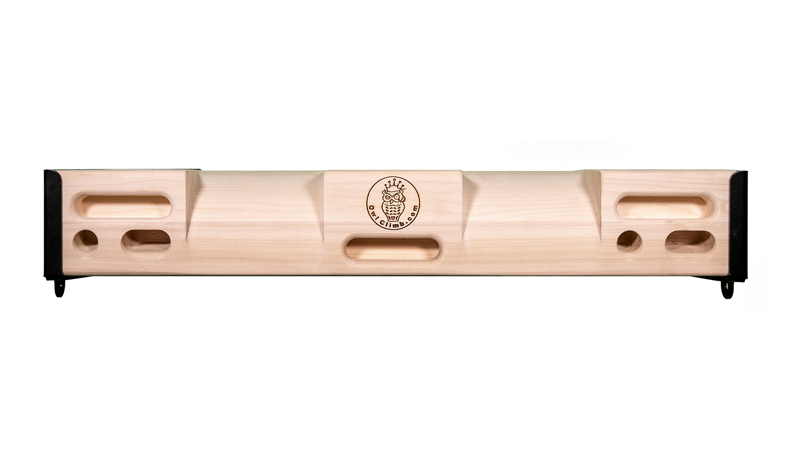
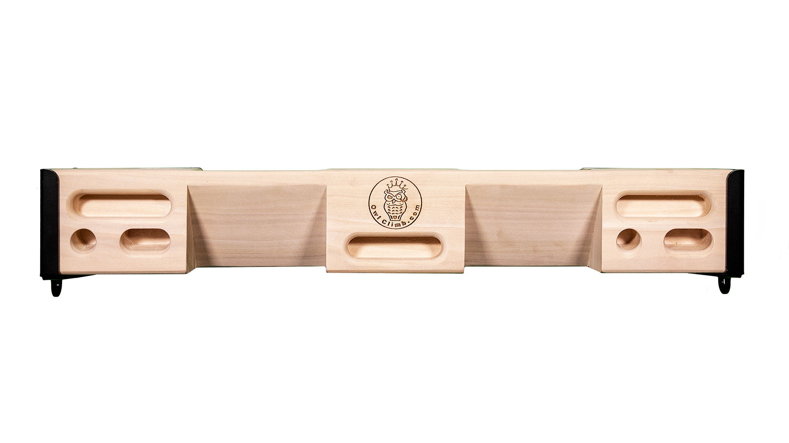
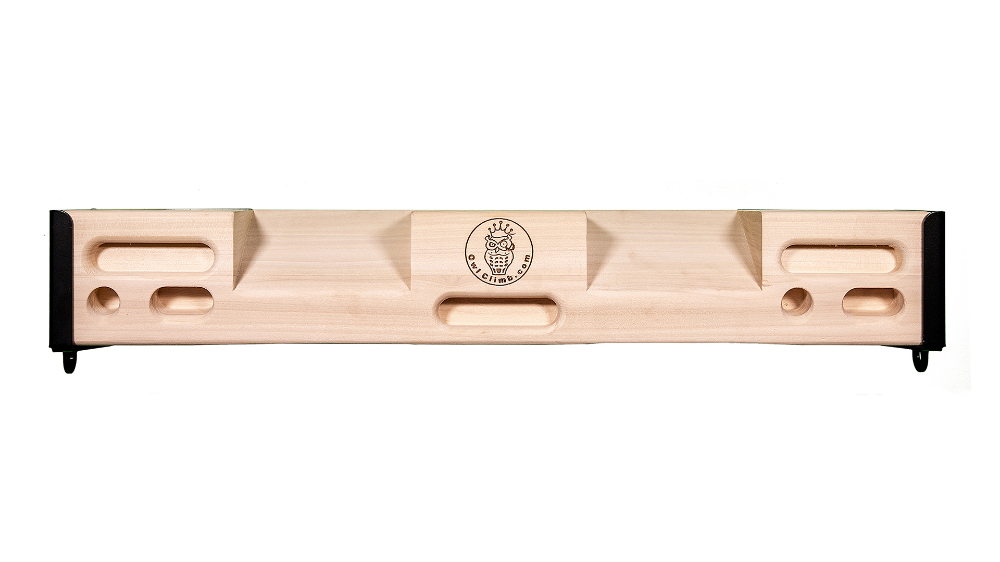
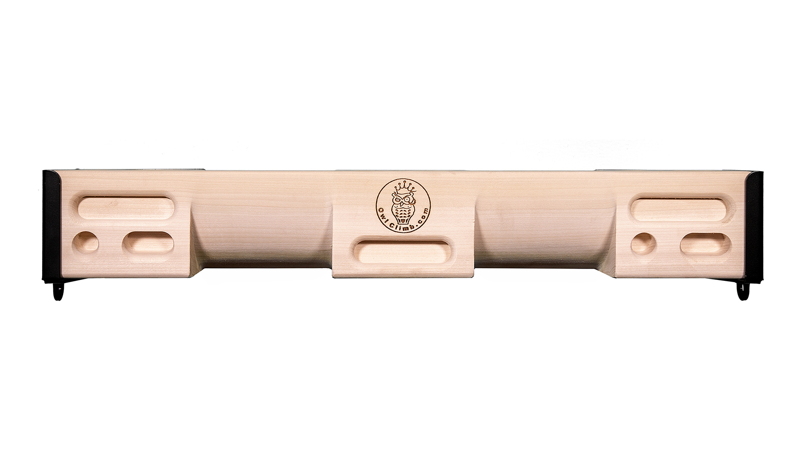

# owl-climb-poker: CAD source evidence

Date: 2026-09-29. Publisher: Owl Climb.

Four exact approved 2019 manufacturer photos establish all four faces, repeated mono/duo end sequences and the two deep rounded Face D recesses. Preserve all 34 physical contacts. Mounting hardware is omitted; no suspension is documented.

Status: historical exact set reused. Native CAD is authored; see geometry-review.html and the native validation reports for the separate geometry review. Historical records naming an agent as reviewer are not treated as new human approval.

## Source 1: owl-climb-poker-face-a.jpg

- Publisher: Owl Climb
- URL: https://owlclimb.com/wp-content/uploads/2019/03/owlclimb_poker19_0.jpg
- SHA-256: `4bae58b408b3f3a82c524b1101079eafa01cd062c398cb203d4803fce9850eab`
- Supports: OP-PHOTO-0 exact manufacturer face A
- Approval: approved exact set in batch-04 design

## Source 2: owl-climb-poker-face-b.jpg

- Publisher: Owl Climb
- URL: https://owlclimb.com/wp-content/uploads/2019/03/owlclimb_poker19_1.jpg
- SHA-256: `0c1d54cb2bc4d8e7fa285f3053b927d7c1a1b3fbafdf0b5d7aface9c82d0dbad`
- Supports: OP-PHOTO-1 exact manufacturer face B
- Approval: approved exact set in batch-04 design

## Source 3: owl-climb-poker-face-c.jpg

- Publisher: Owl Climb
- URL: https://owlclimb.com/wp-content/uploads/2019/03/owlclimb_poker19_2.jpg
- SHA-256: `5fbff79f31db8e85d078a74eb629abd069fc276ac128b3d85a84fc15ad9f1c4e`
- Supports: OP-PHOTO-2 exact manufacturer face C
- Approval: approved exact set in batch-04 design

## Source 4: owl-climb-poker-face-d.jpg

- Publisher: Owl Climb
- URL: https://owlclimb.com/wp-content/uploads/2019/03/owlclimb_poker19_3.jpg
- SHA-256: `ae39598fbf75c0e4e4dfbb599c724ff1e2531ef12ecca84b3504805e7bc3af13`
- Supports: OP-PHOTO-3 exact manufacturer face D
- Approval: approved exact set in batch-04 design

Native CAD review artifacts: [geometry comparison](geometry-review.html), [authoring notes](geometry-authoring-notes.md), [metadata preservation](metadata-preservation.json), [native edit validation](native-validation.json). Final app review is coordinated separately.

C/D junction correction: [native/source cross-section comparison](cd-junction-review.svg), [measured stations and tangent audit](cd-native-junction-correction.json). Native surface tangency and a 2.75° tessellated junction replace the first publication’s incorrect 88.24° ridge.
