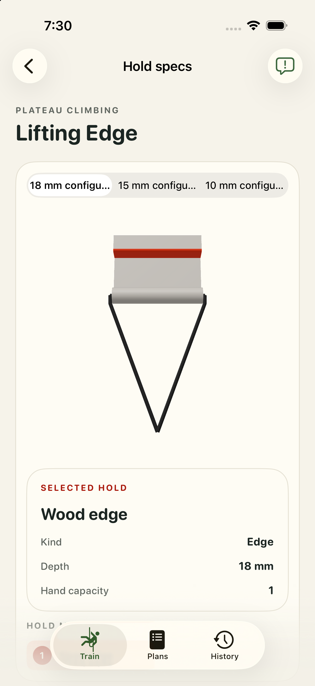
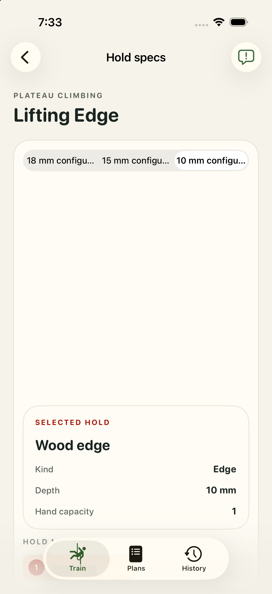
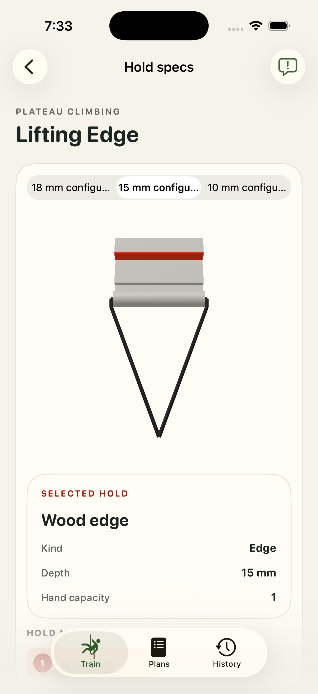
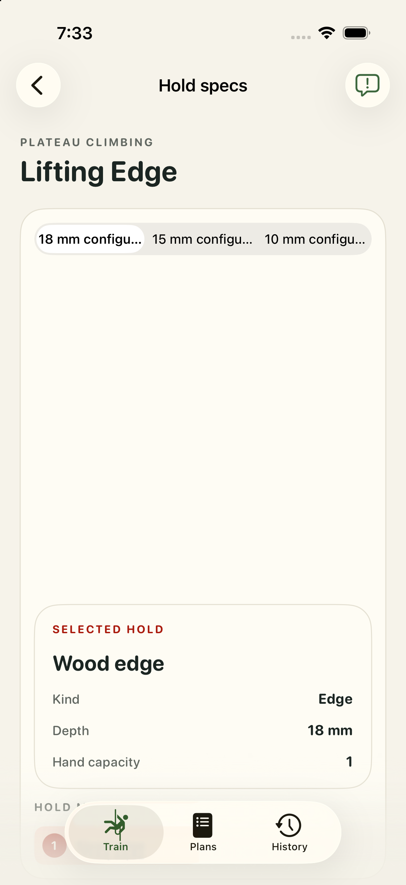

# Plateau Climbing Lifting Edge: app review

Captured in the isolated iPhone 17 Pro simulator on iOS 26.5. Geometry acceptance is pending our one-by-one review.

edge-18; DEBUG initial hold.

edge-18 — 10 mm configuration; presentation selector tap.

edge-18 — 15 mm configuration; presentation selector tap.

edge-18 — 18 mm configuration; presentation selector tap.

[Exact model hashes and validation](validation.json).
