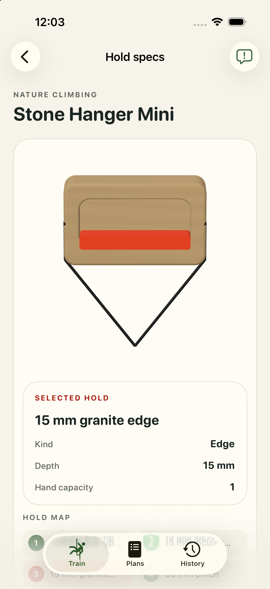

# #10 — Nature Climbing Stone Hanger Mini: bounded runtime attempt

Bounded appearance/pick/touch evidence; fresh app human acceptance pending. **appWorkflowPassed = false**. Historical CAD/human geometry acceptance is unchanged; fresh app human acceptance remains pending.

All 4 logical contacts: jug, wood edge, granite edge and pinch. One real physical mesh pick resolved `pull-up-jug` with tapRevision0 → 1, beyond DEBUG preselection. [Pick receipt](../app-captures/10-jug-physical-mesh-pick-receipt.json) and [whole frame](../app-captures/10-jug-physical-mesh-pick.png) bind the observed installed binary.

[Whole-frame audit](../visual-audits/10-visual-audit.json) is available with the limits below. Ordinary touch frames retain settled camera diagnostics. Portrait/landscape captures and selected-card observations are bounded by that audit, not a universal UI pass.

- Lower pinch underside is not fully exposed.
- Failed DEBUG side readiness frame is retained; ordinary touch supplies the settled end-on view.

The common workout gate failed: #10 landscape rest preview retains a red work highlight, and its portrait attempt reached a bounded accessibility timeout. These are this board’s observed failures. No complete workflow pass is claimed. [Work frame](../app-captures/10-workout-landscape-work-highlight.png), [rest frame](../app-captures/10-workout-landscape-rest-preview.png), [observation](../capture-traces/10-workout-observation.json).

The [final focused rerun](../validation/final-strong-summary.json) passed 455 tests with 0 failures and 1 pre-existing skip, including the fixed-yaw pitch assertion. The full opt-in physics attempt remains unsuccessful; this does not grant human/app acceptance.

Exact unchanged geometry approval context, every source/model/descriptor/sidecar hash, selection coverage and receipt hashes are retained in [10.json](10.json).

| Canonical artifact | SHA-256 |
| --- | --- |
| `Hangboards/nature-stone-hanger-mini/nature-stone-hanger-mini.FCStd` | `1ff0b22347a1ae20d54e57a8a1a8c595dd63918b17f35cb9e009e82524f4cd51` |
| `Hangboards/nature-stone-hanger-mini/assets/primary.usdz` | `1127b3523e411696541c4ff7c308a39af7468aa9d9af91f4813dc484cfcd1360` |
| `Hangboards/nature-stone-hanger-mini/assets/primary.model.json` | `a273405ad25027df88deeb714451045e7e2e809512d16fb2ec77804de0223f95` |
| `Hangboards/nature-stone-hanger-mini/suspension.json` | `7810f367c74b8b70f5185991978dbc8726e45e93696ede5a6f460e545962032f` |
