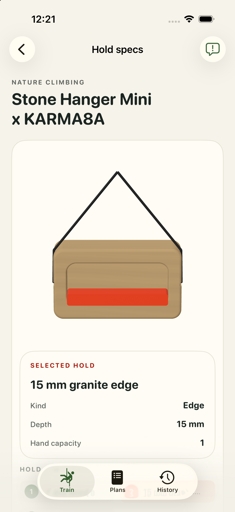

# #11 — Nature Climbing Stone Hanger Mini x KARMA8A: bounded runtime attempt

Bounded appearance/pick/touch evidence; fresh app human acceptance pending. **appWorkflowPassed = false**. Historical CAD/human geometry acceptance is unchanged; fresh app human acceptance remains pending.

All 3 logical contacts: wood edge, granite edge and pinch. One real physical mesh pick resolved `granite-edge-15` with tapRevision0 → 1, beyond DEBUG preselection. [Pick receipt](../app-captures/11-granite-physical-mesh-pick-receipt.json) and [whole frame](../app-captures/11-granite-physical-mesh-pick.png) bind the observed installed binary.

[Whole-frame audit](../visual-audits/11-visual-audit.json) is available with the limits below. Ordinary touch frames retain settled camera diagnostics. Portrait/landscape captures and selected-card observations are bounded by that audit, not a universal UI pass.

- Complete bottom underside, pinch restoration and physical picking of every contact are not established.

The common workout gate failed: #10 landscape rest preview retains a red work highlight, and its portrait attempt reached a bounded accessibility timeout. This board’s workout sequence was not executed afterward. No complete workflow pass is claimed. [Work frame](../app-captures/10-workout-landscape-work-highlight.png), [rest frame](../app-captures/10-workout-landscape-rest-preview.png), [observation](../capture-traces/10-workout-observation.json).

The [final focused rerun](../validation/final-strong-summary.json) passed 455 tests with 0 failures and 1 pre-existing skip, including the fixed-yaw pitch assertion. The full opt-in physics attempt remains unsuccessful; this does not grant human/app acceptance.

Exact unchanged geometry approval context, every source/model/descriptor/sidecar hash, selection coverage and receipt hashes are retained in [11.json](11.json).

| Canonical artifact | SHA-256 |
| --- | --- |
| `Hangboards/nature-stone-hanger-mini-karma8a/nature-stone-hanger-mini-karma8a.FCStd` | `f43f517e6bca51a7a4eab9a7285ea684a614b7a33099fce67ae9e5f21f56942f` |
| `Hangboards/nature-stone-hanger-mini-karma8a/assets/primary.usdz` | `8e734298d1cd44dca533073becaa95eb2a039b87e1706b193d5fd7de48f040de` |
| `Hangboards/nature-stone-hanger-mini-karma8a/assets/primary.model.json` | `17b8d3b689f453a155f5f993fc329111e807c83fb750e94d406ab44628fe2460` |
| `Hangboards/nature-stone-hanger-mini-karma8a/suspension.json` | `901edd326cd872de28cb8a8721c308049c1ff5c5a11da16ff225ddc9643f09bc` |
