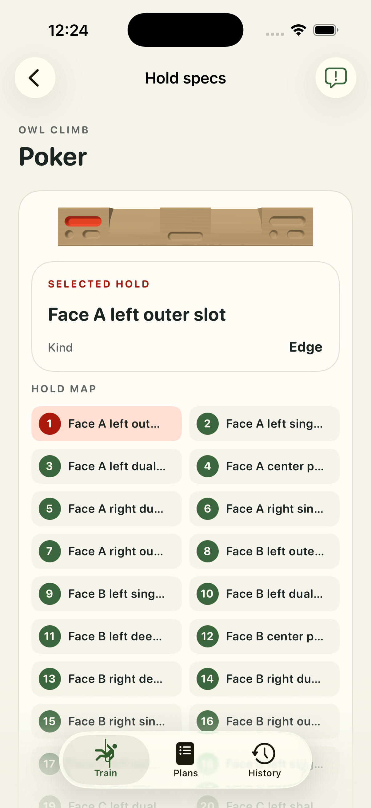

# #12 — Owl Climb Poker: bounded runtime attempt

Bounded appearance/pick/touch evidence; fresh app human acceptance pending. **appWorkflowPassed = false**. Historical CAD/human geometry acceptance is unchanged; fresh app human acceptance remains pending.

Four representative contacts, one from each face A–D; not all 34 contacts. One real physical mesh pick resolved `face-a-left-outer-slot` with tapRevision0 → 1, beyond DEBUG preselection. [Pick receipt](../app-captures/12-slot-physical-mesh-pick-receipt.json) and [whole frame](../app-captures/12-slot-physical-mesh-pick.png) bind the observed installed binary.

[Whole-frame audit](../visual-audits/12-visual-audit.json) is available with the limits below. Ordinary touch frames retain settled camera diagnostics. Portrait/landscape captures and selected-card observations are bounded by that audit, not a universal UI pass.

- Initial vertical top gesture did not orbit; retained failure is followed by a successful diagonal retry.
- Only four representative face contacts were checked; no suspension is authored.

The common workout gate failed: #10 landscape rest preview retains a red work highlight, and its portrait attempt reached a bounded accessibility timeout. This board’s workout sequence was not executed afterward. No complete workflow pass is claimed. [Work frame](../app-captures/10-workout-landscape-work-highlight.png), [rest frame](../app-captures/10-workout-landscape-rest-preview.png), [observation](../capture-traces/10-workout-observation.json).

The [final focused rerun](../validation/final-strong-summary.json) passed 455 tests with 0 failures and 1 pre-existing skip, including the fixed-yaw pitch assertion. The full opt-in physics attempt remains unsuccessful; this does not grant human/app acceptance.

Exact unchanged geometry approval context, every source/model/descriptor/sidecar hash, selection coverage and receipt hashes are retained in [12.json](12.json).

| Canonical artifact | SHA-256 |
| --- | --- |
| `Hangboards/owl-climb-poker/owl-climb-poker.FCStd` | `26476221de9031703c0536e31c7341eb6ba1d6d5176c1c72acd0b06c3d546553` |
| `Hangboards/owl-climb-poker/assets/primary.usdz` | `1ee84de3f5054d55bd1078e466499cbc508decd11826bd5e626b349a75ba3675` |
| `Hangboards/owl-climb-poker/assets/primary.model.json` | `b2fd8b5ff18c57b38d48daaa93e613c00061bb3e61e444d741871e8fe10a3032` |
