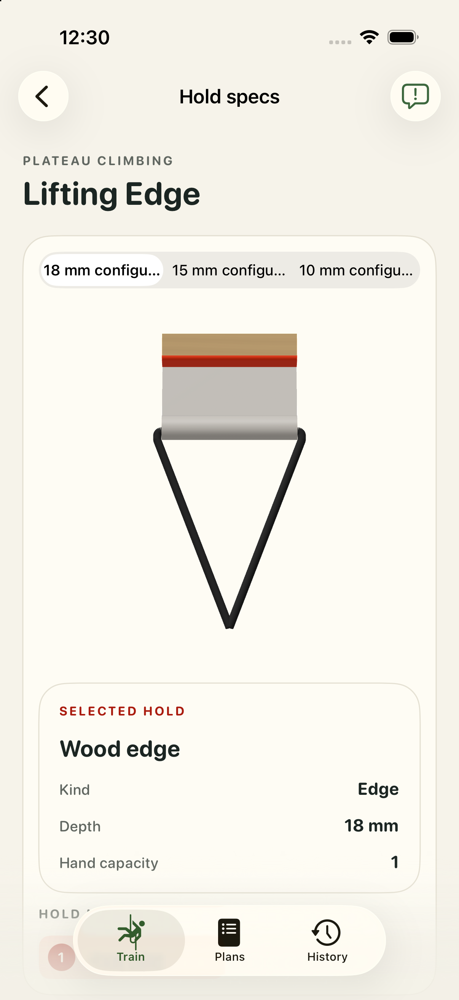

# #13 — Plateau Climbing Lifting Edge: bounded runtime attempt

Bounded appearance/pick/touch evidence; fresh app human acceptance pending. **appWorkflowPassed = false**. Historical CAD/human geometry acceptance is unchanged; fresh app human acceptance remains pending.

One physical edge across the 18 → 15 → 10 → 18 mm authored presentation sequence. One real physical mesh pick resolved `edge-18` with tapRevision0 → 1, beyond DEBUG preselection. [Pick receipt](../app-captures/13-edge-physical-mesh-pick-receipt.json) and [whole frame](../app-captures/13-edge-physical-mesh-pick.png) bind the observed installed binary.

[Whole-frame audit](../visual-audits/13-visual-audit.json) is available with the limits below. Ordinary touch frames retain settled camera diagnostics. Portrait/landscape captures and selected-card observations are bounded by that audit, not a universal UI pass.

- Variant switching recreates presentation entities; no same-entity continuity claim.
- One physical pick at 18 mm; 15/10 mm physical picks not claimed.

The common workout gate failed: #10 landscape rest preview retains a red work highlight, and its portrait attempt reached a bounded accessibility timeout. This board’s workout sequence was not executed afterward. No complete workflow pass is claimed. [Work frame](../app-captures/10-workout-landscape-work-highlight.png), [rest frame](../app-captures/10-workout-landscape-rest-preview.png), [observation](../capture-traces/10-workout-observation.json).

The [final focused rerun](../validation/final-strong-summary.json) passed 455 tests with 0 failures and 1 pre-existing skip, including the fixed-yaw pitch assertion. The full opt-in physics attempt remains unsuccessful; this does not grant human/app acceptance.

Exact unchanged geometry approval context, every source/model/descriptor/sidecar hash, selection coverage and receipt hashes are retained in [13.json](13.json).

| Canonical artifact | SHA-256 |
| --- | --- |
| `Hangboards/plateau-lifting-edge/plateau-lifting-edge.FCStd` | `b1c701af3ea5515b73e5b3641612f15953ecc3fb109332e95470bd70f9da7986` |
| `Hangboards/plateau-lifting-edge/assets/primary.usdz` | `9027767be981b5625b39924dfd924b9055888e01be5d81d2ef8ecd516ea6c6eb` |
| `Hangboards/plateau-lifting-edge/assets/primary.model.json` | `9a973d00fd5ed67818ed796da4c8d251546f2866b4fa8bbbb21eec8c7272bc55` |
| `Hangboards/plateau-lifting-edge/assets/depth-15mm.usdz` | `d7f3eb0be0c35a3a3fd06b57849dc8488ec3573ab78eaed77e8d8178c0803dad` |
| `Hangboards/plateau-lifting-edge/assets/depth-15mm.model.json` | `f93353974ce23439616a6245035e7f868c5f44ee887a36263ca11c530b816a9b` |
| `Hangboards/plateau-lifting-edge/assets/depth-10mm.usdz` | `4dbb21a4ec4f3a9fb2c0daaaf0c36ff3fefa62a33bf9e92cd5845a7e5a43b431` |
| `Hangboards/plateau-lifting-edge/assets/depth-10mm.model.json` | `ede7d1ba99d952db42c3640b7df0fa91148c6aa276e82c8b46a9157d9f7da51e` |
| `Hangboards/plateau-lifting-edge/suspension.json` | `b59eab42fe4416ebd42636adbaa88e69fc4b344d588a5a7537906490483b7d80` |
