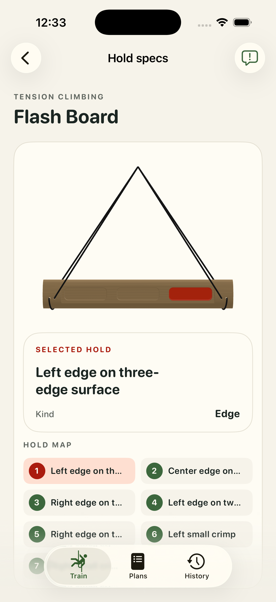

# #14 — Tension Climbing Flash Board: bounded runtime attempt

Bounded appearance/pick/touch evidence; fresh app human acceptance pending. **appWorkflowPassed = false**. Historical CAD/human geometry acceptance is unchanged; fresh app human acceptance remains pending.

All 7 logical contacts; left/right semantic naming remains unresolved. One real physical mesh pick resolved `three-edge-left` with tapRevision0 → 1, beyond DEBUG preselection. [Pick receipt](../app-captures/14-edge-physical-mesh-pick-receipt.json) and [whole frame](../app-captures/14-edge-physical-mesh-pick.png) bind the observed installed binary.

[Whole-frame audit](../visual-audits/14-visual-audit.json) is available with the limits below. Ordinary touch frames retain settled camera diagnostics. Portrait/landscape captures and selected-card observations are bounded by that audit, not a universal UI pass.

- Left-named contacts appear viewer-right and vice versa; intrinsic-versus-screen convention unresolved.
- Explicit inverted-pose visual audit is not claimed.

The common workout gate failed: #10 landscape rest preview retains a red work highlight, and its portrait attempt reached a bounded accessibility timeout. This board’s workout sequence was not executed afterward. No complete workflow pass is claimed. [Work frame](../app-captures/10-workout-landscape-work-highlight.png), [rest frame](../app-captures/10-workout-landscape-rest-preview.png), [observation](../capture-traces/10-workout-observation.json).

The [final focused rerun](../validation/final-strong-summary.json) passed 455 tests with 0 failures and 1 pre-existing skip, including the fixed-yaw pitch assertion. The full opt-in physics attempt remains unsuccessful; this does not grant human/app acceptance.

Exact unchanged geometry approval context, every source/model/descriptor/sidecar hash, selection coverage and receipt hashes are retained in [14.json](14.json).

| Canonical artifact | SHA-256 |
| --- | --- |
| `Hangboards/tension-flash-board/tension-flash-board.FCStd` | `cc549b0ea2021c3b40a864e7936e880c8b43b3cd4b7220a66e9a4090caba8a53` |
| `Hangboards/tension-flash-board/assets/primary.usdz` | `4f09ef7de6c599ec95655c8f7076b10980cdf625c7372807901b9b6c4476084b` |
| `Hangboards/tension-flash-board/assets/primary.model.json` | `cb4918b545ba392fa37137c707531599b9725aa2068602af5ef102b337e83755` |
| `Hangboards/tension-flash-board/suspension.json` | `73d29a328cd20dfe9dd304cb5775d1992b48e9c7fe68dce1400ad115e3ce3ce9` |

[Source-side convention check](../flash-hand-convention.json) found no descriptor/ID swap; the three-edge screen orientation still lacks active-pose proof. No complete side-name runtime explanation is claimed.
