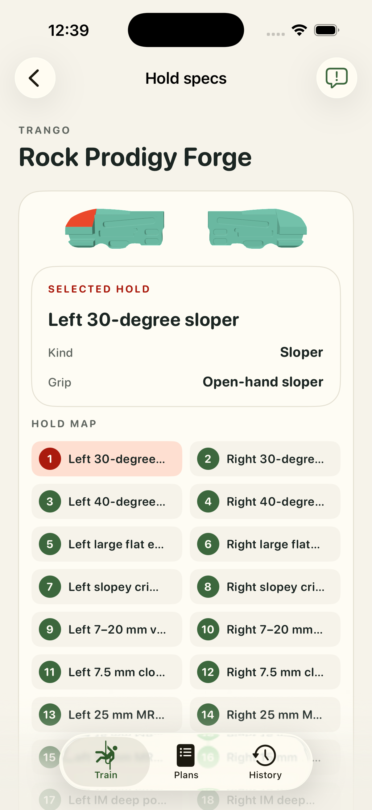

# #15 — Trango Rock Prodigy Forge: bounded runtime attempt

Bounded appearance/pick/touch evidence; fresh app human acceptance pending. **appWorkflowPassed = false**. Historical CAD/human geometry acceptance is unchanged; fresh app human acceptance remains pending.

10 representative categories across the native pair; not all 20 left/right contacts. One real physical mesh pick resolved `sloper-30-left` with tapRevision0 → 1, beyond DEBUG preselection. [Pick receipt](../app-captures/15-sloper-physical-mesh-pick-receipt.json) and [whole frame](../app-captures/15-sloper-physical-mesh-pick.png) bind the observed installed binary.

[Whole-frame audit](../visual-audits/15-visual-audit.json) is available with the limits below. Ordinary touch frames retain settled camera diagnostics. Portrait/landscape captures and selected-card observations are bounded by that audit, not a universal UI pass.

- Whole-frame audit covers ten categories and one pick; 40-degree sloper, large flat edge and slopey crimper remain edge-on, so complete bearing-face coverage is not established.
- No all-20 contact appearance/pick claim.

The common workout gate failed: #10 landscape rest preview retains a red work highlight, and its portrait attempt reached a bounded accessibility timeout. This board’s workout sequence was not executed afterward. No complete workflow pass is claimed. [Work frame](../app-captures/10-workout-landscape-work-highlight.png), [rest frame](../app-captures/10-workout-landscape-rest-preview.png), [observation](../capture-traces/10-workout-observation.json).

The [final focused rerun](../validation/final-strong-summary.json) passed 455 tests with 0 failures and 1 pre-existing skip, including the fixed-yaw pitch assertion. The full opt-in physics attempt remains unsuccessful; this does not grant human/app acceptance.

Exact unchanged geometry approval context, every source/model/descriptor/sidecar hash, selection coverage and receipt hashes are retained in [15.json](15.json).

| Canonical artifact | SHA-256 |
| --- | --- |
| `Hangboards/trango-rock-prodigy-forge/trango-rock-prodigy-forge.FCStd` | `91e9116bf072c355198211c0c3bad12da4b13ad2c5dfa98339a6ce0ba2fbf124` |
| `Hangboards/trango-rock-prodigy-forge/assets/primary.usdz` | `6af1091171a5251914983b6d9c17859eb7e85fe35e15628d5c3c164fe2b8ba61` |
| `Hangboards/trango-rock-prodigy-forge/assets/primary.model.json` | `ec716c7eddbfeeae7ca4881b146dd824138af137299ed23c10b5706076b989e6` |
