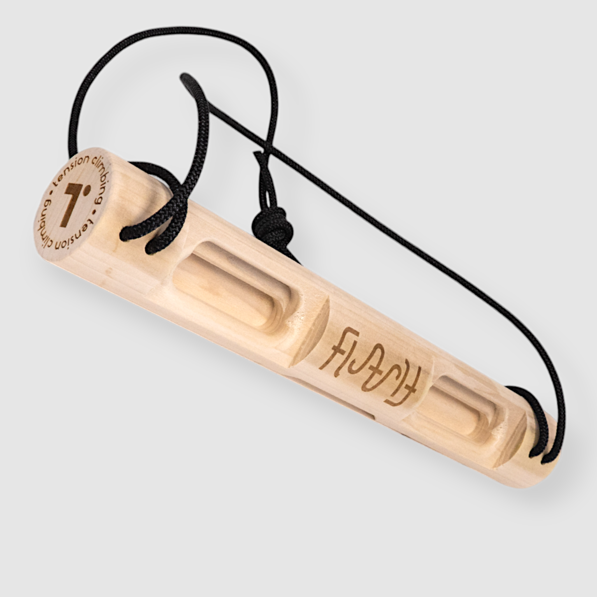
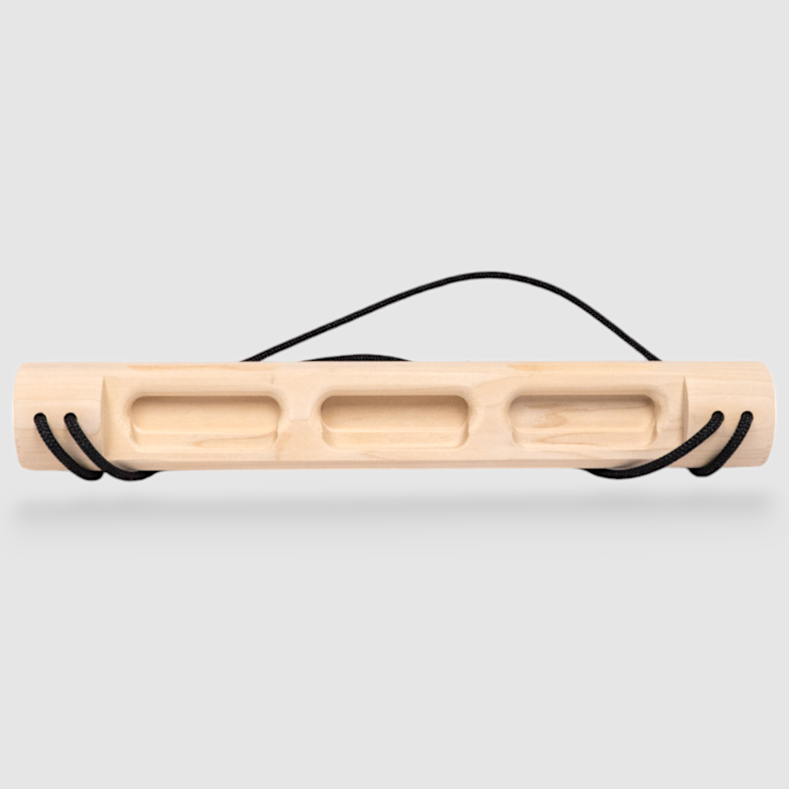
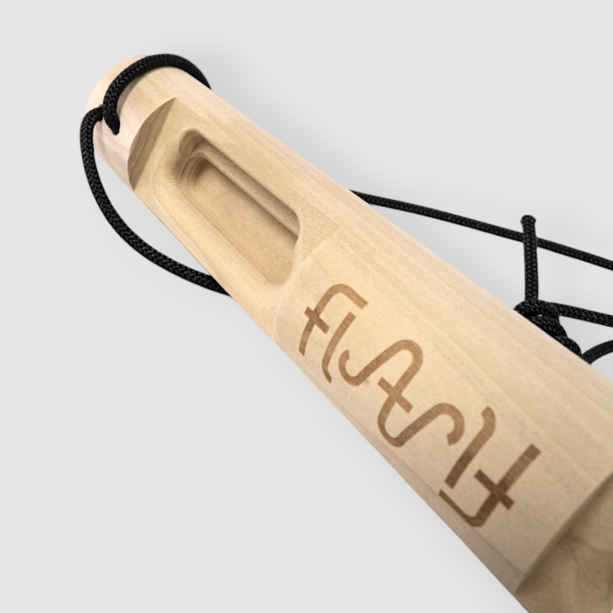
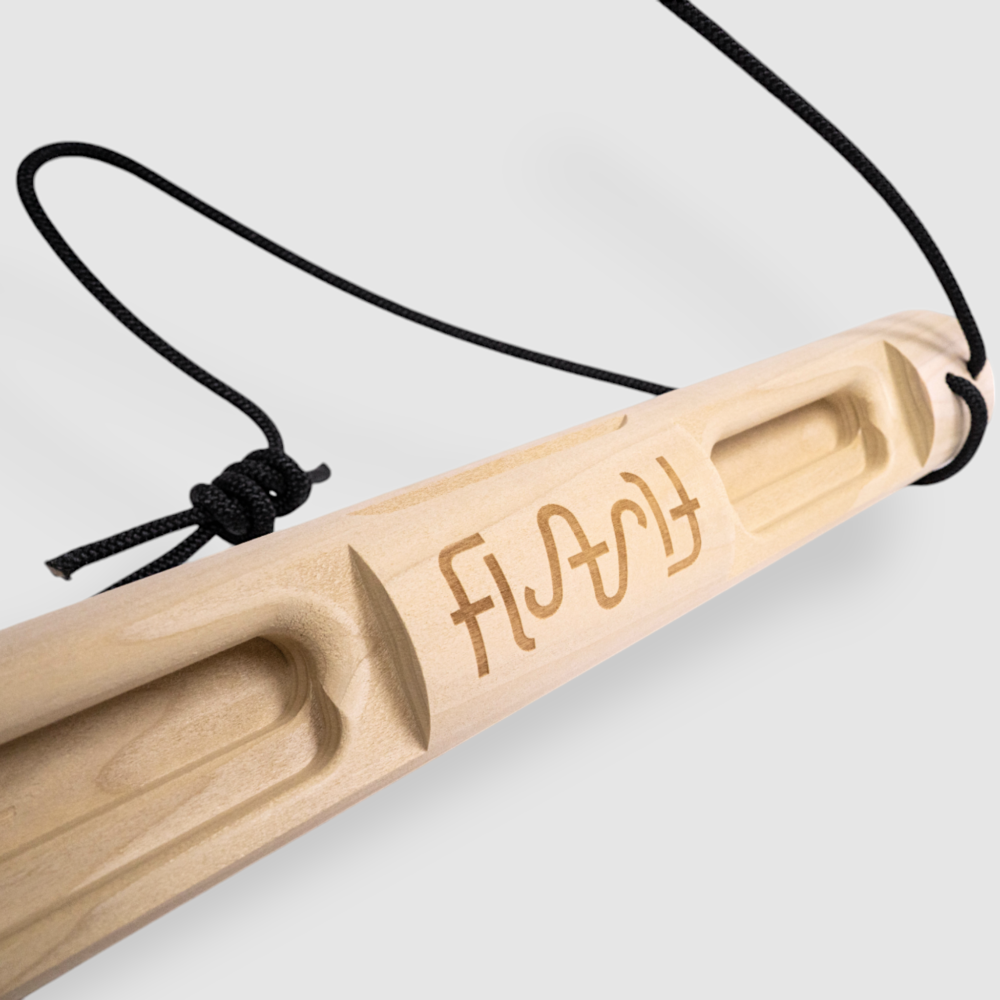

# tension-flash-board: CAD source evidence

Date: 2026-09-29. Publisher: Tension Climbing.

Four product views show the three-well and two-well faces, cylindrical body, shallow long ledges and four cord bores (two per end). Exterior return spans are visible. Existing seven contact IDs remain authoritative; photographs do not establish new training contacts. A graph of two bores plus exterior return at each end differs from a hidden U channel.

Status: approved by user 2026-09-29. Native CAD is authored; see geometry-review.html and the native validation reports for the separate geometry review. Historical records naming an agent as reviewer are not treated as new human approval.

## Source 1: tension-flash-product.html

- Publisher: Tension Climbing
- URL: https://tensionclimbing.com/products/flash-board-2
- SHA-256: `f2e1c2474d7c29b069a6061b04524a2b7df61e33dedbbcb0cd8111b0b7bafca1`
- Supports: exact-revision manufacturer
- Approval: historical cord evidence; new full visual set approved by user 2026-09-29

## Source 2: tension-flash-training-blog.html

- Publisher: Tension Climbing
- URL: https://tensionclimbing.com/blogs/training-tools/hangboard-overview-the-flash-board
- SHA-256: `c9692ca8f898ae65449aa2340d82e9040ed77d643b618217bd7c287ac737ff28`
- Supports: exact-revision training article
- Approval: historical cord evidence; new full visual set approved by user 2026-09-29

## Source 3: FlashBoard1.png

- Publisher: Tension Climbing
- URL: https://tensionclimbing.com/cdn/shop/files/FlashBoard1.png?v=1726542491
- SHA-256: `aa00ab77e04c685acc4dee0e0704d25fd3165810387649a4e924bf3f7bfff148`
- Supports: Four product views show the three-well and two-well faces, cylindrical body, shallow long ledges and four cord bores (two per end). Exterior return spans are visible. Existing seven contact IDs remain authoritative; photographs do not establish new training contacts. A graph of two bores plus exterior return at each end differs from a hidden U channel.
- Approval: approved by user 2026-09-29

## Source 4: FlashBoard2.png

- Publisher: Tension Climbing
- URL: https://tensionclimbing.com/cdn/shop/files/FlashBoard2.png?v=1726542491
- SHA-256: `ae84f7d58def1c2f4e3b14c2e98ddf8e332b7f48e6c774312744b792d4ab97b4`
- Supports: Four product views show the three-well and two-well faces, cylindrical body, shallow long ledges and four cord bores (two per end). Exterior return spans are visible. Existing seven contact IDs remain authoritative; photographs do not establish new training contacts. A graph of two bores plus exterior return at each end differs from a hidden U channel.
- Approval: approved by user 2026-09-29

## Source 5: FlashBoard3.png

- Publisher: Tension Climbing
- URL: https://tensionclimbing.com/cdn/shop/files/FlashBoard3.png?v=1726542491
- SHA-256: `5753461d938adb19655556e8070f7361a0f9a1697752a861bacde4d240f0f63d`
- Supports: Four product views show the three-well and two-well faces, cylindrical body, shallow long ledges and four cord bores (two per end). Exterior return spans are visible. Existing seven contact IDs remain authoritative; photographs do not establish new training contacts. A graph of two bores plus exterior return at each end differs from a hidden U channel.
- Approval: approved by user 2026-09-29

## Source 6: FlashBoard4.png

- Publisher: Tension Climbing
- URL: https://tensionclimbing.com/cdn/shop/files/FlashBoard4.png?v=1726542491
- SHA-256: `7c078225890ae6d6975bff865e706e8858e7a56c3edc8df572637241ca6df200`
- Supports: Four product views show the three-well and two-well faces, cylindrical body, shallow long ledges and four cord bores (two per end). Exterior return spans are visible. Existing seven contact IDs remain authoritative; photographs do not establish new training contacts. A graph of two bores plus exterior return at each end differs from a hidden U channel.
- Approval: approved by user 2026-09-29

Native CAD review artifacts: [geometry comparison](geometry-review.html), [authoring notes](geometry-authoring-notes.md), [metadata preservation](metadata-preservation.json), [native edit validation](native-validation.json). Final app review is coordinated separately.
