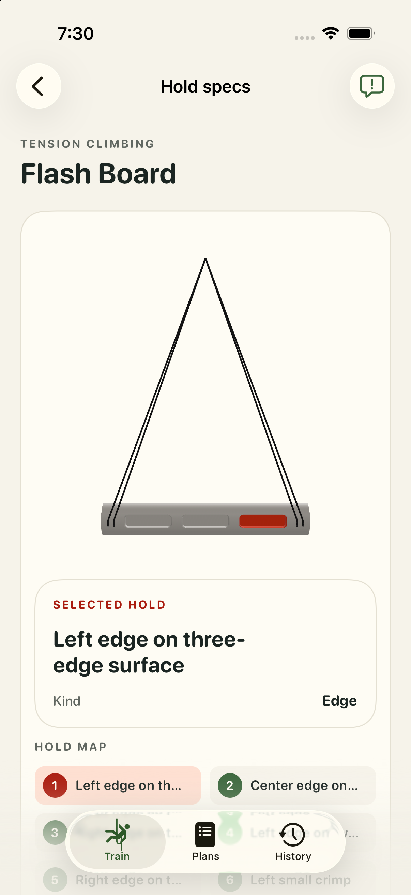
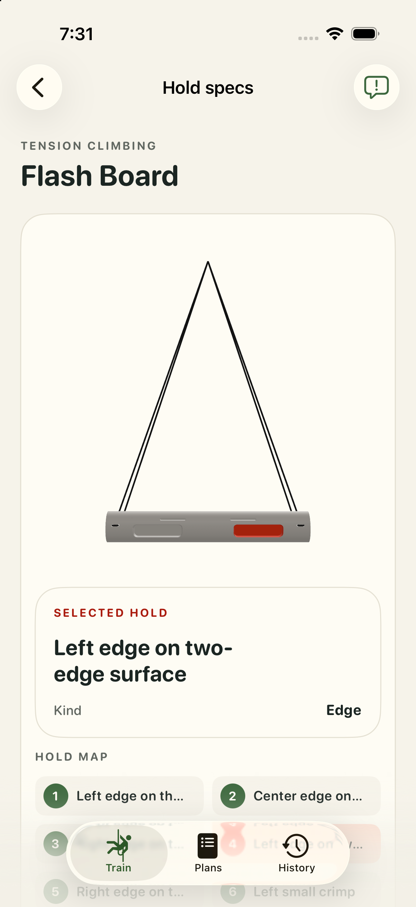

# Tension Climbing Flash Board: app review

Captured in the isolated iPhone 17 Pro simulator on iOS 26.5. Geometry acceptance is pending our one-by-one review.

three-edge-left; DEBUG initial hold.

two-edge-left; DEBUG contact review route.

[Exact model hashes and validation](validation.json).
