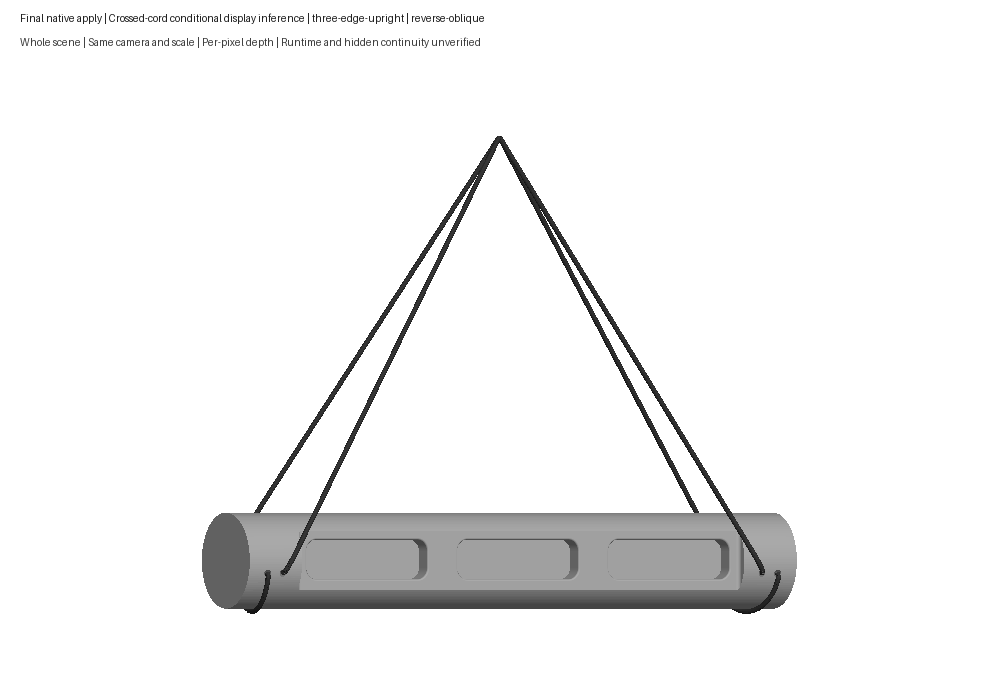
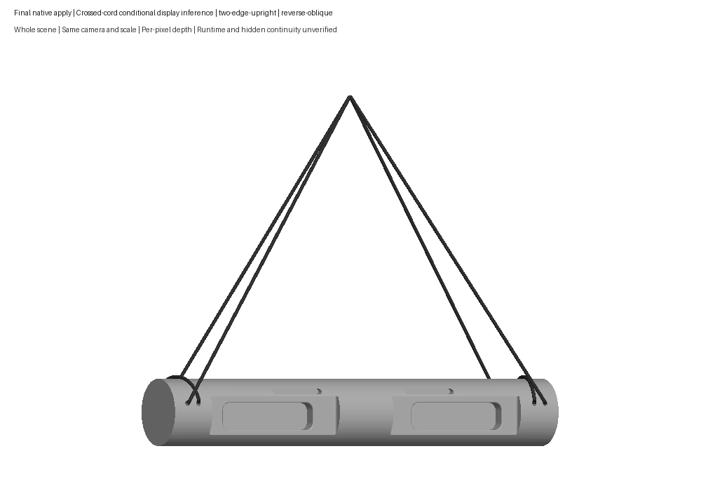

# #14 Tension Flash Board — corrected cord review

The cord now wraps around each barrel end instead of linking adjacent holes on the two-well face. One free lead exits each face at either end. Opus recommended this conditional display reconstruction after inspecting the whole maker footage. The exact hidden connection and strand contact order remain unobserved.

The shallow shelves, rounded mouths and seven selectable holds use the same native source/model/descriptor as the preceding shape correction. Wood remains the generic app finish selector; the USDZ has no materials or textures. These are whole CAD previews with per-pixel depth, not current app screenshots.

Whole prior-committed/current [front](corrected-views/two-edge-upright-front-prior-current.png), [side](corrected-views/two-edge-upright-side-prior-current.png) and [top](corrected-views/two-edge-upright-top-prior-current.png) comparisons cover the changed display. All four poses have additional whole front/side/top/reverse-oblique sheets. The former average-depth painter incorrectly drew hidden geometry over wood; corrected reviews use per-pixel depth.

The existing native solver generated every route and settled height, then reproduced the final cache in a fresh check. Its A* option changes search order on the same visibility graph. The full-solid and tube checks retain their existing 10 µm numerical allowance. No route points were drawn by hand and no solver or renderer code changed. Solved exterior wraps are approximately 107.345 mm; the 109 mm allowances, 420 mm leads, 200 mm starting support offset and 2 mm cord radius are display estimates, not supplied maker rope lengths. The wraps use the native shortest +Y crown section; the exact paths are planar display approximations.

The 500×76×76 mm envelope, native bores, cavities, ledges and round sizes remain estimates. The maker's 8/10/15/20 mm list does not establish a per-contact mapping; original contact facts and all twelve setup transitions remain intact. Conditional pairing depends on the inherited straight-bore estimates, one continuous cord per end, one exterior winding, and the independent reading of the two-well-face mouth roles. None establishes observed hidden continuity.

Fresh package validation covers 64 boards and 58 model deliveries. Both platforms stage the exact generated manifest/model bytes, nine focused Python cases pass, and one generic iOS build-for-testing succeeds for this corrected sidecar. No current app launch, app frames or Swift unit execution is claimed. Current wood, selection, picking, pose cameras and workout behavior remain unverified.

[Current validation scope](runtime-validation.json), [Opus advice](cord-feedback/opus/final-advisory.md), [retained whole maker evidence](cord-feedback/source-retention.json), [exact corrected sidecar](cord-feedback/final-native/certified-suspension.json) and [artifact hashes](artifact-sha256.json) are retained. Earlier cord/build evidence is historical and covers the rejected graph; unchanged native geometry/export proofs retain their original identities.

[Producer closeout](cord-feedback/final-native/final-artifact-index.json) pins the final inputs and cleanup. A [separate argv receipt correction](cord-feedback/final-native/command-argv-supplement.json) records a logging list-alias defect; raw receipts are preserved and the native results are unaffected.

The user accepted the shown CAD shape and inferred barrel-wrap cord on October 2 with **“Y”** to “Does #14 look right now?” [The exact acceptance record](human-acceptance.json) binds the shown images and assets. Current app appearance and workflow remain unverified. Technical reports retain their pending-at-validation historical state.
