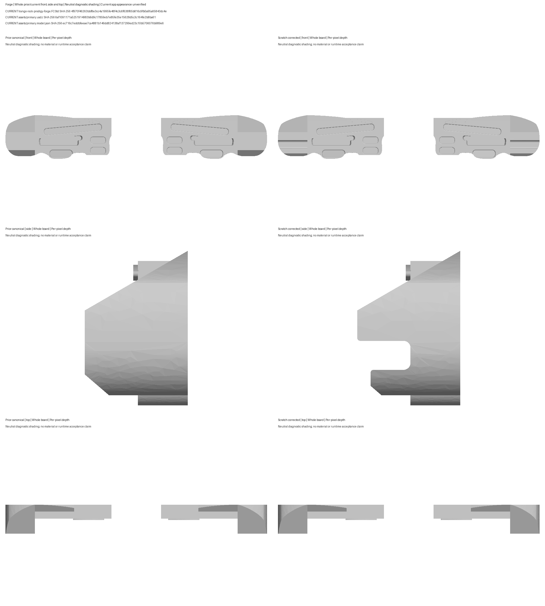
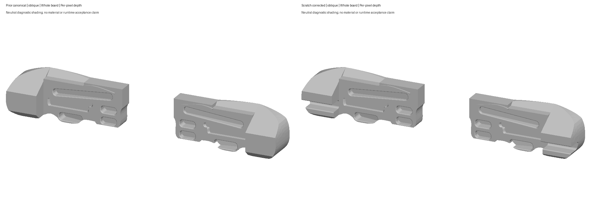

# #15 Trango Rock Prodigy Forge — current CAD review

Human acceptance is pending. The current source is `4f970f46263bbf8e3cc4a1995fe48f4c3c6f638f65b816c9fb0a95a65843dc4e`, model `6af1091171a5251914983b6d9c17859eb7e85fe35e15628d5c3c164fe2b8ba61`, and descriptor `ec716c7eddbfeeae7ca4881b146dd824138af137299ed23c10b5706076b989e6`. [Human review scope](human-review.json) records the exact version.

The outer wings now contain the open recessed band and a lower pinch return set back from the upper projection. Approved whole Trango product views 03/04 and the official hold chart support that visible topology. The earlier chamfered solid wing is retained as the rejected prior revision in [the independent diagnosis](historical-shape/shape-verdict.json). The first rounded-section scratch model was also set aside because its lower lip projected too far forward. The final native sketch carries the lower lip back; no pixels were measured, traced, cropped or transformed.

An intermediate saved source also failed independent contact preservation: a restored depth edit changed serialized face references, so reopening lost the broad 30° sloper highlight surface. The raw failed runs and diagnosis remain under `rejected-verification`. The correction derives the upper contact surfaces from stable native reference geometry; the independent final gate checks every complete contact against the physical body and the immutable baseline after reopening, without relaxing the area tolerance.

The final sketch uses 25 mm opening height, 6 mm back roll, 46 mm inset, 2.5 mm mouth roll, and 11.5 mm lower-lip setback. Those values and the X span are display estimates. Native mirroring retains paired symmetry. All twenty existing contact surfaces and logical factual fields are unchanged. No new pinch contacts or training prescriptions were added.

The embedded `surfaceFinish: plastic` selects the app's generic material palette. It is an appearance inference from molded textured maker photos, not a manufacturer statement about polymer chemistry or exact color. The committed USDZ remains unbound, with no materials or textures. These review images use neutral diagnostic CAD shading and are not app screenshots.

Manufacturer-backed 323.85 × 133.35 mm per-unit dimensions, 30°/40° sloper planes, 7.5 mm closed crimp, 25/15 mm MR pockets, and 7–20 mm variable rail are preserved. The IMR cavity keeps its existing shallow/deep ownership and absence of structured IM depth metadata; the guide's 19–31 mm range remains in the original audit. Mount holes, screws and the visible IMR fastener stay omitted under display policy. [Primary evidence and source mapping](../source-audit.md) remain available beside this revision.

[Front](views/comparison-front.png) · [Side](views/comparison-side.png) · [Top](views/comparison-top.png) · [Current whole oblique](views/current-oblique.png)

Independent native checks, two fresh deterministic compiles, unbound empty-stage USDZ reimport, contact/normal checks and the final export-bound shape review passed. Native recess and mirrored closed-crimp edit/restore checks passed. 31 focused Python tests passed, all 64 packages validated, iOS ODR/Android inline staging matched the current generated metadata and model, and the generic iOS build-for-testing passed. Current app appearance, picking, highlight switching, orbit and workout behavior are unverified; zero current app frames and zero Swift unit cases were executed. Historical app frames belong to the prior asset revision.

The original inverse-rounded-point normal probe flagged 28 vertices and is retained as a completed failure. Independent unique native facet ownership supplied 106 full-precision point/UV witnesses across 90 triangles, resolving every flag without changing the 5e-6 normal tolerance, source, compiler or asset. Maximum vector error was 3.026965410505641e-8; the flags came from rounded inverse parameterization/face-candidate selection. See preflight/full-precision-normal-witness and the final normal disposition.

Exact owned process groups, temporary staging directories and derived data were cleaned and their absence verified. Reports and raw logs are retained byte-for-byte. Only Forge's three package files changed; 203 other package files and all seven reserved shared source files are unchanged. No parallel workspace was inspected or merged.
