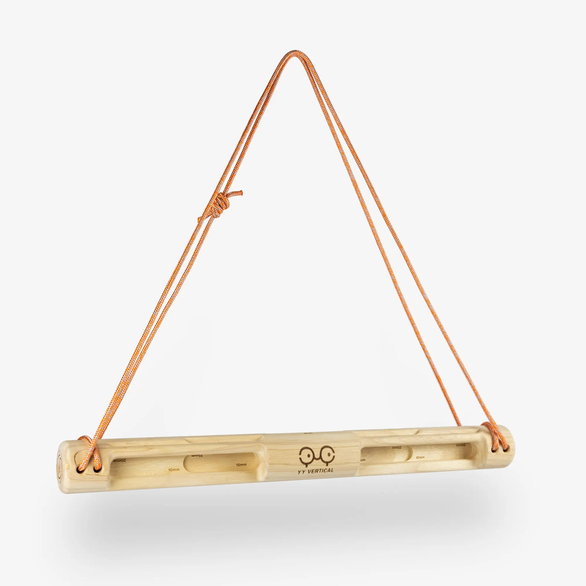
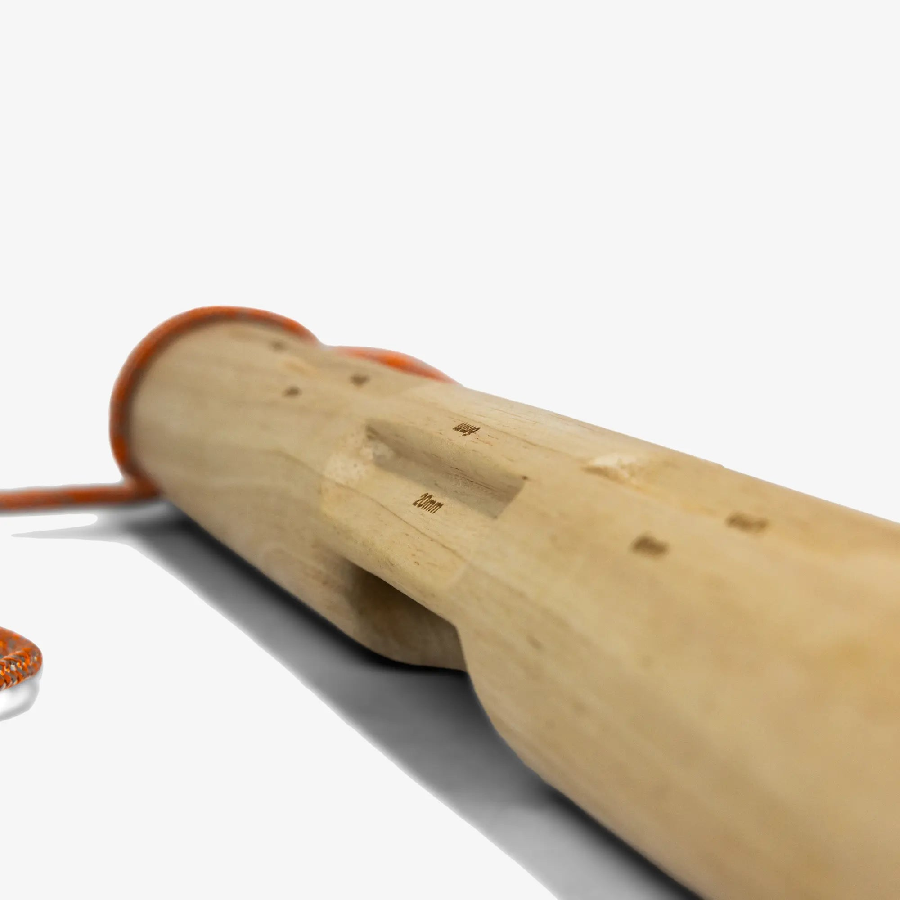
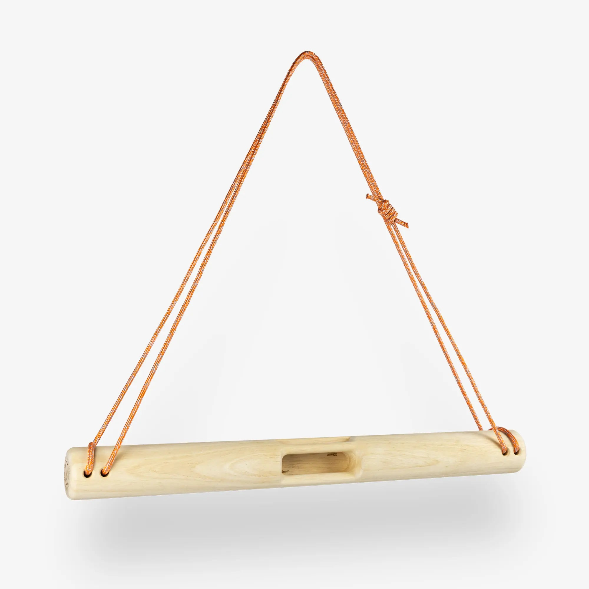
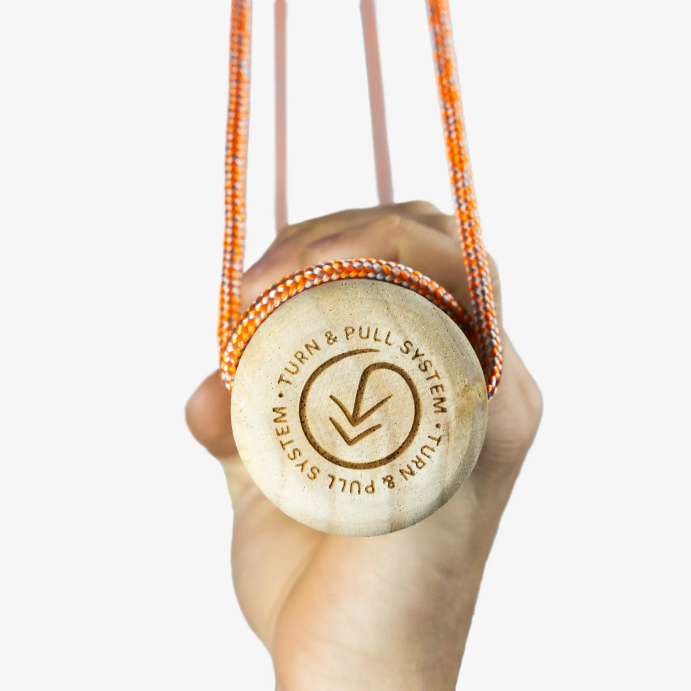
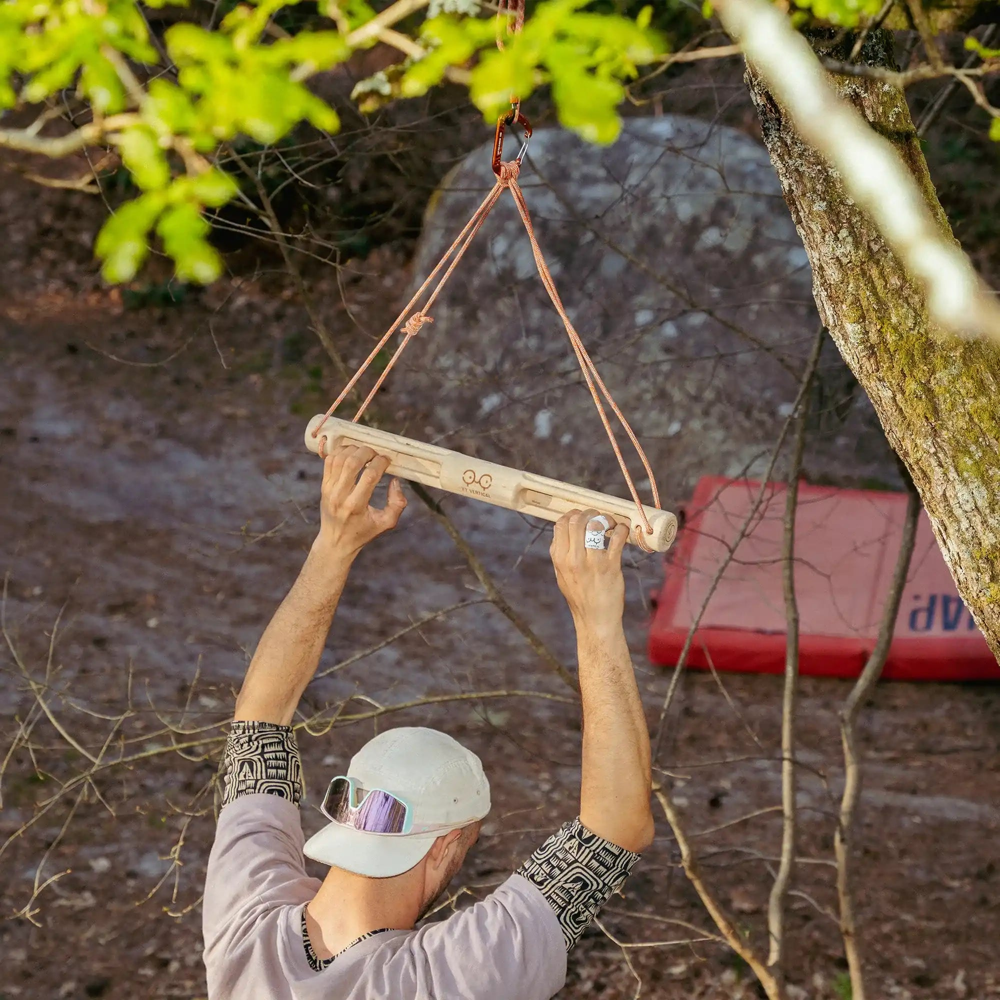

# yy-baguette-evo: CAD source evidence

2026-10-01 individual review: [rounded native cavities, wood finish and nine bearing-up poses](individual-review-2026-10-01/review.md).
The individual review corrects the native cavity ends and splits opposing
bearings into nine poses. The five-position statements below describe the
historical migration. Human acceptance remains pending.

Date: 2026-09-29. Publisher: YY Vertical.

Exact Turn & Pull revision gallery shows a cylindrical bar, multiple rounded cavities, four end bores, and paired exterior cord wraps. 07 shows oblique cavity relief; 03 shows loaded front and four strands; 10 shows the end wrap. Preserve 19 existing contacts across five positions; do not turn the visible exterior return into a hidden connection.

Status: approved by user 2026-09-29. Native CAD is authored; see geometry-review.html and the native validation reports for the separate geometry review. Historical records naming an agent as reviewer are not treated as new human approval.

## Source 1: yy-baguette.html

- Publisher: YY Vertical
- URL: https://www.yyvertical.com/en/products/baguette-evo
- SHA-256: `23ea747dda552429fe9bb1606e47812113ae062b0457941634a37831eeff3af1`
- Supports: exact-revision manufacturer
- Approval: historical cord evidence; new full visual set approved by user 2026-09-29

## Source 2: yy-baguette-evo-image.webp

- Publisher: YY Vertical
- URL: https://www.yyvertical.com/cdn/shop/files/YY_BAGUETTE_EVO_02_FG.webp?v=1751469206
- SHA-256: `c42f96ebed2b58d1a287f5b125fd3607cc9244a651a92e2731fe4b589e80ea3e`
- Supports: exact-revision product image
- Approval: historical cord evidence; new full visual set approved by user 2026-09-29

## Source 3: YY_BAGUETTE_EVO_07_FG.webp

- Publisher: YY Vertical
- URL: https://www.yyvertical.com/cdn/shop/files/YY_BAGUETTE_EVO_07_FG.webp?v=1751469206
- SHA-256: `4e06a28092af6e4d2f8f37e244ea2d39816c37182cf6a78375d68ba126851983`
- Supports: Exact Turn & Pull revision gallery shows a cylindrical bar, multiple rounded cavities, four end bores, and paired exterior cord wraps. 07 shows oblique cavity relief; 03 shows loaded front and four strands; 10 shows the end wrap. Preserve 19 existing contacts across five positions; do not turn the visible exterior return into a hidden connection.
- Approval: approved by user 2026-09-29

## Source 4: YY_BAGUETTE_EVO_03_FG.webp

- Publisher: YY Vertical
- URL: https://www.yyvertical.com/cdn/shop/files/YY_BAGUETTE_EVO_03_FG.webp?v=1751469206
- SHA-256: `5e73306d55787af679e3423f98bf7a0e673bc5bc1a7d83a7cd3381c8d56d0c54`
- Supports: Exact Turn & Pull revision gallery shows a cylindrical bar, multiple rounded cavities, four end bores, and paired exterior cord wraps. 07 shows oblique cavity relief; 03 shows loaded front and four strands; 10 shows the end wrap. Preserve 19 existing contacts across five positions; do not turn the visible exterior return into a hidden connection.
- Approval: approved by user 2026-09-29

## Source 5: YY_BAGUETTE_EVO_10_FG.webp

- Publisher: YY Vertical
- URL: https://www.yyvertical.com/cdn/shop/files/YY_BAGUETTE_EVO_10_FG.webp?v=1751469206
- SHA-256: `4444b62d227c185ad62cfe355bf88b9f2feb367acce0b3095756e36ff03c8de0`
- Supports: Exact Turn & Pull revision gallery shows a cylindrical bar, multiple rounded cavities, four end bores, and paired exterior cord wraps. 07 shows oblique cavity relief; 03 shows loaded front and four strands; 10 shows the end wrap. Preserve 19 existing contacts across five positions; do not turn the visible exterior return into a hidden connection.
- Approval: approved by user 2026-09-29

## Source 6: yy-vertical-escalade-agres-nomade-entrainement-nomadic-tool-gear-equipment-training-baguette-evo-utilisation-22.webp

- Publisher: YY Vertical
- URL: https://www.yyvertical.com/cdn/shop/files/yy-vertical-escalade-agres-nomade-entrainement-nomadic-tool-gear-equipment-training-baguette-evo-utilisation-22.webp?v=1779889382
- SHA-256: `694b540679dee86021a8567a273ba2d5d0fa23430a2893bf12a07057ff69d646`
- Supports: Exact Turn & Pull revision gallery shows a cylindrical bar, multiple rounded cavities, four end bores, and paired exterior cord wraps. 07 shows oblique cavity relief; 03 shows loaded front and four strands; 10 shows the end wrap. Preserve 19 existing contacts across five positions; do not turn the visible exterior return into a hidden connection.
- Approval: approved by user 2026-09-29

Native CAD review artifacts: [geometry comparison](geometry-review.html), [authoring notes](geometry-authoring-notes.md), [metadata preservation](metadata-preservation.json), [native edit validation](native-validation.json). Final app review is coordinated separately.

Final generated cord review: [native solve](native-cord-solve.json), [continuous stored-cache certificate](continuous-cord-clearance.json), [mouth/axis source mapping](cord-authoring-review.json). The original estimated 2 mm radius is retained. All five poses pass continuous solid clearance and cord tube intersection checks.
