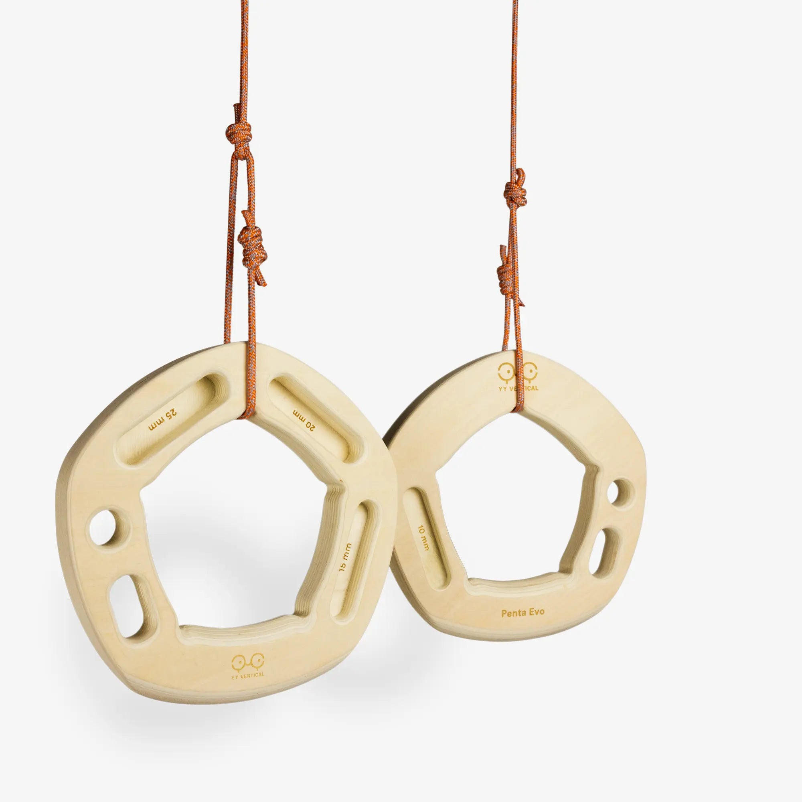
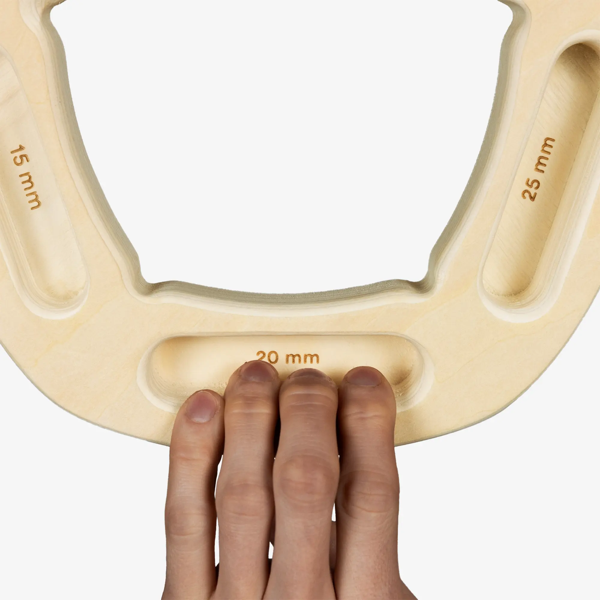

# yy-penta-evo: CAD source evidence

Date: 2026-09-29. Publisher: YY Vertical.

Two byte-exact approved originals show front/reverse of one asymmetric unit and close-up rounded recesses. Seven slots map to 14 contacts through two identical unreflected instances. Two strands wrap the upper band through the existing central opening; there is no evidence for a small hidden channel. Exact original binary URLs remain unknown; the product page is a reference URL only.

Status: historical exact set reused. Native CAD is authored; see geometry-review.html and the native validation reports for the separate geometry review. Historical records naming an agent as reviewer are not treated as new human approval.

## Source 1: yy-penta-evo-front-reverse.webp

- Publisher: YY Vertical
- URL: https://www.yyvertical.com/en/products/penta-evo
- SHA-256: `83b95adc297d634659654f6f27bb43ebae1c53b171b747568ac5e022754e6571`
- Supports: PE-RESTORED full front/reverse original: two exterior strands around top band and through central ring; binary URL unknown, product URL is reference only
- Approval: approved exact set in batch-04 design

## Source 2: yy-penta-evo-close-up.webp

- Publisher: YY Vertical
- URL: https://www.yyvertical.com/en/products/penta-evo
- SHA-256: `1107039ef6d2877cd68a293683c72ec93f3166633199d45484f58c13b48aa2fc`
- Supports: PE-RESTORED intact close-up original: uninterrupted lower band and retaining concavities; binary URL unknown, product URL is reference only
- Approval: approved exact set in batch-04 design

Native CAD review artifacts: [geometry comparison](geometry-review.html), [authoring notes](geometry-authoring-notes.md), [metadata preservation](metadata-preservation.json), [native edit validation](native-validation.json). Final app review is coordinated separately.
