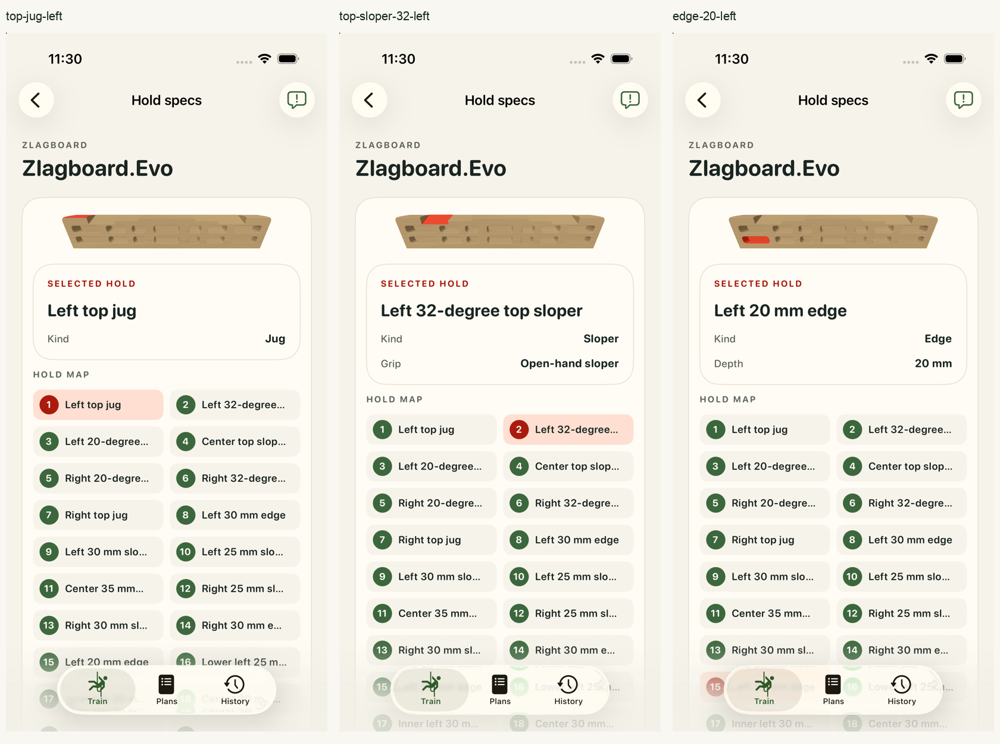
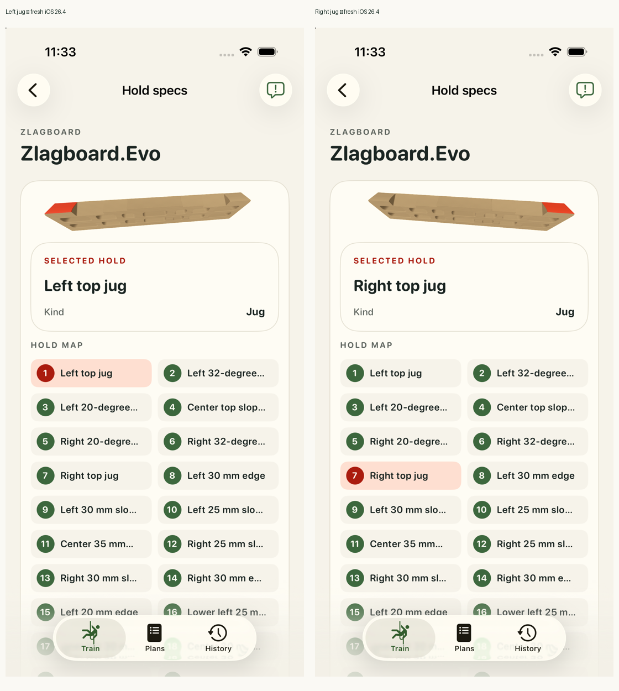
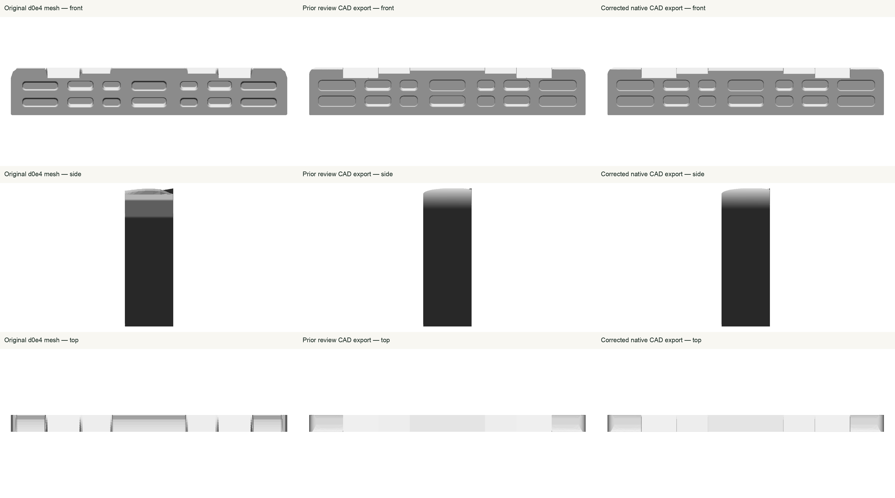

# #20 Zlagboard.Evo — fresh geometry review

Geometry is ready for one-by-one human review; acceptance remains pending. Full app-workflow validation is **not passing** because workout red/blue highlight transitions intermittently show the previous color on both iOS 26.4 and 26.5. No app fix ships with this review.

The native correction adds editable top trough/lip rounds and restores the outer jug crest and corner contact coverage. The 2 mm and 1 mm round sizes are display estimates. All 21 contact identities, 14 pocket bearing surfaces, and sourced depths and top angles remain preserved. The existing renderer wood finish is used; the USDZ remains unbound with no materials or textures. This is a fixed wallboard with one upright orientation and no suspension.

The seven [selection sheets](ios-26-4/review-montages/selections-1.png) and their original captures cover every contact. Both root and an independent Astra reviewer inspected the whole app views. Physical taps selected the right 20 mm pocket, left jug and center 35 mm pocket; tapping a contact after orbiting restored the canonical camera. The initial reset check mistakenly compared against a still-loading frame; its raw failure is retained beside the corrected check against the ready frame.

The app was freshly built, installed and exercised on isolated iPhone 17 Pro Simulators. Final baseline app source matches commit `1f5a5865050c96bf89e67b1929099205dcbd6827` exactly. Installed package bytes and all five Mach-O payloads match the built baseline app. The 26.4 run reused the freshly built baseline app after the 26.5 run had been cleaned up. Two existing wood-finish tests passed; diagnostic tests also passed during experiments but did not detect the visual refresh failure. Their passing results are not evidence that the workout issue is fixed.

Four attempted renderer changes failed actual workout screenshots and were reverted. A diagnostic run observed blue CPU-side material values while the screenshot still displayed red pockets; the cause remains unestablished. See the [investigation notes](investigation-notes.md), [fresh baseline failure](ios-26-4/baseline-b-landscape/following-rest-settled.png), and immutable raw logs, patches and screenshots in this packet. The unchanged `research.max-hangs` routine was only a runtime fixture, not a manufacturer prescription for this board.

Native source and exports are byte-identical to the [retained native validation](../individual-review-2026-10-01/review.md), so unchanged exports were not repeated. The embedded manifest remains authoritative. The 700 × 120 × 42 mm envelope and other unspecified dimensions retain their explicitly documented display-estimate status; no manufacturing or ergonomic accuracy is claimed. Whole manufacturer evidence remains in the [source audit](../source-audit.md).

Both exact temporary Simulators, owned DerivedData and result bundles, and the preserved app product were removed and verified. The workspace and review agents remain available. [Validation summary](validation.json), [proof hashes](proof-sha256.json), and [independent final audit](../app-review-2026-10-02-final-audit.json) retain cleanup, source parity and scope checks. Earlier failure packets and all other board records are preserved. #21 remains scratch-only pending this review.
