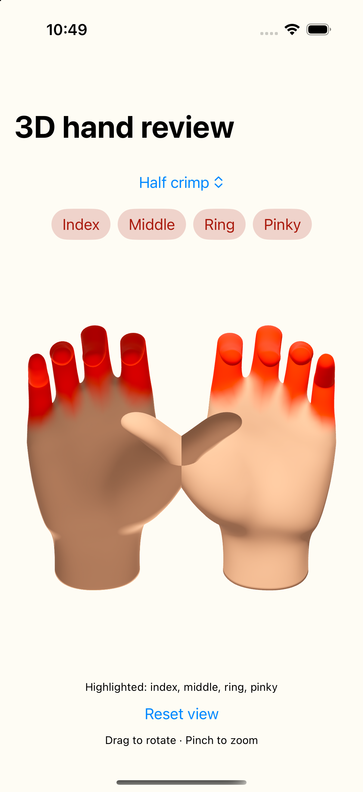
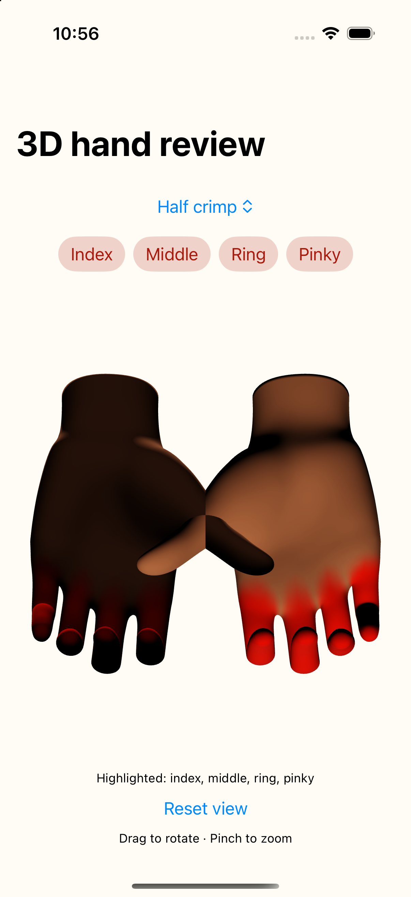
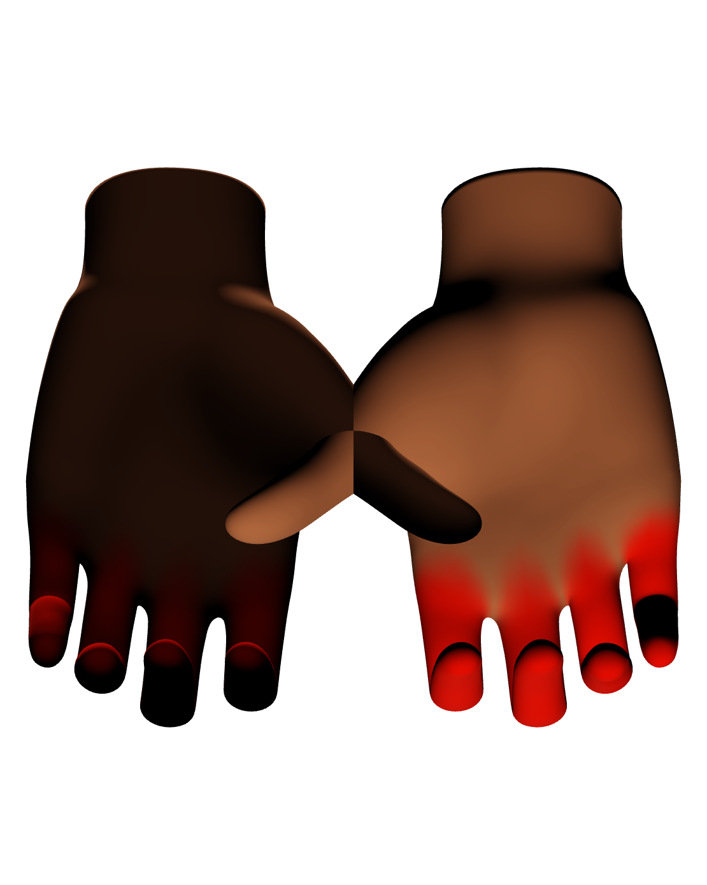

# Original whole static images

These are static prototype images, not workout validation. No crop or image processing was performed for this packet.

## Earlier live reference (first binary)

The paired image-a failed before rendering and has no image to display.

## Final live reference (second binary)

## Final image path (second binary): visual failure

Root reviewed these final three whole images and found vertical inversion and darker shading relative to live. The separate published-artifact copy is retained byte-exact in the raw tree.
