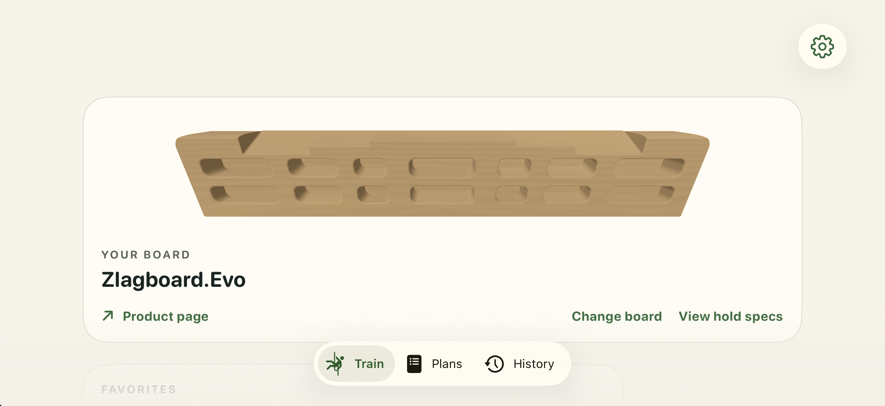

# Invalid prestart-hand suppression repeat

The single authorized unchanged repeat reached its 300-second capture bound with **zero eligible transitions and zero qualified phase screenshots**. It is an invalid comparison, not a color, hand-isolation, or production result. The complete 152-record trace and every original validator status remain exact.

The same source, binary (`f98a07f4383af14396d8442581a330f4d3523d0c9854436420b67bf14b681d97`), flags, readiness protocol, and strict capture prerequisites were used. The retained helper diff changes the run identifier, output paths, and explicit repeat authorization assertion. Prelaunch and final 27-check parity passed. The initial parity invocation supplied the wrong path argument; its failure record and original stdout/stderr remain alongside the corrected invocation's result.

## What was observed

The early whole image below shows Train, not a later workout phase. Its screenshot command took about 1.337 seconds. The pair constructor appeared about 13.781 seconds after the pre-autostart marker. Later CPU state changed to selected active at about +190.475 seconds and selected preview at +197.508 seconds. This supports recorded state progression; it does not establish displayed colors, exact session start, constructor-time suppression state, GPU behavior, or a blocked thread. No positive countdown or earlier empty selection on the eventual workout scene was recorded, so the unchanged capture eligibility rule excluded the later transitions.

All eleven executed validator/comparison commands exited 1; their original stdout/stderr and statuses are retained. Missing phase/capture prerequisites are not converted into semantic passes or failures. In particular, the weak-census identity/schema checks passed, while the required twelve capture brackets failed. This is not an all-validators-passed run.

## Retention and limits

The exact 76-file freeze plus its original manifest are retained. `retention-manifest.json` maps every source to its copy; `retained-files.sha256.json` hashes the entire packet except itself. This includes helper originals/diffs, protocol, complete trace, initial image, parity failure/correction, checker failures, and app termination proof. Shared source/build provenance and the qualified source audit remain in the preceding [invalid-action packet](../runtime-prestart-hand-action-invalid-2026-10-02/README.md) and its linked control evidence.

The exact app PID 30370 was terminated and verified absent. The root controller retains ownership of the Simulator and DerivedData; this packet claims no resource cleanup beyond that app termination. No further repeat or reversal belongs to this experiment. Any subsequent startup-observation preparation is separate and excluded.

No native geometry, human acceptance, production source, queue, prior evidence, or runtime resource was changed by this packaging task. Raw whitespace is preserved. Only this new editorial README is checked for trailing whitespace; no raw-whitespace pass is claimed.
