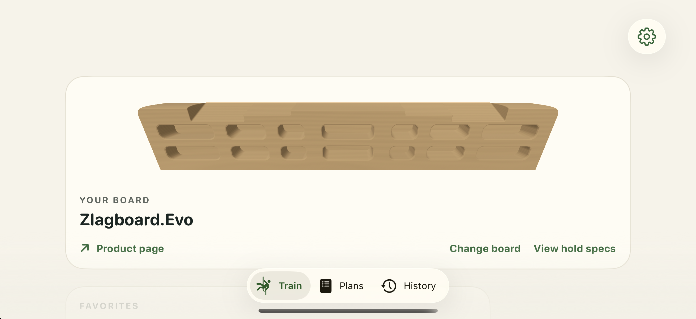

# Invalid matched full-color action

This action is **invalid for the intended comparison**: zero timed phase images were captured before the prospective 30-second initial-sequence deadline. The trace contains 19 complete contiguous records. No color, hand-isolation, or production verdict follows, and no repeat or reversal belongs to this experiment.

The last record is the marker immediately before the existing audio-preparation call, about 0.0077 seconds after workout appearance. No corresponding after-marker was observed by the endpoint, about 30.024 seconds later. This identifies an unfinished instrumented region within a bounded observation. It does not establish an internal audio-API duration, deadlock, cause, eventual completion, or a workout that never started. Unlike the earlier longer invalid attempts, this shorter window contains no later selected CPU transition; no longer history is inferred.

All eleven full-sequence validator/comparison commands exited 1. Their original raw output and statuses are retained. Missing phases and brackets were not bypassed or reclassified as passes. Prelaunch/final 27-check parity passed for the same diagnostic binary `09310b53114826e1e9c39a499846b2e57a6b464e576aa7bf879b56709d267854`; binary parity cannot supply the missing runtime evidence. The separate [matched control](../runtime-startup-full-color-control-2026-10-02/README.md) remains a valid visual failure, while this action leaves the comparison inconclusive.

The additive [source-only audio audit](analysis/startup-audio-prepare-source-audit/summary.md) identifies synchronous MP3 decoding and audio-engine preparation on MainActor in the preferred path, with no obvious app-owned blocking wait. It separately records fallback/callback limits. It does not prove which backend executed, localize the unfinished region internally, or establish a lock cycle, deadlock, or cause.

The only whole image is the early Train screen with the native board visible. Its screenshot command took about 0.472 seconds. It shows no later workout phase and cannot establish later board colors or hand visibility.

The exact 66-file freeze and its original manifest preserve raw logs, trace, validators, protocol, timing/correlation records, image, parity, and app termination proof. Shared helper/source/build provenance remains in the control and startup-observation packets; no app bundle is duplicated. `retention-manifest.json` maps every copy; `retained-files.sha256.json` hashes this packet except itself.

Exact app PID 67318 was terminated and verified absent. The root controller retains Simulator/DerivedData ownership; no broader cleanup is claimed. This packaging changes no source, runtime resources, native package, queue, acceptance record, or previous packet. Raw whitespace remains exact; only the new editorial README is checked for trailing whitespace. Any subsequent source audit or preparation is separate unless explicitly listed as an additive supplement in this packet's manifest.
