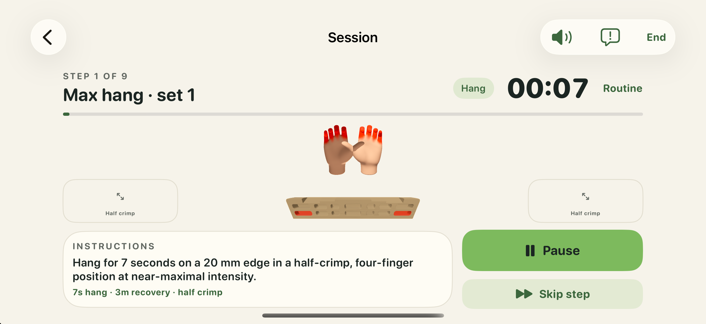
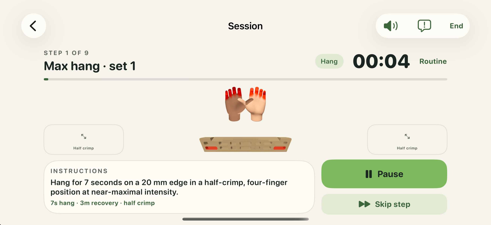
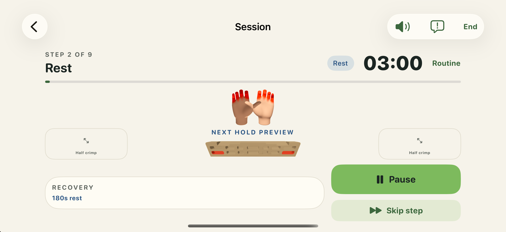
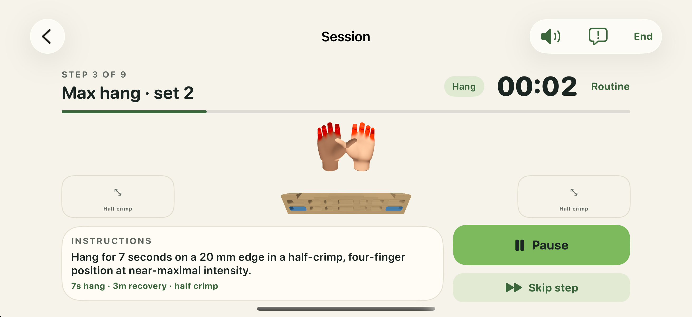

# Complete control images

Whole original screenshots; no crop or processing. Offsets are requested capture offsets, not guarantees of instantaneous display timing.

## First Hang — expected red, all four red

## Rest — expected blue, all four red

## Following Hang — expected red, all four blue

