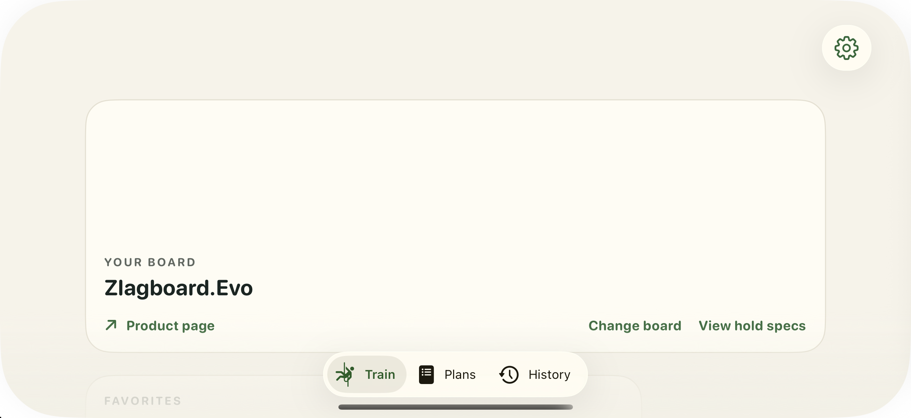

# Bounded startup observation

This single 30-second observation completed and **did not reproduce the earlier long startup gap**. It is not a workout color result, suppression-isolation result, or production fix. The diagnostic binary was `09310b53114826e1e9c39a499846b2e57a6b464e576aa7bf879b56709d267854`; the complete trace contains 82 records, with one request context and attempt.

Scalar markers record audio preparation (~0.126 seconds), audio arming (~0.025 seconds), the existing arm task resuming, and the visible-countdown mutation completing about 0.268 seconds after appearance. The recorded countdown values progress 0→3→2→1→0. Both model-load returns are explicitly associated with their constructor scene tokens; the workout load completed about 0.383 seconds after appearance. The cancellation call-site marker had both task/pending flags false, so it does not establish an actual task cancellation. These are CPU event measurements, not display/GPU presentation times.

The window ended about 0.011 seconds after its appearance-plus-30-second target. The final sparse trace record precedes that deadline, so the last unsampled interval remains right-censored. Added synchronous diagnostic work and asynchronous screenshot polling changed observation conditions; this run does not explain why prior initialization gaps occurred. No full phase-image sequence or color verdict was attempted. The sole whole image, independently reviewed by root, shows Train with a blank board slot during navigation; it shows neither a workout phase nor a hand cue.

The exact 114-file freeze and original manifest retain raw commands, logs, trace, source/build/install/parity snapshots, all proposal versions and their original failure/correction records, runtime helpers, and the root image review. The source audit is analysis rather than runtime proof. The separately retained independent timeline audit reconstructs the observation from frozen records and preserves its scope. It places the first paired-hand constructor/make about 0.736/0.756 seconds after the first selected highlight; no hand-readiness or visibility proof at a hypothetical active+0.25-second capture follows. Its intervals are marker-to-marker, not exclusive API CPU time; no deferred request or actual cancellation branch was exercised. `retention-manifest.json` maps the exact source paths to copies; `retained-files.sha256.json` hashes the packet except itself. No app bundle is included.

Prelaunch/final 27-check parity passed. App PID 18952 was terminated and verified absent; the Simulator and DerivedData remained owned by the root controller. This packet claims no broader resource cleanup. Earlier invalid-action/control evidence remains unchanged. No native package, source, queue, human acceptance, or runtime resource was changed by this packaging task, and no further run is part of this observation. Raw whitespace is preserved; the editorial README alone is checked for trailing whitespace.
