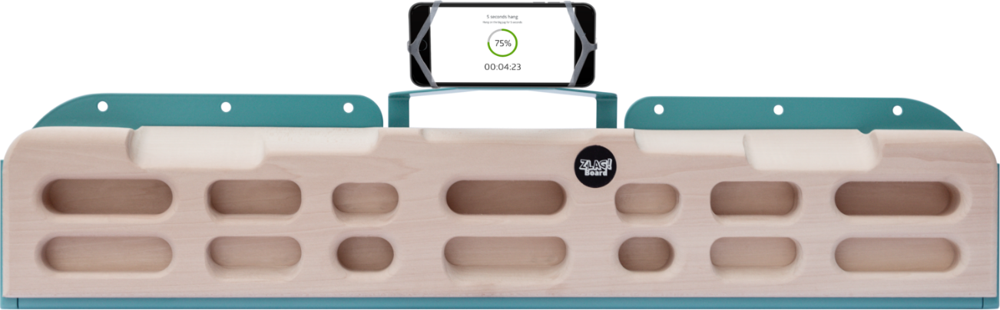
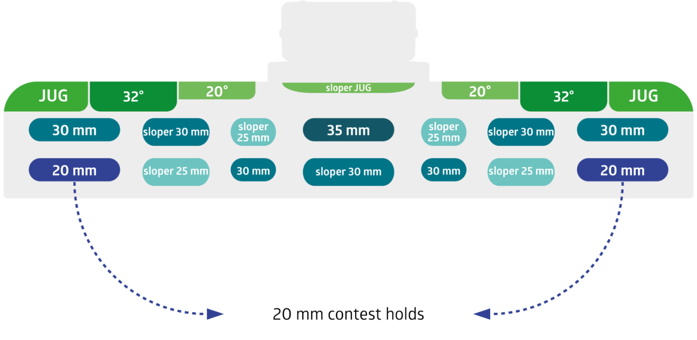

# zlagboard-evo source audit

Current compact lime-wood Evo revision: two seven-pocket rows below seven top surfaces. Manufacturer photo gives cavity and top profile form; materially distinct annotated hold chart gives 20/32 degree top surfaces and 20/25/30/35 mm rows. Preserve all 21 contact IDs. Phone/mounting plate/hardware omitted. Overall dimensions are absent from current package and must remain estimated unless supported separately.

Source-set approval: asherlc, 2026-09-29, direct conversation: “those are fine, feel free to use more searches for individual boards as needed”. Consolidated snapshot: `.context/placid-badger/source-review.json`.

## Sources

- [product-01.png](https://zlagboard.com/assets/web/Zlagboard_EVO-newscreen2x-fb153e0817b3e2ffc54e8fabd042ed5e7fffa804ef80388787da3b777004da3f.png) — Vertical-Life / Zlagboard; SHA-256 `fb153e0817b3e2ffc54e8fabd042ed5e7fffa804ef80388787da3b777004da3f`. Manufacturer gallery.
- [product-02.png](https://zlagboard.com/assets/web/zlagboard-evo-holds-014x2x-00d8566361fdbbb0740896a8a7805e652d20e09b2fbe54eb2d36b4b7ecb66d10.png) — Vertical-Life / Zlagboard; SHA-256 `00d8566361fdbbb0740896a8a7805e652d20e09b2fbe54eb2d36b4b7ecb66d10`. Manufacturer hold chart.

## Immutable pre-migration reference

Git commit `d0e4e95191e4a76822815bb4eeef3a32caa6fea0`; USDZ SHA-256 `35cabe2a3aa0505b4cca5545b368cca02396a30f826e1186449f546ff2f40884`; descriptor SHA-256 `0edf804bb442c9d04f5e486aedcd4acd97f2b936c7816f02e4920484e09f5042`. Bytes resolved through Git LFS and checked against the pointer. These are review/measurement references only.

## Native construction and verification

The canonical source is `Hangboards/zlagboard-evo/zlagboard-evo.FCStd`. It contains 78 fully constrained Sketcher profiles, seven native top-profile extrusions, a directly drawn rounded silhouette trim, 14 native ruled capsule-pocket lofts and final-body semantic SubShapeBinders. The file embeds the original metadata without any value, ordering, capacity, grip or camera changes. Each pocket floor is driven by a named `Depth_*` parameter; the document reopens and recomputes without Python callbacks or an external geometry source.

The retained manufacturer chart governs the seven top identities, 20/32 degree top slopes and 14 published pocket depths. The 700 x 120 x 42 mm display envelope comes from the prior display asset, not a recovered factory drawing. All pocket mouth sizes/centers, 2 mm mouth blend, 18 mm upper and 2 mm lower silhouette rounds, jug crest curves and unspecified interior slopes are operator-selected display estimates. The paired apertures are deliberately symmetric. Top jug surfaces are smooth native cubic profiles; pockets are analytic arcs and lines. Mounting plate, phone holder, holes, logos and materials are omitted under repository policy.

The pinned compiler passed its complete source/archive, binding, published-depth, USDZ-reimport, descriptor and staged-package checks. Native reopening and a 20→22 mm left lower edge depth edit moved that contact and the physical body while leaving every unrelated contact unchanged; restoration and unchanged source bytes were verified. There are 21 contacts, 22 nodes and 20,332 triangles; USD inspection found no material/shader prims or bindings. Exact hashes and dimensions are in `package-verification.json`; reproducible input, field inventory and native check evidence are retained beside this record.

| View | Prior and native CAD |
| --- | --- |
| Front | [Comparison](review/comparison-front.png) |
| Side | [Comparison](review/comparison-side.png) |
| Top | [Comparison](review/comparison-top.png) |

These orthographic CPU renders use the exact prior/current USDZ geometry and the shared `preview.py` renderer. They establish shape review, not native-app picking or performance; root integration owns native-app acceptance.

## Retained primary visual comparison

The CPU review renders shade triangle face normals; the runtime export retains native CAD surface normals. Native-app screenshots remain the final appearance check.

## Individual review update — 2026-10-01

The [individual review packet](individual-review-2026-10-01/review.md) retains the original evidence above and documents narrow native top-transition/lip rounds, restored jug crest selection coverage, and existing renderer wood finish with a gently downward camera. All 21 contact identities and published depths/angles are preserved; new 2 mm/1 mm rounding sizes are display estimates. The final source is `6f44115b879b6a2214dff04f13477ec1bf949627dfccc4319f1f9da6ec28b58c`. The new unbound export has 22 nodes and 36,970 triangles; its hashes and current validation are in [verification-index.json](individual-review-2026-10-01/verification-index.json). Human acceptance remains pending until the one-by-one review reply. Historical compiler and app proofs above retain their original hashes and statuses.

## Fresh app review — 2026-10-02

The [app review packet](app-review-2026-10-02/review.md) shows all 21 selectable
contacts, existing wood finish, gently elevated jug coverage and physical picking
with camera reset in a freshly built app. Native source and exports remain exactly
as validated above. Human geometry acceptance remains pending. Workout red/blue
highlight transitions have a retained, unresolved refresh failure on iOS 26.4 and
26.5; this packet does not claim full app-workflow validation. All trial app/test
edits were reverted; raw failures and historical proofs retain their exact bytes.
