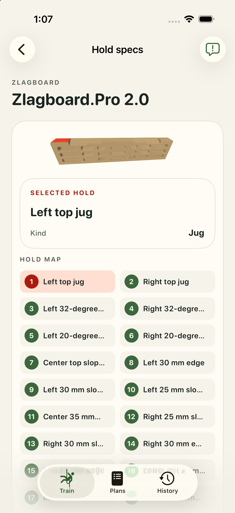
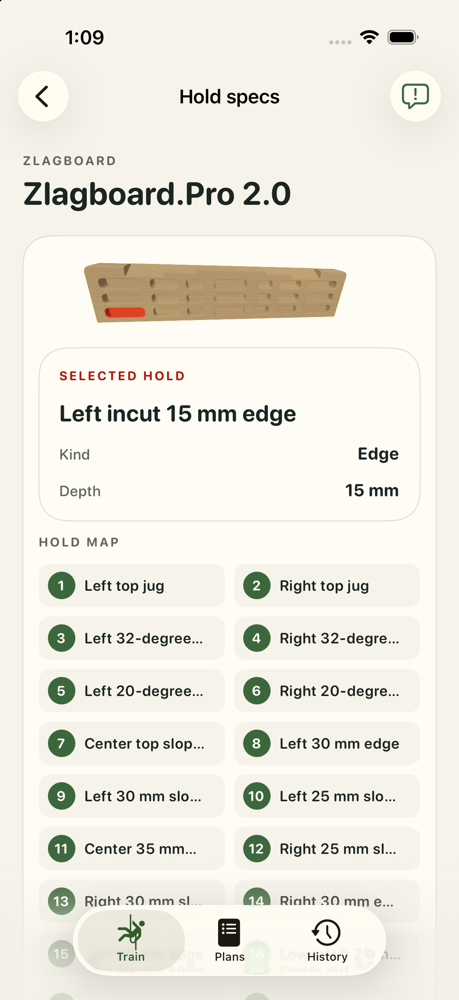
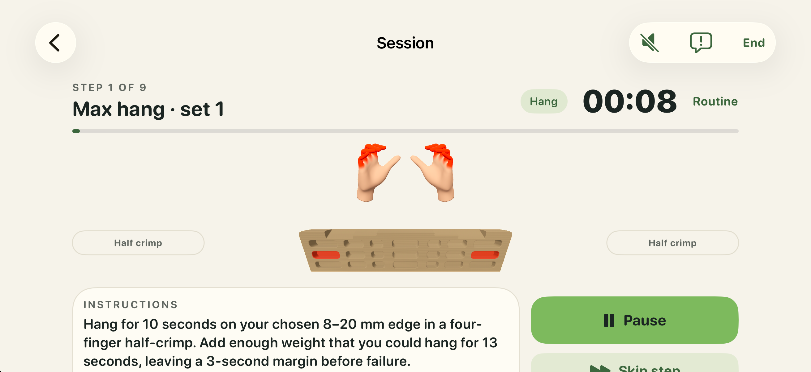
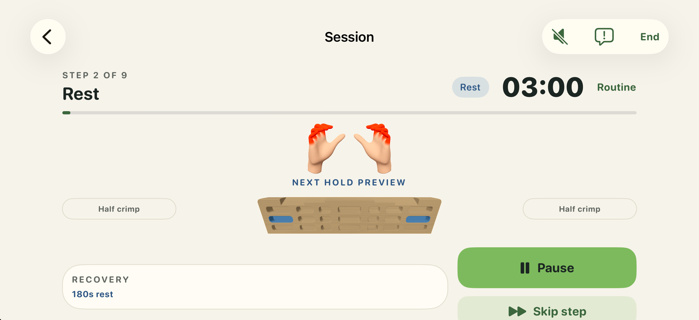
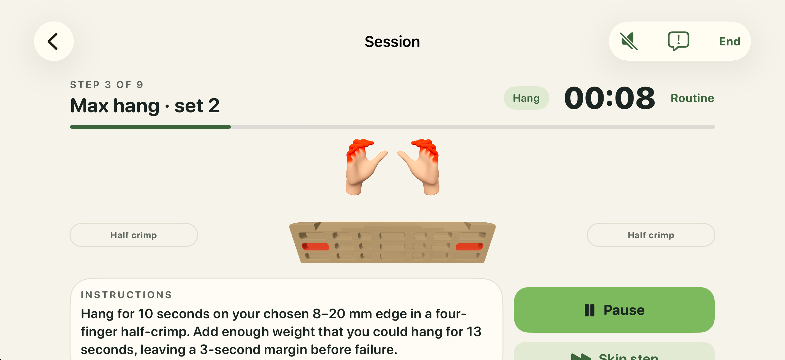

# Zlagboard.Pro 2.0 — fresh app review, #21

Native geometry was accepted on 2026-10-02. Its three canonical files remain byte-identical. This new app review is **pending the user’s separate reply**.

A fresh isolated iOS 26.5 build verified all 28 physical contact taps and 40 whole screenshots: 28 selected contacts, six horizontal yaw views, and six fresh detail-view re-entries. The independent whole-image review passed. The separate clean normal workout captured 58 whole frames with red Hang → blue Rest preview → red following Hang; its twelve frozen source files match this fresh build. See [technical validation](validation.json).

The original [manufacturer product image](../sources/product-01.png), [manufacturer hold chart](../sources/product-02.png), and [original/prior/native front-side-top comparisons](../individual-review-2026-10-02/comparison/comparison-front-side-top.png) remain available. The [source audit](../source-audit.md) labels display estimates; no geometry or export changed for this review.

The fresh static build uses `d191ee27…`; the separate clean workout build uses `97f7f90c…`. Matching source hashes establish source correspondence, not binary equality. Wood finish comes from existing renderer metadata; the committed USDZ remains unbound. This fixed board has no suspension cord.

The successful drag checks are horizontal yaw only. Earlier diagonal attempts failed and are preserved. Re-entry restores framing; no reset-button behavior is claimed. Hidden back surfaces, exact bearing angles, factory dimensions and physical-device behavior are not established.

All exact raw bytes, initial pending statuses, failed attempts, commands, logs and screenshots are retained with the [853-file hash manifest](raw-manifest-7d74eca0b393afad1287a13aab97d1e7bfc26d706c6cbe9d2bf3a0b2f1d6d743.json). The owned Simulator, DerivedData and app processes were deleted; both cleanup checks passed. No shared resource was changed.

Every static contact image:

| Contact | Whole app image |
| --- | --- |
| top-jug-left | [View](raw/captures-v4/top-jug-left.png) |
| top-jug-right | [View](raw/captures-v4/top-jug-right.png) |
| top-sloper-32-left | [View](raw/captures-v4/top-sloper-32-left.png) |
| top-sloper-20-left | [View](raw/captures-v4/top-sloper-20-left.png) |
| top-sloper-jug-center | [View](raw/captures-v4/top-sloper-jug-center.png) |
| edge-20-left | [View](raw/captures-v4/edge-20-left.png) |
| edge-15-left | [View](raw/captures-v4/edge-15-left.png) |
| edge-incut-15-left | [View](raw/captures-v4/edge-incut-15-left.png) |
| edge-incut-10-center | [View](raw/captures-v4/edge-incut-10-center.png) |
| edge-35-center | [View](raw/captures-v4/edge-35-center.png) |
| top-sloper-32-right | [View](raw/captures-v4/top-sloper-32-right.png) |
| top-sloper-20-right | [View](raw/captures-v4/top-sloper-20-right.png) |
| edge-30-left | [View](raw/captures-v4/edge-30-left.png) |
| sloper-edge-30-left | [View](raw/captures-v4/sloper-edge-30-left.png) |
| sloper-edge-25-left | [View](raw/captures-v4/sloper-edge-25-left.png) |
| sloper-edge-25-right | [View](raw/captures-v4/sloper-edge-25-right.png) |
| sloper-edge-30-right | [View](raw/captures-v4/sloper-edge-30-right.png) |
| edge-30-right | [View](raw/captures-v4/edge-30-right.png) |
| sloper-edge-25-lower-left | [View](raw/captures-v4/sloper-edge-25-lower-left.png) |
| edge-30-inner-left | [View](raw/captures-v4/edge-30-inner-left.png) |
| sloper-edge-30-center | [View](raw/captures-v4/sloper-edge-30-center.png) |
| edge-30-inner-right | [View](raw/captures-v4/edge-30-inner-right.png) |
| sloper-edge-25-lower-right | [View](raw/captures-v4/sloper-edge-25-lower-right.png) |
| edge-20-right | [View](raw/captures-v4/edge-20-right.png) |
| edge-incut-30-left | [View](raw/captures-v4/edge-incut-30-left.png) |
| edge-incut-30-right | [View](raw/captures-v4/edge-incut-30-right.png) |
| edge-15-right | [View](raw/captures-v4/edge-15-right.png) |
| edge-incut-15-right | [View](raw/captures-v4/edge-incut-15-right.png) |

Clean normal workflow:

