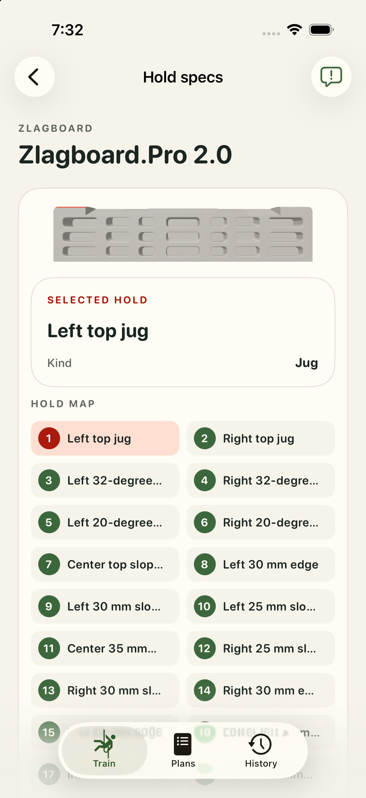
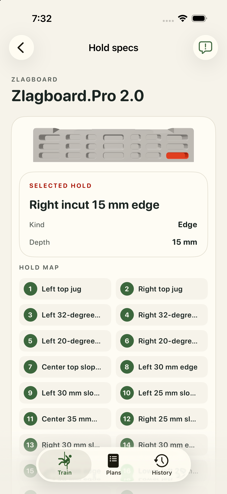

# Zlagboard Zlagboard.Pro 2.0: app review

Captured in the isolated iPhone 17 Pro simulator on iOS 26.5. Geometry acceptance is pending our one-by-one review.

top-jug-left; DEBUG initial hold.

edge-incut-15-right; DEBUG contact review route.

[Exact model hashes and validation](validation.json).
