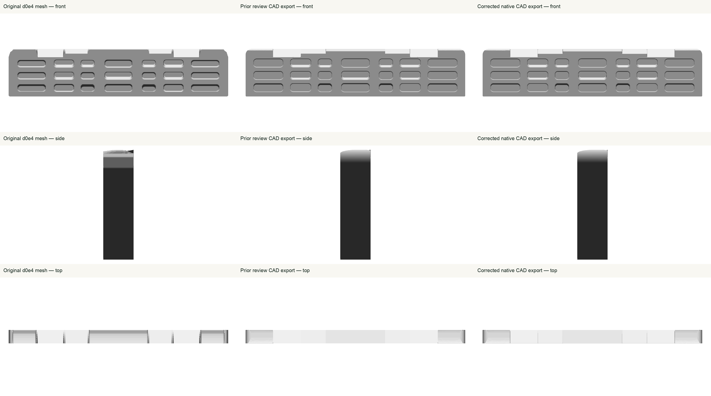

# #21 Zlagboard.Pro 2.0 — individual review

**Fresh app review is blocked; human acceptance is pending.** Native/export/build checks pass, but neither isolated Simulator became usable for app screenshots. This is the current 28-contact Pro 2.0 revision, with seven top surfaces and three rows of seven pockets, including the distinct lower incuts.

The existing native CAD history is retained. Two editable fillets round the top trough transitions and front lips, and the jug contact bindings now include their previously omitted flat crests and outer rounded corners. The 2 mm trough and 1 mm lip radii are display estimates supported qualitatively by the whole manufacturer photo. The final embedded manifest uses the existing renderer wood finish and an approximately 19.3-degree downward camera, also a display adaptation. The exported USDZ remains unbound and has no materials or textures.

All 28 contact IDs, the 21 published pocket depths, and the published 20/32-degree top slopes remain unchanged. Existing pocket bearing geometry is preserved exactly, including the distinction between flat, sloping and incut surfaces. The prior 7-degree numerical incut slope is a display estimate, not a manufacturer measurement. The 705 × 152 × 42 mm envelope, unspecified pocket centers/mouths, other interior slopes and round sizes remain documented display estimates. Mounting plate, phone holder, holes, hardware and branding are omitted; the physical product does have mounting hardware. This fixed wallboard requires no cord or changing suspended pose.

The retained native verification establishes one valid solid, 113 fully constrained sketches, 28 uniquely bound final-skin contacts, and unchanged pocket depth/bearing surfaces. Reopening/recomputing and editing the trough radius from 2 to 2.2 mm changed the physical body and seven top contacts; restoring it returned the original body volume/contact areas. Metadata embedding changed only Document.xml; all other archive members match the already verified candidate exactly.

The [manufacturer source audit](../source-audit.md) retains both whole approved images and the initial migration proofs. Fresh export/app checks and their limitations are recorded below. This display review does not certify manufacturing or ergonomic accuracy.

The final USDZ contains 29 unbound meshes and 44,738 triangles for 28 contacts.
The compiler check and publication produced byte-identical USDZs. A separate
reconstruction of the descriptor from native bindings and the published USD
points reproduced its exact bytes. Package parsing, material/texture absence,
and iOS/Android staging parity passed. See
[reproduction](compiler-final/two-export-reproduction.json),
[package checks](package-checks/final/published-package-verification.json), and
[delivery verification](delivery-validation.json). No third unchanged native
export was run.

The first fresh iOS 26.4 Simulator stopped in initial migration, then remained
at the system-app startup screen after an ordinary reboot and a bounded
eight-minute wait. This is retained as an environment failure; it does not
prove a cause or establish an app pass. No shared Simulator service was changed.

The single alternative iOS 26.5 device had the same startup failure after its
bounded ordinary reboot. A normal install succeeded, but launch, screenshot,
and installed-container queries timed out; accessibility provided no usable UI.
**There are no fresh app views and 0 of 28 app contact selections were reviewed.**
No app pass or human acceptance is claimed. See [runtime evidence](ios/final-runtime-validation.json)
and [validation summary](validation.json). The shared workout-highlight issue
observed on #20 remains unresolved and was not exercised on #21.

Both fresh generic Simulator builds passed with zero errors and six warnings,
retained in their raw summaries. A second build was necessary because the first
build's completed cleanup had already removed its product before the alternative
runtime attempt was prepared. The final build stayed under one ownership trap
through installation and cleanup. Build/staged package bytes match the final
source, USDZ and descriptor; installed byte parity could not be obtained.

Both exact owned Simulators and all owned DerivedData/result bundles were
removed and verified. No shared service restart, private migration edits, or
unknown resource cleanup occurred. The workspace and review agents remain
available. Native work is saved; the remaining gate is a fresh app review in a
working Simulator, followed by the user's separate #21 reply. See the
[independent final audit](../individual-review-2026-10-02-final-audit.json) and
[proof hashes](proof-sha256.json).
