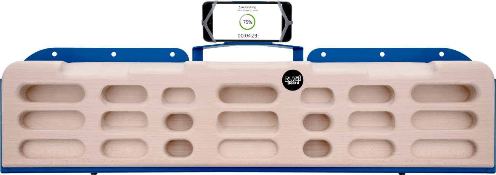
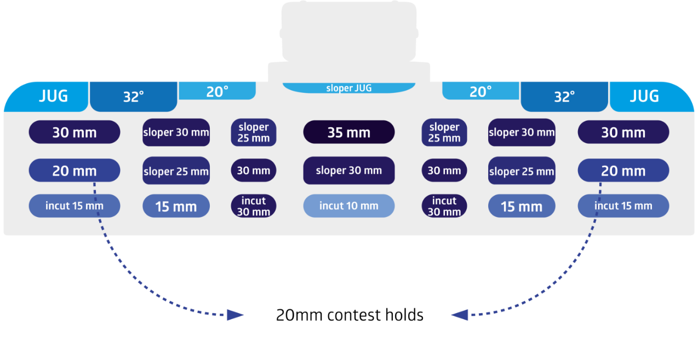

# zlagboard-pro source audit

Current Pro 2.0 revision (not older 24-hold Pro 1.0): three seven-pocket rows below seven top surfaces. Manufacturer photo and independent annotated chart cover matching 28-contact layout, including bottom incut row. Preserve all 28 contact IDs. Phone/mounting plate/hardware omitted. Overall dimensions are absent from current package and must remain estimated unless supported separately.

Source-set approval: asherlc, 2026-09-29, direct conversation: “those are fine, feel free to use more searches for individual boards as needed”. Consolidated snapshot: `.context/placid-badger/source-review.json`.

## Sources

- [product-01.png](https://zlagboard.com/assets/web/Zlagboard-2019-smaller2x-8011f7e115f3707e78d58c5b3587d3a15fd82b009c421a6c6dbc9f560e50dc1b.png) — Vertical-Life / Zlagboard; SHA-256 `8011f7e115f3707e78d58c5b3587d3a15fd82b009c421a6c6dbc9f560e50dc1b`. Manufacturer gallery.
- [product-02.png](https://zlagboard.com/assets/web/zlagboard-pro2-holds-014x2x-af05a1450fd55d0cdba84c0bcd43206f2798cf426cb31f5bf762d33acb66d34d.png) — Vertical-Life / Zlagboard; SHA-256 `af05a1450fd55d0cdba84c0bcd43206f2798cf426cb31f5bf762d33acb66d34d`. Manufacturer hold chart.

## Immutable pre-migration reference

Git commit `d0e4e95191e4a76822815bb4eeef3a32caa6fea0`; USDZ SHA-256 `c8b740284160de55c5f846c9d11742b5a29a31c0a67c9bb5f43ce1d4873bbd30`; descriptor SHA-256 `1be45681ce98fcb6fb1eda0f7939f3174a85d3c70c625b2aa8d6f2aed399cb83`. Bytes resolved through Git LFS and checked against the pointer. These are review/measurement references only.
## Native construction and verification

The canonical source is `Hangboards/zlagboard-pro/zlagboard-pro.FCStd`. It contains 113 fully constrained Sketcher profiles, seven native top-profile extrusions, a directly drawn rounded silhouette trim, 21 ruled capsule-pocket lofts and final-body semantic SubShapeBinders. The original metadata is embedded unchanged, including all 28 contact IDs and their ordering. Named `Depth_*` parameters drive the pocket floors; the source reopens and recomputes without Python callbacks or an external geometry source.

The retained manufacturer chart governs the seven top identities, 20/32 degree top slopes and 21 published pocket depths. The 705 x 152 x 42 mm display envelope is inherited from the prior display asset and is not a factory measurement. Pocket centers and mouth sizes, the 2 mm mouth blend, 18 mm upper and 2 mm lower silhouette rounds, jug crest curves and unspecified pocket interior slopes are operator-selected display estimates. The paired apertures are symmetric; lower-row incut surfaces are distinct from flat and sloping pockets. Mounting plate, phone holder, holes, logos and materials are omitted under repository policy.

The pinned compiler passed all source, archive, binding, published-depth, USDZ-reimport, descriptor and staged-package checks. Native reopening and a 15→17 mm left edge depth edit moved the intended contact and physical body, left unrelated contacts unchanged and restored the original geometry without changing source bytes. The runtime has 28 contacts, 29 nodes and 28,370 triangles. USD inspection found no material/shader prims or bindings. Exact hashes and bounds are recorded in `package-verification.json`; native and compiler reports are retained alongside it.

| View | Prior and native CAD |
| --- | --- |
| Front | [Comparison](review/comparison-front.png) |
| Side | [Comparison](review/comparison-side.png) |
| Top | [Comparison](review/comparison-top.png) |

All three comparisons were visually inspected. These orthographic renders use the exact prior/current USDZ geometry and shared `preview.py` renderer. Native-app picking and performance acceptance remain root integration work.

## Retained primary visual comparison

The CPU review renders shade triangle face normals; the runtime export retains native CAD surface normals. Native-app screenshots remain the final appearance check.

## Individual review update — 2026-10-02

The [individual review packet](individual-review-2026-10-02/review.md) documents
narrow native top-transition/lip rounds and restored jug crest/corner selection
coverage. The 2 mm/1 mm round sizes and downward app camera are labeled display
adaptations. Existing renderer wood finish follows the retained whole product
photo; USDZ meshes remain unbound without materials or textures. All 28 contact
identities, 21 pocket bearing surfaces/depths and published top angles remain
preserved, including the distinct lower incuts. The existing 7-degree numerical
incut slope remains an estimate, not a newly sourced dimension. The final source
is `44028d9bb5f7f301aab912da164e9e6684aa9533bfbe9cda55a6fde2819da72a`.
Historical source/export/app proofs above retain their original hashes and status;
new checks and their limitations are retained in the new packet. Human acceptance
requires the subsequent one-by-one review reply.
