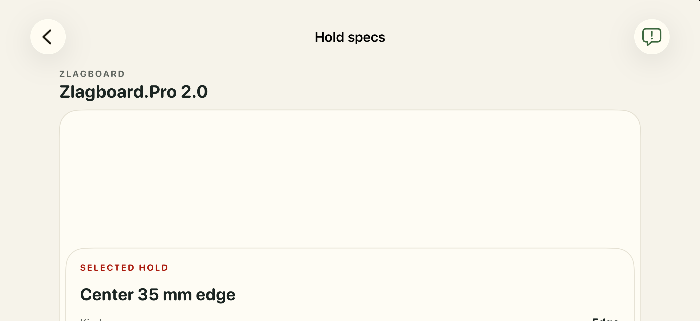
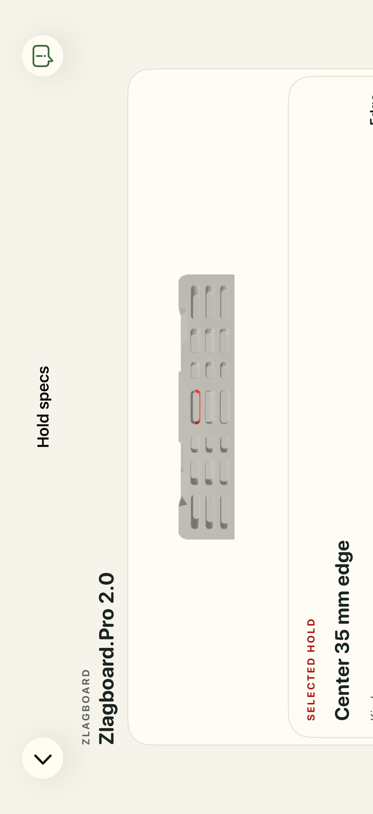

# VerticalBoard delivery CI follow-up

CI run [36621669794](https://github.com/Asherlc/hang-ten/actions/runs/36621669794)
failed in `InitialWeightSetupUITests.testInlineChoicesDefaultToSkipAndKeepManualDraft`:
the bodyweight switch remained off after a synthesized thumb tap on iOS 26.5.
The retained XCTest attachment showed a switch frame of `(303, 423, 61, 28)`
and an actual tap at `(321.3, 437)`, inside the off-state thumb. The recording
showed an unobstructed native switch. The unchanged test reproduced the same
assertion failure on a workspace-owned iPhone 17 Pro iOS 26.5 simulator.
Its runner was stopped after recording the assertion because result finalization
stalled; that red invocation did not exit normally.

An initial short drag also failed on repetition: XCTest used its default
500-pixel-per-second velocity with a 0.1-second press and no endpoint hold.
The interim fix in `d176de308` made both tests drag the thumb from normalized
`(0.3, 0.5)` to `(0.8, 0.5)` with a 0.5-second press, explicit slow velocity,
and a 0.2-second endpoint hold. The existing switch-value assertion, manual-draft
persistence checks, and purchased-workout weight-summary checks remain intact.
Production UI behavior and board geometry are unchanged.

Main's Whetstone migration (`b9d05c9e5`) was integrated while correcting CI.
Both native-model test functions, both sets of generated-manifest ignores,
and all four migrated package entries are retained. The combined delivery lock
is `ec63a290383db0b18f3c2604908325258494f3be90a45464da6bdfaff4b623fa`;
verification passed for 53 models and 122 files. The three VerticalBoard source,
descriptor, and USDZ bytes remain unchanged.

Validation on the combined branch:

- Rebuilt the iOS Simulator app and test targets successfully.
- All three `InitialWeightSetupUITests` and the purchased manual-weight summary
  test ran twice each: eight executions, zero failures.
- Python CAD/model/package suites: 492 passed, 14 skipped, 24 subtests.
- Full merged Swift unit suite: 1,235 tests, three skipped, zero failures.
- Delivery verification: 53 models, 122 files, exact locked identity confirmed.
- Both CI-fix simulators were shut down/deleted, ownership manifests consumed,
  and workspace DerivedData removed; deletion was verified against simulator
  inventory.

Local CI logs and result bundles are retained under
`.context/supreme-zebra-cad-validation/ci-fix-*`.

## Subsequent main integration

Main commit `d0e4e9519` updated the same tests with a fixed Original Grindstone
raster fixture and explicit fixture assertions, an initial off-state assertion,
a narrow switch-frame assertion, and a separate visible-label interaction test.
It also added a tap handler to the visible label. The merge retains those main
changes, including the normal `bodyweight.tap()` interaction, in place of the
interim drag. Both UI test files match main exactly; none of its assertions are
removed. Board geometry and the delivery lock are unchanged.

The merged build passed. All four weight-setup tests and the manual-weight
purchase-summary test passed twice each (ten executions, zero failures).
The full Swift unit suite passed 1,241 tests, three skipped, zero failures.
The exact post-test `simctl diagnose` collectors stalled after successful
testcase completion and were stopped; both xcodebuild invocations finalized
successfully with exit zero. Logs and result bundles are retained as
`.context/supreme-zebra-cad-validation/main-integration-*`.
The isolated simulator was deleted, ownership manifests consumed, and
DerivedData removed; deletion was verified.

## Distinct ODR project registrations

Post-merge review identified that Whetstone and VerticalBoard First both used
the `D100...31` build-file and `D200...31` file-reference identifiers. First now
uses the unused `...34` pair consistently in both definitions, its group entry,
and its Resources phase entry; Whetstone retains `...31`.

The existing ODR inventory test now rejects duplicate project object
definitions. It failed against the colliding identifiers before the fix.
All 29 package-staging tests passed after the fix. `plutil` validation and
`xcodebuild -list` passed; the parsed project confirms distinct file references,
resource-phase membership, paths, and ODR tags for both packages.

## Explicit non-AR camera for board maps

CI run `36644927341`, map-batch05-b job `109665698938`, failed the
Pro rendered-body check after its contact controls appeared. Decoding the
retained screen recording with FFmpeg confirms persistent blank geometry;
contact accessibility alone is not evidence that RealityKit renders the mesh.
The other Forge, Natural, and Owl cases in that shard passed.

The view added its authored `PerspectiveCamera` without requesting virtual
camera mode. Apple documents AR as the iOS default, with non-AR fallback when
the device camera or AR is unavailable:
https://developer.apple.com/documentation/realitykit/realityviewcameracontent
https://developer.apple.com/documentation/realitykit/realityviewcamera/virtual
Local diagnostics confirmed `RKARCameraEntity` in that fallback configuration.
A rapid-navigation baseline also reproduced a physical-picking failure.

RealityView initialization now explicitly selects `.virtual` before adding
the model and authored camera. This corrects the configuration gap without
changing the loader, geometry, materials, navigation, or visual thresholds.
The exact intermittent CI rendering cause is not independently established;
the new CI result remains the decisive validation. Opt-in DEBUG lifecycle
logging and a failure screenshot with viewport/sample diagnostics preserve
evidence if rendering still fails.

Local builds use SDK 27.0 with Simulator runtime 26.5; CI uses SDK 26.5.
An unrelated local startup deadlock was sampled in HealthKit and its simulator
background-task service. Only the owned simulator service was stopped to
allow board validation; no production HealthKit code was changed.

The changed build-for-testing succeeded. Evo passed its rendered-body, physical
picking, orbit, canonical-reset, and landscape assertions with explicit
virtual mode. Full shard and repeated Pro checks continue in the retained
`map-virtual-*` logs and result bundles under the workspace-owned validation
directory; these additional runs are not claimed complete here.

## Stable surface lifecycle

The virtual-camera variant reproduced the blank Pro map locally. Its
`map-virtual-pro-app.log` records scene attachment followed by repeated
load/disappear events; selecting virtual mode alone did not resolve the fault.
The container was `Group`, so its `.task` and `.onDisappear` modifiers apply
to the changing placeholder/model children. Replacing the placeholder can
therefore cancel the load or run the disappearance handler that clears the
just-loaded scene. Apple explicitly documents this modifier distribution:
https://developer.apple.com/documentation/swiftui/group

The surface now uses a persistent `ZStack`; lifecycle modifiers belong to the
surface container across loading/ready/unavailable state changes. Actual
navigation disappearance still clears the model.

The long failed visual wait also exposed a sampler crash when XCTest returned
nonfinite or empty frames: the retained runner crash report identifies a
NaN-to-Int conversion in `modelBodySampleCount`. Sampling now rejects missing,
nonfinite, empty, and out-of-screenshot viewports as zero visible-body samples.
This preserves the visibility threshold and timeout while preventing a stale
accessibility snapshot from crashing the test runner.

The stable-container build and all eight map UI cases passed, including
Pro and Evo rendered-body checks, physical picking, orbit and canonical reset,
and the four Owl map/layout cases. The xcodebuild invocation finalized with
exit zero. Results are retained in `map-lifecycle-shard.xcresult` and its log.
Additional picker and three independent Pro repetitions are recorded in
`map-lifecycle-picker` and `map-lifecycle-repeat-*` artifacts as they complete.

## CI follow-up: DoorMount reset tap and unit timeout

Run `36654455929` passed Pro and Evo after the lifecycle change, along with
the purchase/settings/workout shard and Python checks. The board shard ran
21 UI cases with one failure: DoorMount's post-orbit physical reset tap.
The selected contact remained present, but its projected center stayed
10.33 points to the right of the canonical frame. The screen recording
also retained the orbit pose after the tap. Selection remaining present
does not establish that the second physical tap hit anything.

The synthesized event records the reset tap at `(328.413, 261.867)` points.
The existing `0.82, 0.55` offset biases the tap toward the pocket's right rim.
The accessibility overlay supplies a fixed 44-point target rather than actual
pocket bounds, so that offset adds 14.08 horizontal points irrespective of
the pocket's visible width.
A projected-center reset was tested as a candidate, but failed in the combined
11-case run. It was rejected. DoorMount's original initial surface point,
original drag direction, and `0.82, 0.55` reset offset are retained.

Native diagnostic runs found agreement between manual and RealityKit contact
projection (under 0.12 points for the measured DoorMount pose) and native hits
at the projected center. These measurements do not establish hit delivery at
another screen point. Removing the per-update virtual-camera assignment did
not fix a callback-free initial tap and was also rejected. The diagnostic
runs additionally reproduced an Evo initial tap with no targeted callback;
a later run delivered the expected callback. Source-hull containment alone
cannot establish the runtime collider or gesture result.

The completed screenshot comparisons exposed an assertion race. Selection
could change the hold label while the captured model still had its previous
highlight. That delayed material update could satisfy pixel inequality after
orbit, and the projected camera could reset before the rendered frame did.
The test now establishes visible body geometry before selection, waits for
the selected surface's rendered highlight before recording the canonical
reference, and requires restoration of that rendered reference after the
single physical reset tap. Landscape also requires visible body geometry.
These are bounded waits for visual conditions, with the original physical
interaction and navigation preserved.

A DoorMount diagnostic run with rendered-selection synchronization showed a
correct highlight, visible geometric orbit, and an RGB-identical canonical
reset, with native projected X `270.157 -> 280.286 -> 270.157` and camera
revisions `2 -> 3 -> 4`. A subsequent run passed with the original initial
surface point as well. No proposed snapshot-based production invalidation
change was applied. Final validation removes temporary native projection,
entity-hit, callback, and parameter tracing. The local SDK remains 27.0
versus CI's 26.5; CI verification remains necessary.

The sampling helper uses saved screen geometry because asking XCTest for a
RealityView coordinate's `screenPoint` can fail even while the hosted view is
queryable. Its sampling window includes the visible pocket rim, and rejects
invalid crops while polling instead of recording an intermediate assertion
failure. The corrected sampling run passed Pro/Evo's portrait selection, orbit, and
rendered canonical reset. Its landscape visibility assertions failed. A live
simulator screenshot (`live-landscape-sampling.png`) confirmed that Pro's map
was actually blank after the long wait, independently of the sampler. The
landscape sampler also required using the normalized screenshot's scale,
because Springboard's accessibility width can remain in portrait orientation.

The next isolated candidate makes `BoardDetailMapSizeModifier` a single
modifier chain with an optional width limit. Its previous nil/non-nil height
branches replaced the content hierarchy when compact-height metrics arrived
or orientation changed. The candidate preserves the fitted-map accessibility
node and the compact width limit while keeping the model surface's structural
identity stable. Camera, model geometry, contact binding, and loader behavior
are unchanged. The trace-free focused run passed both Evo and Pro, including physical
selection, rendered highlight, visible orbit, exact rendered canonical reset,
and visible landscape body. The first complete affected suite passed ten of
eleven cases, including all five other Batch05 boards and their landscape
checks. Pro failed its initial physical selection. Its retained synthesized
event tapped (183.5535, 247.5154), while its live target frame was
(179, 225.3, 44, 44), with center (201, 247.3). The screenshot places the
old normalized fixture on the gap beside the narrow center pocket after
main’s default viewing-angle change. Pro now picks the live contact center;
a separate orbit-start argument preserves the original drag trajectory.
This keeps one physical initial tap and one physical reset tap, with no
retries. The subsequent trace-free complete suite passed nine of eleven cases.
DoorMount’s physical reset did not return its projected center; Pro’s
selection succeeded, but reset did not advance camera revision 3 and the
rendered board remained orbited. The old three-point AX tolerance masked
that Pro failure; the new exact rendered-reset assertion caught it.

A focused temporary native-query run exposed an instrumentation confound:
publishing the entire changing hit-query string through SwiftUI changed
synchronization. A second, logging-only run kept the original short AX
diagnostic and passed both DoorMount and Pro, with two fresh native callbacks
per board, rendered canonical restoration, and landscape geometry. Native
queries also show Pro’s former fixed fixture misses while its live center
hits. These results establish intermittent native interaction/presentation
behavior, not a proved camera defect. All temporary hit-query and callback
tracing was removed before the delivery build. No snapshot invalidation,
camera-mode experiment, retries, weakened reset checks, or production
picking changes were retained.

Local builds use SDK 27.0 with Simulator runtime 26.5; CI builds use SDK 26.5.
The trace-free integrated build and full unit suite passed: 1,245 tests,
three skipped, zero failures. Python’s integrated suite passed 437 tests;
the delivery lock validates 53 models and 122 authored files. CI on the
pushed branch must supply the remaining interaction validation. The local trace-free UI failures are retained and
are not described as a full-suite pass.

The retained before/after landscape screenshots show the actual blank map
and the same board rendered with its selected contact:

The unit shard's sole failure was
`AppStoreTests.testFailedSessionPersistenceDoesNotConsumeCredit`: a two-second
expectation expired while the test took 19.658 seconds. Its simulator app log
shows a HealthKit connection activated at `04:56:32.268` and cancelled at
`04:56:51.916`, matching the stalled interval. This supports investigating a
transient simulator stall; the exact blocking call is not established. A
single targeted rerun was requested after the full workflow completed;
replacement unit job `109756688319` passed at `06:14:36Z` on the unchanged
commit. A subsequent local diagnostic launch also stalled in
`HealthKitService.authorizationState`; its process sample identifies
`HKHealthStore.authorizationStatusForType` waiting for a synchronous XPC
reply on the main thread (`AppStore.init`, line 93). That launch never
reached a board interaction and was cancelled with exact-resource cleanup.
This corroborates the environment hypothesis without establishing that the
original unit failure blocked in the same call. No expectation timeout or
production persistence code was changed. The original logs, result bundle,
exported diagnostics, screenshots, and synthesized events are retained under
`.context/supreme-zebra-cad-validation/ci-6296-*`.

### SDK 26.5 rendering and menu-event investigation

Run `36689422401` on `119306ca3` passed Python, Swift units, and the
purchase/settings/workout shard. Its board shard ran 21 tests with five
failures: Forge retained its orbit after reset; Megalith, Natural, and Pro
retained their canonical geometry after dragging; the one-handed Left menu
selection retained Alternate hands. DoorMount and Evo passed their complete
rendered interaction sequence. Pro's independent recording corroborates the
frozen canonical pose while RealityView's diagnostic revision advances from
2 to 11. Megalith advances from 2 to 8. Active root/camera membership and AX
projection changes therefore do not certify the presented camera pose.

The Left-menu synthesized event targets Springboard PID 4670, while Hang Ten
is PID 57460. The recording shows the menu remaining open after that event.
The finite-frame helper now takes the owning application explicitly and
anchors the coordinate in that application; the menu-window workaround and
single tap remain intact. CI must establish the behavioral result.

Two read-only reviewers independently recommended one diagnostic invocation
that compares camera transforms, native projections, and engine-frame
callbacks. The temporary DEBUG trace was guarded by the existing board-review
diagnostics environment flag and wrote only logs. After retaining CI's result
bundle, attachments and 363 trace records, its state, subscription, logging,
projection helper, disappearance cleanup and class definition were removed.
No trace wiring remains in the delivered application source.

The local picker baseline and subsequent diagnostic invocation were
interrupted before their interactions because startup blocked in
`HealthKitService.authorizationState`. Owned-process samples identify the
main-thread synchronous HealthKit XPC wait; the owned daemon sample identifies
its background-task submission wait. Rebooting the exact owned simulator did
not establish a valid comparison. No permission policy, authorization state,
assertion, or retry loop was changed. CI's SDK 26.5 run must supply the
remaining evidence. Local compilation and the 22 CI-contract tests passed;
no successful local UI result is claimed for this investigation.

Run `36696460939` on diagnostic head `2512db816` passed Python and Swift
units. The application-owned Left-menu tap passed its complete test in
97.187 seconds. All six Batch05 boards failed rendered orbit checks. Their
native projections follow the changed camera transforms before and after
synchronization and in subsequent engine-frame callbacks, while their
presented geometry remains frozen. This weakens camera-math, missing-update,
and deterministic mode-rebinding explanations. The diagnostic subscription
may affect scheduling, so this run does not establish an exact internal
RealityKit fault or make the observed failure rate comparable to the prior
trace-free run.

The controlled candidate preserves normalized orbit state in gesture
callbacks, but defers the camera entity write to `frame(in:)` inside
`RealityView.update`. This submits the changed transform at the host's
synchronization boundary and lets the existing before/after detector observe
it. Unhosted callers retain immediate camera updates. The camera unit test
also verifies deferred orbit/reset leave the entity transform unchanged
until framing submits them. Camera calculations, mode configuration, native
picking, navigation, rendered assertions, and single-tap behavior are
unchanged. This candidate requires fresh trace-free CI interaction validation;
no successful rendering fix is claimed before that result.

The trace-free `dfbf13842` unit shard ran 1,245 tests with three skips. Its
sole failing case was successful session persistence: the one-second
condition wait expired before the asynchronously dispatched main-actor
completion consumed the credit (two failed assertions). The deferred-camera
unit case passed. Purchase/settings/workout UI also passed; the board shard
is still pending.

The paired persistence tests previously pumped `RunLoop.main` from a
synchronous main-actor test while the production append callback scheduled a
main-actor task. The candidate test correction suspends between condition
checks, allowing that executor to run normally. It retains the one-second
deadline, the controlled storage completion, the pre-completion zero-credit
assertion, and the final success/failure credit assertions. Credit policy and
application persistence code are unchanged. The exact CI scheduling delay is
not proved; fresh CI must validate this test correction.

Run `36699899387` completed. All six Batch05 boards failed the rendered orbit
assertion; the remaining 15 board/grip/picker cases passed. The deferred
camera-submission candidate therefore did not correct the observed failure
and was removed, including its optional model API and candidate-only unit
assertions. The previous immediate-camera behavior is restored; temporary
presentation tracing remains removed. The prepared persistence-test wait
correction is delivered separately. Rendering investigation remains open,
and auto merge remains disabled.

Two fresh read-only rendering-host reviewers agreed to a one-variable
post-failure diagnostic before another camera or hosting change. The first
proposal used root translation; the counter-review initially proposed a
material probe plus clipping A/B. They converged on root translation first,
leaving clipping and ARView comparisons dependent on the observed result.
Both exact owned reviewer agents were archived and verified.

The temporary Pro-only DEBUG probe changes the existing root's X position
once by six percent of its current model width, after the original rendered
orbit wait times out. It does not change camera state, cameraRevision,
SwiftUI state, or subscriptions. The original timeout remains the result
asserted by the acceptance test. A fixed five-second diagnostic capture
window avoids treating the Probe button's press appearance as movement.
Sparse mode/synchronization logs record any intervening camera writes, and
existing attachment logs identify host recreation. Extra camera/host/layout
activity makes attribution inconclusive. Geometry and viewpoint must be
judged separately, excluding the temporary control from pixel comparisons.

Visible displacement with a canonical viewpoint supports a camera-specific
path; displacement revealing the pending orbit supports camera-only render
invalidation. Neither movement leaves rendering versus presentation open
and selects a clip-only comparison. Failure to reproduce is inconclusive.
This is an interim investigation change, not a rendering fix. All temporary
probe state, methods, overlays, logs, launch environment and test branch must
be removed before delivery; this diagnostic head must not merge even if its
checks pass. No local UI pass is claimed.

The trace-free baseline run `36703970064` on `9e18e68b3` passed all 1,245
unit tests with three skips; the successful-session persistence test passed
in 0.021 seconds. Python and purchase/settings/workout UI passed. The board
shard ran 21 cases with six failures: DoorMount, Evo, and Natural reached
rendered orbit but failed canonical reset; Forge, Megalith, and Pro failed
rendered orbit. This preserves a fresh Pro freeze for comparison with the
post-failure root-translation probe. The baseline logs are retained, and the
diagnostic must not be interpreted as a passing acceptance run.

The final probe arm64 Simulator build-for-testing and 22 CI-contract tests
passed. Its exact DerivedData was deleted by the exit trap and deletion
verified. No local Simulator or UI execution was attempted.

Run `36708033330` on `e031e83bd` passed units, Python and
purchase/settings/workout UI, but the board shard retained six failures.
Pro rendered its orbit and then failed canonical rendered reset, so the
orbit-only diagnostic did not execute. Exported app stdout contains 40
probe-related synchronization lines and zero root translations. The camera
returns to canonical in the synchronization logs; Pro's orbit and reset map
crops are RGB-identical, while active-to-orbit geometry visibly changes.
No conclusion about root displacement or camera-only invalidation follows
from this unexecuted probe.

The same one-shot diagnostic is now invoked after the first saved rendered
Pro failure, either orbit or reset. Its helper and five-second observation
are unchanged, and the original stage/result are recorded before mutation
and asserted afterward. Root motion, camera configuration, navigation,
physical picking and acceptance assertions are unchanged. This adjusts
diagnostic coverage to the observed failed stage; it is not an unchanged CI
retry or a rendering fix. All temporary probe wiring still requires removal
before final trace-free validation and merge.

### Root-translation result and controlled clipping comparison

The fcc9 diagnostic run 36712514869 failed all six rendered map interaction
cases while units, Python and purchase/settings/workout UI passed. Pro failed
rendered orbit. Its root translation executed once (0.042299997 model units,
6% width); the camera matrix remained unchanged, with no later camera-mode or
synchronization log. The active, failed-orbit and five-second post-translation
map crops are RGB-identical. The map bounds remain (34, 220, 334, 72), and the
scene identity and revision 3 remain unchanged. This isolates failure beyond
scene mutation but does not prove whether renderer output or hosted
presentation is stale. Evidence is retained in workspace-owned ci-fcc9 logs,
artifact, exported diagnostics and attachments.

All temporary root-probe state/methods, UI button, sparse logs, launch flag,
test helper and both helper calls have now been removed. The original saved
failure assertions remain intact.

The next controlled comparison removes only the ancestor content clipping
from the Hold specs map card. The rounded cream background, border, padding,
layout, Train-to-Hold-specs navigation, camera configuration, native gestures,
rendered selection/orbit/reset and landscape assertions are retained. Other
cards keep their default clipping. This is an experimental presentation change,
not a demonstrated rendering fix; fresh trace-free CI must establish its result.

### Non-AR host comparison after clipping failed

The clipping comparison 4059b0214 failed six board cases in CI36716897566.
Two additional attempts were explicitly requested by the user; they repeated
rendered orbit/reset failures. Attempt3 also encountered the intermittent hand
menu label failure. Logs are retained as ci-4059-board-failure.log,
ci-4059-retry-board-failure.log and ci-4059-attempt3-board-failure.log. The
ineffective content-clipping change is removed; the original rounded card clip
and design-system API are restored.

The next controlled comparison uses a stable UIViewRepresentable/non-AR ARView
for interactive maps while retaining RealityView for the Train and picker
previews. It reuses each independently loaded BoardModelRealityScene, root,
camera, manifest contacts, collider mapping, framing math and highlighting.
An identity world anchor owns only that host's root/camera and is detached on
dismantle. Actual UIKit bounds govern framing. Native entity(at:) supplies the
single physical tap, and orbit/pinch update the existing normalized camera
state; the existing accessibility contact overlay remains non-pickable.
Navigation, physical selection, rendered selected baseline, visible orbit,
canonical rendered reset and actual landscape assertions remain unchanged.
The host's default rendering appearance may differ; each test compares against
its own canonical baseline.

This is an architectural host experiment, not proof of RealityView's internal
fault or a claimed production fix. All required CI must pass before retention
or merge. No temporary probe, trace subscription, altered test route, repeated
interaction or weakened assertion is introduced.

API references: Apple ARView non-AR camera mode and native picking:
https://developer.apple.com/documentation/realitykit/arview/cameramode-swift.enum/nonar
https://developer.apple.com/documentation/realitykit/arview/entity(at:)
https://developer.apple.com/documentation/swiftui/uiviewrepresentable

### Main finish integration and conflict resolution

Merged main 6566d8e82 at the user's request to resolve PR524 conflicts. The only
textual conflict was docs/model-delivery-lock.json. Retain main's runtime finish
provenance and source hashes alongside the three YY migrations, combine the
package inventory and regenerate the checksum from the exact merged bytes.
Main's new complete-finish inventory test failed for VerticalBoard First's
missing surfaceFinish before the integration correction.

All three YY manifests now explicitly select surfaceFinish=neutral through
Tools/HangboardCAD/set_board_manifest.py. This preserves the prior runtime
appearance and authors no manufacturer finish claim. Archive member comparison
confirms only Document.xml changed; manifests differ only by that display
field, so all49 contacts and factual metadata remain unchanged. Delivered USDZ
and descriptor bytes are identical (including comparison with retained LFS
object hashes). The updated lock pins all53models/122files,
SHA256 1c8912a1485ac4da85352192289dcb74335c5b2f9383246f2532f34b6b9b668a.
Main's materials are runtime-only; no material or texture is added to the three
YY USDZ files. Existing non-AR host comparison and strong rendered assertions
are retained. Build/Python integration checks and fresh CI govern delivery.

## Natural migration integration and delivery-lock retirement

Main `65efe7b77` delivers Trango Natural native CAD and deliberately removes the delivery lock, its verifier and the reproducible-export command. Accept those removals rather than recreating the retired release gate. Historical digest and rebuild results above remain evidence from their stated commits. No YY geometry, model asset, manifest metadata or contact inventory changes in this integration.

Resolve `.gitignore` by retaining all three YY generated manifests and Natural’s generated manifest. Preserve the original rapid Train → Hold specs interaction route instead of adopting main’s direct-detail test launch; the departing preview remains part of the renderer acceptance scenario. Main’s published-history waits, guided-cancellation timing correction and app-owned raster hand-choice fixture are retained.

Integrated arm64 Simulator build-for-testing passed. Exact workspace-owned DerivedData was trap-deleted and absence verified in `natural-integration-cleanup.json`; no simulator was created. All 467 integrated package/manifest/contract tests passed; results are retained in `natural-integration-python.log`. This build is not a local UI pass.

## Non-AR host failure boundary capture (temporary)

At c742c5c60, the board shard ran 21 tests with five failures; units, Python and purchase/settings/workout passed. Door visibly orbited and restored its exact canonical crop. Natural retained canonical pixels after orbit; Megalith retained orbited pixels after reset. The full app log records revision 3 for Evo and Pro with their contact elements still present, so a missing callback is not established. Forge's preserved vertical drag conflicts with the new horizontal-only delegate; this is an input-contract regression, separate from the renderer investigation. Megalith's one-third-point projected displacement lies inside the three-point reset tolerance and cannot certify a canonical matrix.

Two independent committee reviews converged on one normal board CI shard based on a83ee63b0, after integration of main0ad6303b4's complete-check rules and history-publication wait. Instrument only the six existing Batch05 cases. Preserve navigation, coordinates, test order, single physical taps, assertions, deadlines, clipping, delegate decisions, terminal-motion consumption and camera behavior. The bounded 400-entry buffer records native touches/delegate decisions, pan cumulative and consumed translation, existing tap hits, revision causes, host identities, authored matrices before/after synchronization and ARView camera/projection readback. Record the canonical matrix before the first pan. No frame subscription, scene mutation, new SwiftUI publication or extra picking probe is added.

After the first retained rendered orbit/reset failure per test, capture the screen before requesting one native ARView snapshot, record request/completion camera state, then capture the screen again. Snapshot completion is bounded to 15 seconds without retries; the original failed result remains asserted with normal abort behavior. AX failures only flush the buffer. A snapshot-induced refresh remains diagnostic evidence and cannot satisfy the original assertion. A passing instrumented run is inconclusive about intermittent failures.

All boundary-trace properties, touch/delegate hooks, class/registry/transparent controls, launch environment, test capture branches and this temporary investigation wiring must be removed before delivery. This diagnostic head must not merge even if green. Forge's behavior correction is kept separate. Native snapshot API: https://developer.apple.com/documentation/realitykit/arview/snapshot(savetohdr:completion:)-66jzu . The readback is not certification of the camera consumed by a presented frame.

## Transgression main integration and review reconciliation

Main `7fe13f454` added two Transgression revisions while the boundary diagnostic was queued. The merged PR CI exposed three Python failures: Transgression and YY Light/One used the same Xcode object IDs 32/33, and two successful CI-gate test cases did not provide main's new native-CAD gate inputs. Reproduced all three locally before correction. Preserve main's Transgression IDs, assign YY Light/One unique build/file objects 35/36, and supply the native-CAD test environment. Additional cases require a required native-CAD job to succeed; failed, cancelled and skipped results remain rejected.

The per-board audits now distinguish each original compile/rebuild input from the current source hash after the metadata-only neutral finish addition. Archive comparison verifies identical geometry members and exactly one parsed-manifest change: presentations[0].media.display.surfaceFinish. This does not claim the new source hash was the earlier reproducibility input. Inspecting all 49 committed YY contact objects also confirms no HangTenDepthAxis declarations; their effective compiler axis is Y, including One's inclined and 50 mm pairs, so the review's hypothetical X-axis measurement mismatch does not apply to these sources.

Remove stale backdrop seeds for One and the already model-only Beastmaker1000/TrainingTiles packages. A regression check requires every remaining configured seed to have a primary.png input; no raster or geometry generation is performed. Focused integration checks passed 110 tests. The full integrated package/manifest/contract suite passed 510 tests with two native-edit cases deselected. The integration build also reproduced a stale reset call passing screenFrame after main removed that parameter from mapSnapshot. Correct the remaining call to use main’s normalized screenshot scale, preserving the exact image-equality assertion. That compile failure prevents the queued old merge-ref board job from producing runtime evidence; push the substantive integration corrections after the build passes, then obtain the one runtime diagnostic execution. No rendering fix or local UI pass is claimed.

## Per-hand plan main integration

Main781e64636 arrived immediately after the prior integration push. Resolve the GripCueSnapshotUITests conflict in favor of main's new sourced per-hand task model: explicit two-hand Max Hangs on the one-hand Nug requires two boards and no separate session hand picker. The obsolete Alternate/Left menu path no longer applies to that explicit task. Retain main's absence-of-picker and running-workout assertions. This integration does not change Batch05 physical coordinates, rapid navigation, camera/gesture behavior, rendering assertions or the temporary boundary capture. All 59 CI contract tests and the Swift test parser passed; fresh combined CI remains required.

The selected-highlight sampler now uses the normalized screenshot scale and direct screen-point coordinates, matching the map crop. It no longer subtracts a potentially stale SpringBoard frame origin or derives scale from that frame. Rendered selection thresholds and interaction assertions remain unchanged.

## Completed boundary capture and confirmed input corrections

Trace head fdb0eab72 ran 24 board/grip/picker tests with four failures. Door and Natural passed their full rendered sequence. Forge's trace explicitly rejected its vertical pan. Evo applied its full recorded 40-point horizontal delta; ended translation equaled consumed translation, so terminal-delta loss is not supported by this case. Its central accessibility frame remained unchanged. Pro failed tapping the diagnostic capture control, limiting that case; no repeat is claimed.

Megalith's native reset hit the selected collider and returned authored and ARView camera matrices exactly to the recorded canonical baseline. Its native snapshot at failure displays canonical geometry, while screen crops before and after remain byte-identical to the orbited crop (148,681 changed RGB pixels versus canonical). This narrows the demonstrated failure to onscreen presentation relative to live renderer output; the internal cause remains unproved. Snapshot collection did not visibly refresh the screen in this case. Retained app logs, all 101 boundary entries, screenshots and reconstructed native PNG remain under the workspace context.

All temporary boundary trace properties, hooks, registry/class, transparent controls, snapshot capture, launch environment and test branches are now removed. No renderer/camera workaround is added. The interactive host now accepts vertical and diagonal orbit as the previous SwiftUI map did, and explicitly permits its own pan/pinch pair to recognize simultaneously. Other preview delegates retain horizontal scroll arbitration; unrelated recognizers are excluded. New unit cases cover those policies. Rendered orbit/reset/landscape assertions, gestures and timeouts remain intact. Fresh trace-free validation is required; this input correction does not claim to fix the separate presentation failure.

## Gesture unit fixture correction

Trace-free CI0df2f5da1 ran 1,286 unit tests with three skips and one failure in the newly added interactive-vs-preview direction test. The simultaneous-recognition test passed. The failing fixture used setTranslation on an idle UIKit recognizer, so it did not supply a controlled delegate input. Replace only that fixture with a recognizer subclass that returns explicit translation and zero velocity. Preserve vertical/diagonal/horizontal acceptance, default preview vertical rejection, and every production gesture implementation. The focused isolated iOS26.5 simulator execution passed all six OrbitPanArbitrationTests, including the corrected direction fixture and simultaneous-recognition policy. The local build uses SDK27, unlike CI SDK26.5. Exact simulator and DerivedData cleanup is verified in gesture-fixture-cleanup.json. No UI rendering success is implied.

Main integration after PR525 merged: retained all six YY/Tension native CAD packages and generated-manifest exclusions. YY First/Light/One use distinct Xcode ODR identifiers 37/38/39 alongside main’s Evo/Honestone/Original Grindstone identifiers 34/35/36. Removed the obsolete Evo raster seed. Combined UI helpers retain coordinates relative to the owning application, including main’s new bodyweight controls. The original Batch05 rapid navigation, orbit trajectory, Door reset location, rendered selection, exact canonical reset and visible landscape assertions remain intact. No board geometry or camera behavior was changed by this conflict resolution. Combined arm64 Simulator build-for-testing passed after correcting the helper application parameter; Python passed 515 tests with two native-edit cases deselected. Xcode plist lint, unique object-ID checks and Swift parsing passed. Exact owned DerivedData and pytest scratch deletion was verified in main525-cleanup.json. No local board UI pass is claimed. The preceding remote63e0 unit suite passed 1286 tests, three skips and zero failures; its UI shards were still running.

The combined trace-free b08f2cdaf CI ran 24 board/grip/picker tests with six Batch05 failures; all other enabled suites passed (1287 units, three skips; 23 purchase/settings/workout UI tests). Door/Megalith active-to-orbit crops changed zero RGB pixels; Natural/Pro orbit-to-reset crops changed zero pixels despite earlier visible orbit. Evo/Forge stopped at projected-contact movement and remain unresolved input/observation cases. These are not a validated host fix.

The next interim diagnostic implements committee consensus: one post-failure explicit transaction changes an already-visible UIKit marker outside the map crop, only on Megalith and Pro. The original failed verdict, gestures and deadlines remain intact. Read-only host/window/layer ancestry, candidate Metal layer properties and authored/native camera matrices are logged at creation, canonical framing, failure and afterwards; intervening synchronization is reported. Screen captures precede the intervention and follow at approximately 0.5 and 2 seconds. No camera/entity/material changes, redraw requests, flush, resize, native snapshot or engine/render subscription are added. Marker recovery only establishes that its own app-owned presentation path reaches the screen; board recovery is temporal association, not mechanism or causality. An absent/occluded/unchanged marker or changed host/camera/geometry makes attribution inconclusive. All marker/observer/log/test branches must be removed before delivery or merge, even if the instrumented head passes.

Interim marker diagnostic validation: generic arm64 Simulator build-for-testing and all 59 CI contracts passed. Exact owned DerivedData and pytest scratch deletion, both committee archives, and the exact unexpected committee plan artifact deletion were verified in commit-probe-cleanup.json. No local UI pass is claimed.

## Marker diagnostic result and review cleanup

Diagnostic b22b0fe4a CI36797244811 ran 24 board tests with six failures; units, purchase UI, Python and native CAD passed. Megalith and Pro failed rendered orbit. Their established UIKit markers changed magenta to cyan in the two-second capture while both map crops remained RGB-identical to canonical. Both Metal layers reported presentsWithTransaction=true and correct finite drawable sizes. Authored/native orbit matrices, host identity, geometry and synchronization count were unchanged immediately before/after the intervention; Megalith also retained unchanged two-second readback. Pro's late readback was not retained, limiting that guard. No intervening synchronization was logged. This establishes marker presentation while the board region stays stale; it does not prove the responsible layer or renderer fault. The next evidence-selected hypothesis is a controlled transparent/opaque surface comparison, not a production fix claim.

All temporary marker/observer/class/coordinator/container hooks, QuartzCore import, launch environment, timeout branches and capture helper are removed. Original gestures, rendered assertions and deadlines are preserved. Review changes add reverse picking identity for all YY contacts, horizontal preview acceptance, cancellation exit for persistence waiting, Train-button readiness, shared FreeCAD invocation, and aggregation of independent native validation failures. Duplicate CI gate cases were removed; existing required/disabled native-gate coverage remains.

The persistence wait retains the original one-second budget: pre-9e18e68b3 AppStoreTests.waitUntil used Date().addingTimeInterval(1), not the different ten-second expectation helper. The explicit post-TemporaryDirectory check verifies owned-resource deletion rather than requiring the subprocess to delete its intentional saved-edit outputs. The rendered-orbit budget remains the original 15 seconds under the authorized diagnostic acceptance contract; extending it or substituting entity/native state would not repair demonstrated stale presented pixels.

Probe-free generic arm64 Simulator build-for-testing passed. Focused Python contracts/reporting tests passed 57 cases; actual FreeCAD/OpenUSD source/edit/reopen checks passed for all three YY packages in 41.25 seconds. Exact owned DerivedData and temporary directories were deleted and verified in review-followup-cleanup.json. No local board UI pass is claimed. Fresh remote verification is required.

Native CI review follow-up: the existing gated native CAD job now also invokes the three YY source/edit/reopen cases and their failure-reporting tests. It installs pinned usd-core26.8 into its already owned CAD toolchain directory and passes that path to the FreeCAD interpreter. Explicit FreeCAD/pxr file preflight prevents the YY skip marker from silently accepting a missing toolchain. The existing job identifier/check name and always-run exact-toolchain cleanup remain. All 56 CI contracts and actionlint passed locally; native YY cases previously passed all three under the pinned local toolchain. Push follows completion of the current board baseline so its evidence is retained.

The reporting unit tests now import the real native validator with isolated shallow FreeCAD/Part/pxr stubs; they no longer extract functions via AST or build a substitute globals dictionary. CAD operations are not called by these reporting tests. Combined CI/reporting validation passed 58 tests and actionlint passed; exact test scratch deletion was verified.

Prepared opaque-surface comparison: change only interactive ARView/container opacity and matching hangCream environment/UIKit background. Retain camera math, entity synchronization, gestures, card clipping and every rendered assertion. This tests the next hypothesis selected by the marker evidence; it is not yet a validated fix. Generic arm64 build-for-testing passed, exact owned DerivedData deletion verified in opaque-cleanup.json. Display-only RealityView previews remain unchanged.

Opaque comparison 37601e8b9 completed CI36802470745 with six failures in 24 board tests: Door/Megalith rendered orbit, Evo projected orbit, Forge rendered selection, and Natural/Pro rendered reset. All other enabled checks passed: 1287 units (three skips), 23 purchase/workout UI tests, Python, and 10 native CAD/reporting cases with zero skips. The native job executed the newly selected YY source/edit/reopen cases and deleted its owned toolchain. The previously failing workout case passed without a workout source change or an unchanged retry; its earlier cause remains unproved.

The opacity hypothesis did not resolve presentation, so b6681e51f reverted the entire comparison and restored the prior transparent renderer. This also addresses the review's valid concern that an unconditional cream rectangle would affect interactive maps on other backgrounds; no diagnostic production surface remains. Original gestures, assertions and timeouts remain unchanged. Logs and the complete board xcresult are retained under ci-3760-* in the workspace-owned validation directory. No local UI success or rendering fix is claimed.

## Interim Train-preview renderer comparison

The transparent b668 baseline completed with six failures in 24 board tests. Megalith failed rendered selection before any orbit: its initial, neutral and failed-selection map crops were RGB-identical while the selected card/list changed to Center 25 mm edge. Failure-time geometry was not separately retained, limiting that comparison. All other enabled checks passed.

The committee selected one bounded preview-suppression comparison before adding a postProcess render pass. A DEBUG provenance marker applies only to selectedBoardCard in TrainView; the Batch05 environment flag replaces only that surface's ready renderer child with a static clear stand-in bearing the existing boardModel.3d identifier. The outer ZStack, loader, resource/model construction, cancellation, disappearance, rapid navigation and detail renderer are retained. Other preview calls are unchanged. This changes rendering work and scheduling, so a passing comparison establishes association, not causality or a production fix.

Direct stand-in/load/cancellation and detail create/dismantle logs validate the intervention. Existing RealityView attachment logs must show zero attachments in each Batch05 process; the guarded ready branch provides source evidence that the Train RealityView is never constructed. A live accessibility getter reads detail host/renderer/scene identities, bounds/window frame, Metal drawable size/scale/presentsWithTransaction, actual contact materials, authored/native camera matrices and sync count at the existing reference captures and first rendered selection/orbit/reset failure. The getter performs no scene mutation, synchronization, redraw, layout forcing, subscription or native snapshot. Original gestures, assertions, waits and failed verdicts remain unchanged.

Before pushing this arm, retain the completed f21d9c00c baseline and require reproduced rendered failures in at least three of Door, Megalith, Natural and Pro; otherwise reassess. Execute the normal 24-test shard once. A stale result with zero preview attachments shows preview creation is not necessary for that reproduction; revert and investigate the normal framebuffer boundary in the original setup. Passing all four rendered sequences is association only and also requires the original-setup boundary investigation before a corrective change. Earlier projected-contact failures remain separate input/observation cases. Invalid isolation, too few checkable cases, or failure not reproduced yields no conclusion and no unchanged retry toward green.

All environment markers, stand-in branches, live readbacks, logs, counters, DEBUG imports and test flag/attachments/failure branches must be removed after the diagnostic run regardless of result. This head must never be merged, including if green. No local UI pass is claimed.

The f21d9c00c baseline completed CI36809462956 with six failures in 24 board tests. Megalith failed rendered reset, Natural/Pro rendered orbit, Door physical coordinate selection, and Evo/Forge projected orbit. The three reproduced rendered failures satisfy the diagnostic baseline gate; Door is not counted as a rendered case. The other 18 board/grip/picker cases passed. Units passed 1287 tests with three skips, purchase UI passed 23, native CAD/reporting passed 10 with zero skips, and Python/lint passed. The prepared diagnostic generic arm64 Simulator build-for-testing, Swift parse/diff checks and 58 focused CI/reporting contracts passed; exact owned DerivedData/scratch deletion was verified in preview-comparison-cleanup.json. No local board UI pass is claimed.
